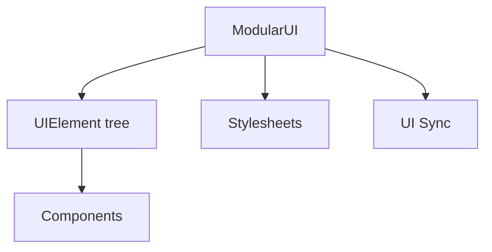

# LowDragMC Wiki 编写规范

## 1. 目标

Wiki 的目标是让读者快速完成一件事：理解概念、找到 API、写出可运行的用法，或完成迁移。

- 先说读者能做什么，再说明必要原理。
- 使用短句、明确动词和具体名词。
- 不写空泛背景、重复赞美或与使用无关的宏大叙述。
- 每段只表达一个主题；复杂概念拆为小节。
- API 名称、类名、方法名、属性名、文件名统一使用反引号。

推荐：

> `VirtualScrollerView` 只挂载可见区域附近的行，适合数百项以上的列表。

避免：

> 为了满足现代化、高性能、可扩展 UI 的需求，框架引入了一套先进且强大的虚拟滚动机制。

## 2. 页面类型与最低结构

### Index 页面

每个大篇章必须有 `index.md`，例如 UI、同步、编辑器、Node Graph Toolkit。

Index 页至少包含：

1. 一句话说明该篇章解决什么问题。
2. 一张概览图、截图或预留图位。
3. 核心模块或概念的简短列表。
4. 指向下级页面的章节导航。
5. 适用范围或前置条件（仅在必要时）。

架构型 Index 页应优先使用 Mermaid 结构图。例如：



没有可用图片时，保留明确的占位区，而不是使用无意义图片：

```html
<figure>

<figcaption>
UI module overview. Replace this placeholder with a real editor or runtime screenshot.
</figcaption>
</figure>
```

### 概念与架构页面

适用于框架组成、数据流、生命周期、模块关系等主题。

推荐顺序：

1. 概念定义。
2. 结构图或流程图。
3. 核心对象职责表。
4. 最小使用示例。
5. 常见边界、限制或相关页面链接。

当有三个及以上对象、步骤或分支关系时，使用 Mermaid 图。简单的一两步关系直接用文字说明，不为图而图。

### 组件与 API 页面

适用于 `UIElement`、组件、注解、资源类型和工具类。

推荐顺序：

1. 简要用途与适用场景。
2. 最小示例。
3. 配置项、字段或方法表。
4. Java、Kotlin、XML、KubeJS 中实际支持的用法。
5. 样式属性与默认值（适用时）。
6. 限制、性能注意事项和相关链接。

不要把所有 public 方法机械抄进文档。优先记录用户实际会调用、容易误用、默认行为不直观，或会影响兼容性、性能和数据安全的 API。

### 教程与 Getting Started 页面

教程必须从可运行的最小结果开始，逐步增加内容。

- 示例中的类、变量和注册方式应能对应真实源码或测试示例。
- 每一步说明新增了什么，以及为什么需要它。
- 不在入门教程中混入所有可选参数；高级内容链接到专门页面。

### 迁移页面

破坏性变更、数据格式变更、弃用 API 必须进入迁移页面或在原页面中显著标明。

每一项包含：受影响版本、旧写法、新写法、行为差异、是否自动兼容，以及用户需要执行的迁移动作。

## 3. 版本标记

新增、废弃、行为变化或版本相关限制必须使用 `VersionBadge`。

新增 API：

```md
<VersionBadge version="2.2.35" label="Since" icon="tag" />
```

弃用 API：

```md
<VersionBadge version="26.1" label="Deprecated" icon="triangle-alert" />
```

版本变更必须在正文中明确说明从哪个版本起可用，或哪个版本后行为改变。不要只依赖徽章让读者自行推断。

## 4. 图片、图表与媒体

- 每个大篇章的 Index 页必须有概览截图、结构图或明确图片占位。
- 编辑器、可视化组件、复杂交互优先使用截图、GIF 或短视频。
- 图片应紧贴说明它的段落，并提供准确的 `alt` 文本和图注。
- 图片中的界面区域、步骤和术语应与正文一致。
- 新增图片放在对应模块的 `assets/` 下；共享资源放在 `docs/assets/`。
- 不使用与内容无关的装饰图。

## 5. 示例与代码

- 示例应短、完整、可复制；省略部分用注释说明。
- 默认以 Java 为主；确有对应绑定时，再提供 Kotlin、XML 或 KubeJS 标签页。
- 不支持的语言或入口不要伪造示例。
- 示例使用真实 API 名称、真实默认值和当前包结构。
- API 表中的返回值、默认值、客户端或服务端限制需准确。
- 说明线程、Side、生命周期或资源释放要求时，使用 `::: warning`。

组件标签页：

```md
<DocTabs>
<DocTab title="Java">

```java
// Minimal working example
```

</DocTab>
<DocTab title="Kotlin">

```kotlin
// Equivalent Kotlin example
```

</DocTab>
</DocTabs>
```

## 6. 提示容器

只在信息会影响读者决策时使用容器：

- `::: info`：补充背景、默认行为、阅读提示。
- `::: tip`：推荐实践、简化方案。
- `::: warning`：破坏性变更、Side 或线程限制、数据丢失或常见误用。

容器内容保持简短。普通说明不要滥用容器。

## 7. 双语与术语

- `docs/en/` 与 `docs/zh/` 的页面结构、标题层级、示例和链接必须同步。
- 中文译文表达自然，不逐字翻译英文句式。
- 类名、方法名、属性名和配置键保持原样；首次出现时可附中文解释。
- 同一概念使用固定译名。例如 `resource provider` 统一为“资源提供器”，`binding` 统一为“绑定”。
- 新术语以英文 API 名为准，避免不同页面各自翻译。

## 8. 导航与文件组织

- 大篇章、新增子系统或可独立学习的功能必须有 `index.md`。
- 需要固定顺序或章节标题时更新附近 `.pages` 文件。
- 页面名使用小写 kebab-case，例如 `virtual-scroller-view.md`。
- 图片路径优先相对当前页面；共享静态资源使用 `/assets/...`。
- 新页面必须从父级 Index 页可访问，不能只依赖搜索。

## 9. 链接与可维护性

- 优先链接到本 Wiki 的具体相关页面，而不是重复解释已有内容。
- 链接应使用描述性文字，避免“点击这里”。
- 不链接到不稳定的源码行号；可链接到稳定的仓库文件或官方文档。
- 更新 API 时同时检查引用它的教程、索引页、迁移页和双语页面。

## 10. 提交前检查

- [ ] 内容准确对应当前代码和目标版本。
- [ ] 新增、变更、废弃 API 已添加版本标记。
- [ ] 英文与中文页面同步。
- [ ] 大章节有 Index 页，必要时有图或图位。
- [ ] 示例不包含过期 API，且能表达最小正确用法。
- [ ] 新页面已加入导航或 `.pages`。
- [ ] 内部链接、图片路径、标题锚点有效。
- [ ] 运行 `npm run docs:check` 和 `npm run build`。
