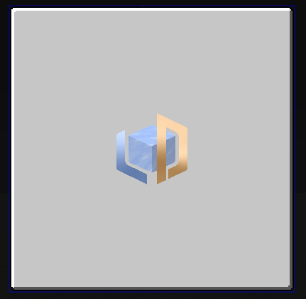

# ImageWidget



`ImageWidget` is used to display images, which provided by a [`GUI Texture`](../textures/index.md).

## Basic Properties

| Field           | Description                                        |
|-----------------|----------------------------------------------------|
| border          | The border width (range: -100 to 100)              |
| borderColor     | The color of the border                            |

---

## APIs

### setImage

Sets the image texture using a texture instance.

<DocTabs>
<DocTab title="Java / KubeJS">

``` java
imageWidget.setImage(new ResourceTexture("ldlib:textures/gui/icon.png"));
```

</DocTab>
</DocTabs>

---

### setImage

Sets the image texture using a supplier.

<DocTabs>
<DocTab title="Java">

``` java
imageWidget.setImage(() -> new ResourceTexture("ldlib:textures/gui/icon.png"));
```

</DocTab>
<DocTab title="KubeJS">

``` javascript
imageWidget.setImage(() => new ResourceTexture("ldlib:textures/gui/icon.png"));
```

</DocTab>
</DocTabs>

---

### getImage

Returns the current image texture.

<DocTabs>
<DocTab title="Java / KubeJS">

``` java
var texture = imageWidget.getImage();
```

</DocTab>
</DocTabs>

---

### setBorder


Sets the border width and color.

<DocTabs>
<DocTab title="Java / KubeJS">

``` java
imageWidget.setBorder(2, 0xFFFFFFFF); // ARGB
```

</DocTab>
</DocTabs>

---