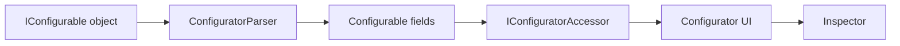

# Introduction

<VersionBadge version="2.1.5" label="Since" icon="tag" />

Configurable is LDLib2's annotation-based property editing system. It turns Java objects into editable UI, so editor tools can inspect a selected object, edit its fields, and record the change into history without hand-building every property panel.

The UI Editor uses this system for element properties, textures, renderers, style objects, editor settings, and many inspector panels. For a custom editor, Configurable is the usual way to expose "selected object properties" to the user.

::: tip IDE support
LDLib annotations are easier to read with the [LDLib Dev Tool](https://plugins.jetbrains.com/plugin/28032-ldlib-dev-tool) IDEA plugin. It adds highlighting, syntax checks, navigation, completion, and annotation support for LDLib2 projects. See [Java Integration](../java_integration.md).
:::

For example, `TestConfigurators` is just a normal data object with annotated fields and a few helper methods. The imports are omitted here, but the shape is the same as the test source:

<div class="ldlib-limited-code" markdown="1">

```java
@LDLRegister(name = "configurators", registry = "ldlib2:menu_test")
@NoArgsConstructor
public class TestConfigurators implements IConfigurable, IPersistedSerializable {
    @Configurable
    @ConfigNumber(range = {-5, 5})
    private float numberFloat = 0.0f;

    @Configurable
    @ConfigColor
    private int numberColor = -1;

    @Configurable
    private boolean booleanValue = false;

    @ConfigHeader("Header")
    @Configurable(tips = "Test tip 0")
    private String stringValue = "default";

    @Configurable
    private ResourceLocation resourceLocation = LDLib2.id("test");

    @Configurable
    private Direction enumValue = Direction.NORTH;

    @Configurable
    private Vector3f vector3fValue = new Vector3f(0, 0, 0);

    @Configurable
    private Vector3i vector3iValue = new Vector3i(0, 0, 0);

    @Configurable
    private Quaternionf quaternionfValue = new Quaternionf(0, 0, 0, 1);

    @Configurable
    private BlockPos blockPosValue = BlockPos.ZERO;

    @Configurable
    private AABB aabbValue = new AABB(0, 0, 0, 1, 1, 1);

    @Configurable
    @ConfigNumber(range = {0, 1}, type = ConfigNumber.Type.FLOAT)
    private Range rangeValue = Range.of(0, 1);

    @Configurable
    private TransformRef transformRef = new TransformRef();

    @ConfigHeader("Array Like")
    @Configurable
    private int[] intArray = new int[]{1, 2, 3};

    @Configurable
    private List<Boolean> booleanList = new ArrayList<>(List.of(true, false, true));

    @Configurable
    private Component componentValue = Component.translatable("ldlib.author");

    @Configurable(subConfigurable = true)
    private final TestToggleGroup toggleGroup = new TestToggleGroup();

    @Configurable
    @ConfigList(
            configuratorMethod = "buildTestGroupConfigurator",
            addDefaultMethod = "addDefaultTestGroup"
    )
    private final List<TestGroup> groupList = new ArrayList<>();

    @Configurable
    @ConfigSelector(candidate = {"A", "B", "C"})
    private String stringSelector = "A";

    @Configurable
    @ConfigSelector(
            candidate = {"north", "west", "east"},
            subConfiguratorBuilder = "subConfiguratorBuilder"
    )
    private Direction subConfiguratorSelector = Direction.NORTH;

    @Configurable
    @ConfigSearch(searchConfiguratorMethod = "createBlockSearchConfigurator")
    private Block blockSearch = Blocks.STONE;

    @Configurable
    private ItemStack item = new ItemStack(Items.STONE);

    @Configurable
    private FluidStack fluid = new FluidStack(Fluids.WATER, 1000);

    @Configurable
    @ConfigRL(ConfigRL.Type.ITEM_TAG_KEY)
    private ResourceLocation itemTagKey = ItemTags.AXES.location();

    @Configurable
    private EntityType<?> entityType = EntityType.PIG;

    @Override
    public ModularUI createUI(Player player) {
        var root = new ScrollerView();
        root.layout(layout -> {
            layout.width(250);
            layout.height(350);
        }).setId("root");

        var group = new ConfiguratorGroup("root");
        group.setCollapse(false);
        group.setTips("Test tip 0", "Test tip 1", "Test tip 2");
        buildConfigurator(group);

        return new ModularUI(UI.of(root.addScrollViewChild(group)));
    }

    private Configurator buildTestGroupConfigurator(
            Supplier<TestGroup> getter,
            Consumer<TestGroup> setter
    ) {
        var instance = getter.get();
        return instance != null ? instance.createDirectConfigurator() : new Configurator();
    }

    private TestGroup addDefaultTestGroup() {
        return new TestGroup();
    }

    private void subConfiguratorBuilder(Direction direction, ConfiguratorGroup group) {
        switch (direction) {
            case NORTH -> group.addConfigurator(new Configurator("NORTH"));
            case WEST -> {}
            case EAST -> group.addConfigurator(new Configurator("EAST"));
            default -> group.addConfigurator(new Configurator("DEFAULT"));
        }
    }

    private SearchComponentConfigurator.ISearchConfigurator<Block> createBlockSearchConfigurator() {
        return new SearchComponentConfigurator.ISearchConfigurator<>() {
            @Override
            public Block defaultValue() {
                return Blocks.STONE;
            }

            @Override
            public void search(String word, IResultHandler<Block> searchHandler) {
                var lowerWord = word.toLowerCase();
                for (var key : BuiltInRegistries.BLOCK.keySet()) {
                    if (key.toString().toLowerCase().contains(lowerWord)) {
                        searchHandler.acceptResult(BuiltInRegistries.BLOCK.get(key));
                    }
                }
            }

            @Override
            public String resultText(Block value) {
                return BuiltInRegistries.BLOCK.getKey(value).toString();
            }
        };
    }

    public static class TestToggleGroup implements IToggleConfigurable {
        @Getter
        @Setter
        private boolean isEnable = false;

        @Configurable
        @ConfigSelector(candidate = {"north", "west", "south", "east"})
        private Direction enumValue = Direction.NORTH;
    }

    public static class TestGroup implements IConfigurable {
        @Configurable
        @ConfigNumber(range = {0, 1}, type = ConfigNumber.Type.FLOAT)
        private Range rangeValue = Range.of(0, 1);

        @Configurable
        private Direction enumValue = Direction.NORTH;

        @Configurable
        private Vector3i vector3iValue = new Vector3i(0, 0, 0);
    }
}
```

</div>

After `buildConfigurator(group)` runs, LDLib2 turns those fields into an editable panel:

<figure>

<figcaption>
Generated configurators from &lt;code&gt;TestConfigurators&lt;/code&gt;.
</figcaption>
</figure>



## Chapter Map

Start with [Getting Start](./getting_start.md) if you only want to expose a few fields in an editor inspector.

[Annotations](./annotations.md) covers `@Configurable` and the helper annotations that tune names, tips, ranges, selectors, lists, search fields, setters, and resource locations.

[Accessors](./accessors.md) explains how LDLib2 chooses a UI control from a Java type, and how to register support for your own type.

[Configurator UI](./configurator-ui.md) covers the actual UI nodes created by accessors: `Configurator`, `ConfiguratorGroup`, array/list groups, events, and copy-paste behavior.

[Inspector and History](./inspector-and-history.md) explains how the editor `InspectorView` displays an `IConfigurable`, listens for changes, and records undo/redo actions.

[Examples](./examples.md) points to source files worth reading after you understand the flow.

## When To Use It

Use Configurable when your object has editor-facing properties: a shop entry, animation clip, node graph constant, renderer setting, UI element style, or any data model selected by a custom view.

If the property panel is mostly regular fields, annotate the fields and let `ConfiguratorParser` build the UI. If the panel needs custom layout, conditional rows, or custom controls, override `buildConfigurator(...)` and add configurators manually.

`@Configurable` fields are persisted by default. `PersistedParser` treats them like `@Persisted` fields unless `@Configurable(persisted = false)` is used. See [PersistedParser](../sync/PersistedParser.md) for the serialization side.
