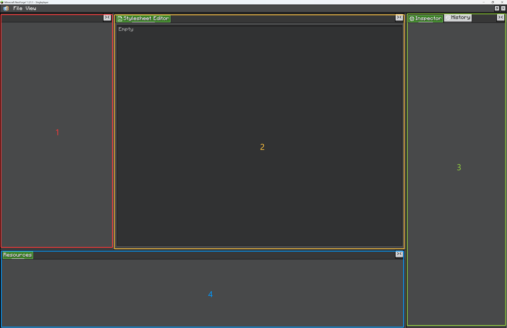

# Getting Start

This page builds the smallest useful editor: an editor window, one project type, one project, and default resources.

## Understand the Editor UI

An editor screen is usually made of three visible parts:

<figure>

<figcaption>
A typical editor screen: menu, views, and resources.
</figcaption>
</figure>

1. **Menu**  
   The top bar holds editor commands. `FileMenu` handles project actions such as New, Open, Save, Save As, Settings, and Exit. Custom editors can add more menu entries or new menu tabs.

2. **View area**  
   The main workspace is made of dockable views. A view can be a canvas, tree, code editor, graph editor, preview, inspector-like panel, or any custom UI. Views can be arranged inside split panels.

3. **Resource area**  
   The resource panel shows reusable assets exposed by the current project. Resources are grouped by resource type and loaded through providers such as built-in resources, file folders, or packs.

## Default View Areas

The editor workspace is split into several default areas. These areas are backed by `ViewContainer`s, which are tabbed containers used to display `View`s.

<figure>

<figcaption>
Default editor workspace areas.
</figcaption>
</figure>

1. **`leftWindow`**  
   A left-side area for hierarchy, tree, list, or browser-style views.

2. **`centerWindow`**  
   The main work area. Put your primary editor view here: canvas, graph, code editor, preview, or scene view.

3. **`rightWindow`**  
   A right-side area for inspector-like panels. The built-in `InspectorView` and `HistoryView` are placed here by default.

4. **`bottomWindow`**  
   A bottom area for asset/resource views. The built-in `ResourceView` is placed here by default.

Use `placeView(view, fallback)` to put a view into one of these areas:

```java
placeView(myView, () -> centerWindow.getLeftTop());
```

The fallback chooses the default `ViewContainer`. Users can still drag views between panels at runtime.

## Create the Editor

Create an `Editor` subclass for your tool. The editor owns the workspace, menus, built-in views, settings, and the currently loaded project.

```java
public class ShopEditor extends Editor {
    public static final ResourceLocation WINDOW_ID = LDLib2.id("shop_editor");

    public ShopEditor() {
        var view = new View("editor.view.shop");
        view.addChild(new Label().setText("Shop Editor"));
        placeView(view, () -> centerWindow.getLeftTop());
    }

    @Override
    protected Editor createNewEditorInstance() {
        return new ShopEditor();
    }

    @Override
    protected void initMenus() {
        super.initMenus();
        fileMenu.addProjectProvider(ShopProject.TYPE);
    }
}
```

`EditorWindow` is the shell that hosts the editor. It handles editor tabs, maximized/windowed mode, minimize restore, dragging, resizing, and GUI scale restore.

Use a fixed `WINDOW_ID` when the same editor should be restored after being minimized:

```java
EditorWindow.open(ShopEditor.WINDOW_ID, ShopEditor::new);
```

Use a direct window when you only need a temporary client screen:

```java
new EditorWindow(ShopEditor::new);
```

## Create a Project Type

A project type tells the File menu how to create, open, save, and identify your project files.

```java
public class ShopProject implements IProject {
    public static final ProjectType TYPE = ProjectType.of(
            Icons.FILE,
            "project.shop",
            ".shop.nbt",
            ShopProject::new
    );

    private final Resources resources = Resources.of(
            ShopEntryResource.INSTANCE
    );

    @Override
    public Resources getResources() {
        return resources;
    }

    @Override
    public ProjectType getProjectType() {
        return TYPE;
    }

    @Override
    public void initNewProject() {
        // Fill default project data here.
    }

    @Override
    public void onLoad(Editor editor) {
        // Add project-specific views here.
    }

    @Override
    public void onClosed(Editor editor) {
        // Remove project-specific views here.
    }

    @Override
    public CompoundTag serializeProject(HolderLookup.Provider provider) {
        return new CompoundTag();
    }

    @Override
    public void deserializeProject(HolderLookup.Provider provider, CompoundTag nbt) {
        // Restore project data here.
    }
}
```

When the project is loaded, `Editor` reads `project.getResources()` and loads those resources into the built-in resource view.

## Open as a Client Screen

For a pure client-only tool or a test screen, create a `ModularUI` directly from an `EditorWindow`:

```java
public ModularUI createUI(Player player) {
    var root = new EditorWindow(ShopEditor::new);
    return new ModularUI(UI.of(root))
            .shouldCloseOnEsc(false)
            .shouldCloseOnKeyInventory(false);
}
```

This is simple and useful for local editor tools that do not need container-menu behavior.

## Open Through a Menu

For a real player-opened editor, register a `PlayerUIMenuType` and open it from the server side.

```java
PlayerUIMenuType.register(ShopEditor.WINDOW_ID, ignored -> player -> {
    if (player.level().isClientSide) {
        return new ModularUI(UI.of(EditorWindow.open(ShopEditor.WINDOW_ID, ShopEditor::new)))
                .shouldCloseOnEsc(false)
                .shouldCloseOnKeyInventory(false);
    }
    return new ModularUI(UI.empty());
});
```

Open it later:

```java
PlayerUIMenuType.openUI(serverPlayer, ShopEditor.WINDOW_ID);
```

::: tip XEI drag-and-drop
If your editor should support XEI drag setting features, open it through a menu. A plain client-only screen is fine for quick tools, but menu-backed opening gives the editor the container context needed by those integrations.
:::
