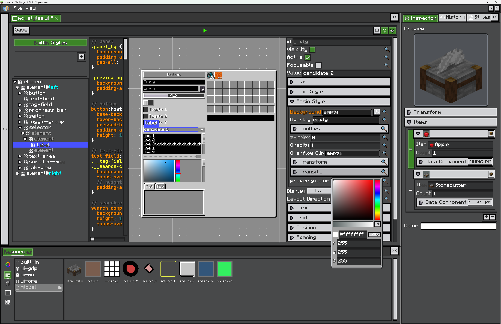
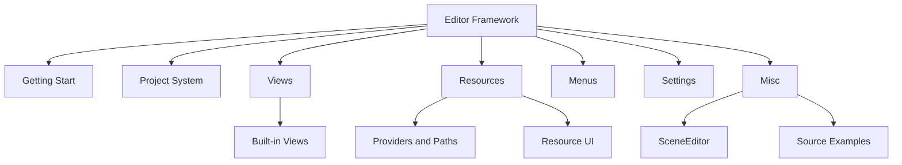

# Introduction

{{ version_badge("2.1.5", label="Since", icon="tag") }}

The Editor framework is LDLib2's foundation for building in-game editing software.

It is not a single editor. It is a set of reusable systems for building editors: split panels, dockable views, project files, resource browsers, inspectors, undo history, settings, and specialized widgets such as scene or graph editors.

The built-in UI Editor is built with this framework. It uses the same project system, resource panel, inspector, history view, and split workspace that you can use in your own editor.

<figure markdown="span">
    
    <figcaption>
    Built with the Editor framework: UI Editor
    </figcaption>
</figure>

<figure markdown="span">
    
    <figcaption>
    Built with the Editor framework: Node Graph Editor
    </figcaption>
</figure>

<figure markdown="span">
    
    <figcaption>
    Built with the Editor framework: Photon Editor
    </figcaption>
</figure>

You can use it for tools such as shop editors, visual scripting editors, UI builders, node graph editors, scene/object editors, resource managers, or any in-game tool that feels closer to Unity, Blender, Blockbench, or Adobe-style software than to a normal Minecraft screen.

## Modules

[Getting Start](./getting_start.md){ data-preview } creates a small editor project, explains the default view areas, and shows how to open it.

[Project System](./project-system.md){ data-preview } explains project types, project lifecycle, and file persistence.

[Views](./views/index.md){ data-preview } explains the view system. [Built-in Views](./views/builtin-views.md){ data-preview } covers Inspector and History.

[Resources](./resources/index.md){ data-preview } explains resource definitions. [Providers and Paths](./resources/providers.md){ data-preview } covers resource sources and typed paths. [Resource UI](./resources/resource-ui.md){ data-preview } covers the built-in resource browser.

[Menus](./menus.md){ data-preview } covers File/View menu extension.

[Settings](./settings.md){ data-preview } covers persistent editor settings.

[Misc](./misc/scene-editor.md){ data-preview } currently covers `SceneEditor` and [Source Examples](./misc/source-examples.md){ data-preview }.

## Learning References

The best way to learn the framework is to read real editors and compare their structure.

* `UIEditor`: a complete editor with project registration and default resources.
* `UIXmlProject` / `UIXmlProjectType`: a project that saves plain XML instead of default NBT.
* `GraphEditorView`: a complex view with dirty state, commands, save button, and navigation.
* `ResourceProviderContainer`: the main reference for resource panel interactions.

See [Source Examples](./misc/source-examples.md){ data-preview } for more details.

<figure markdown="span">
    
    <figcaption>
    Mod developed with the LDLib2 Editor framework: [ViScriptShop](https://github.com/zhenshiz/ViScriptShop)
    </figcaption>
</figure>
