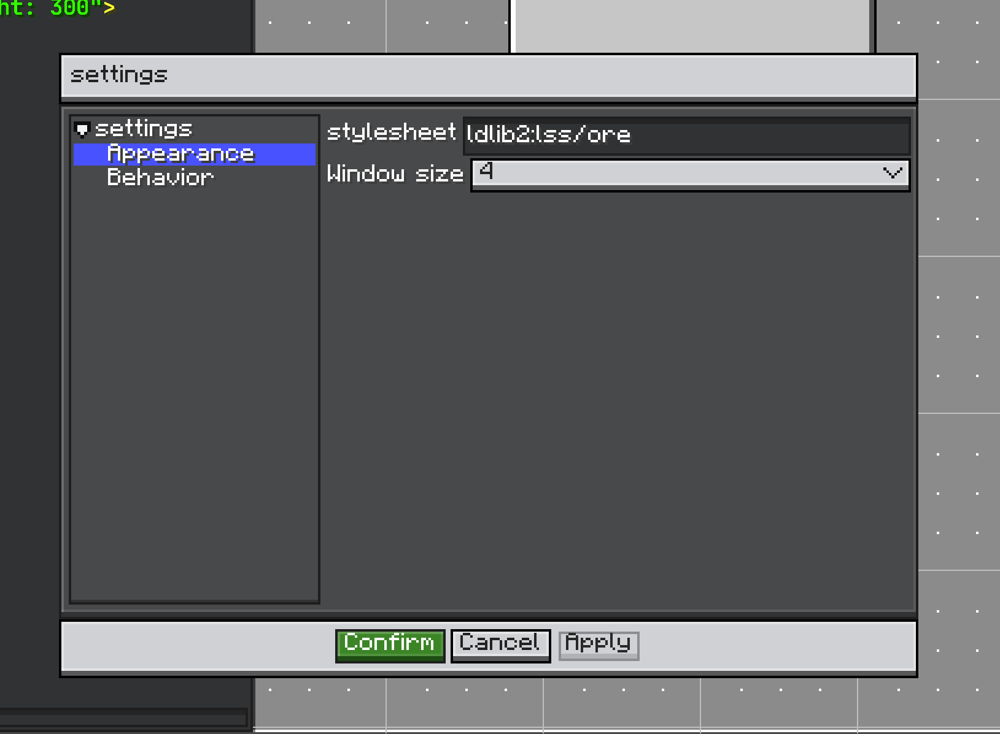

# Settings

Editor settings are persistent preferences for the editor UI and behavior.

<figure markdown="span">
    
    <figcaption>
    Editor settings panel: setting groups on the left, editable settings on the right.
    </figcaption>
</figure>

`Settings` is the unit of configuration:

```java
public interface Settings extends IConfigurable {
    ResourceLocation getId();
    String getPath();
    void onApply(Editor editor);
}
```

`EditorSettings` owns registered settings and codecs. It can:

* register and unregister settings,
* build the settings panel,
* load JSON from `config/ldlib2/editor.json`,
* save JSON,
* detect dirty state,
* apply changed settings,
* restore the last applied state.

Register defaults by overriding `initEditorSettings()`:

```java
@Override
protected void initEditorSettings() {
    super.initEditorSettings();
    editorSettings.registerSettings(new ShopSettings(), ShopSettings.CODEC);
}
```

## Built-in Settings

`AppearanceSettings` controls the editor stylesheet and GUI scale. `ViewMenu` uses it for window size options.

`BehaviorSettings` installs editor key handling:

* optional Esc close,
* Alt + S settings panel,
* Ctrl + Shift + S save as,
* Ctrl + S save.

## Custom Settings

```java
public class ShopSettings implements Settings {
    public static final ResourceLocation ID = LDLib2.id("shop");
    public static final Codec<ShopSettings> CODEC =
            PersistedParser.createCodec(ShopSettings::new);

    @Configurable
    private boolean previewItems = true;

    @Override
    public ResourceLocation getId() {
        return ID;
    }

    @Override
    public String getPath() {
        return "Shop";
    }

    @Override
    public void onApply(Editor editor) {
        // Read settings and update editor behavior.
    }
}
```

This page only shows the editor-side settings flow. Configurator details are covered separately.
