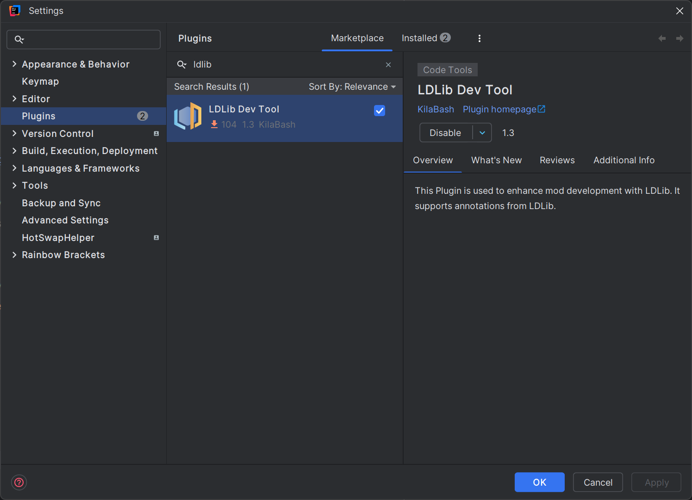

# Java Integration


## maven
You can find the latest version from our [maven](https://maven.firstdark.dev/#/snapshots/com/lowdragmc).

[](https://maven.firstdark.dev/#/snapshots/com/lowdragmc/ldlib2/ldlib2-neoforge-1.21.1)

[](https://maven.firstdark.dev/#/snapshots/com/lowdragmc/ldlib2/ldlib2-neoforge-26.1)

<VersionBadge version="2.2.1" label="Since" icon="tag" />
``` c
repositories {
    // LDLib2
    maven { url = "https://maven.firstdark.dev/snapshots" } 
}

dependencies {
    // for LDLib2 1.21
    implementation("com.lowdragmc.ldlib2:ldlib2-neoforge-${minecraft_version}:${ldlib2_version}:all")
    // for LDLib2 26.1+
    implementation("com.lowdragmc.ldlib2:ldlib2-neoforge-${minecraft_version}:${ldlib2_version}")
}
```

::: details before 2.2.1
``` c
repositories {
    // LDLib2
    maven { url = "https://maven.firstdark.dev/snapshots" } 
}

dependencies {
    // LDLib2
    implementation("com.lowdragmc.ldlib2:ldlib2-neoforge-${minecraft_version}:${ldlib2_version}:all") { transitive = false }
    compileOnly("org.appliedenergistics.yoga:yoga:1.0.0")   
}
```
:::

## IDEA Plugin - LDLib Dev Tool


If you are going to develop with LDLib2, we strongly recommend you to install our IDEA Plugin [LDLib Dev Tool](https://plugins.jetbrains.com/plugin/28032-ldlib-dev-tool). 
The plugin has:

- code highlight
- syntax check
- cdoe jumping
- auto complete
- others

which greatly assist you in utilizing features of LDLib2. Especially, all the annotations of LDLib2 have been supported for use.

## LDLibPlugin
You can create a LDLibPlugin by using `ILDLibPlugin` and `@LDLibPlugin`
```java
@LDLibPlugin
public class MyLDLibPlugin implements ILDLibPlugin {
    public void onLoad() {
        // do your register or setup for LDLib2 here.
    }
}
```