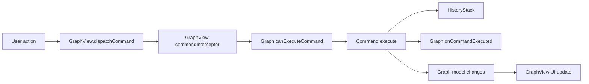

# Commands and Customization

NGT edits are command-driven. Use commands when a change should participate in undo, redo, model change tracking, and UI refresh.

## Command Flow



Use graph-level hooks for policy tied to the graph type:

```java
@Override
public boolean canExecuteCommand(IGraphCommand command) {
    return !(command instanceof GraphCommands.DeleteElementsCommand);
}
```

Use view-level interception for one editor instance:

```java
graphView.setCommandInterceptor(command -> allowEditMode);
```

Both must allow the command.

## Command Listeners

Use listeners for UI or tool behavior that should react after a command runs.

```java
graphView.addCommandListener((view, graphModel, command) -> {
    refreshCustomPanel();
});
```

Use `Graph.onCommandExecuted(...)` when the reaction belongs to the graph definition itself.

## Capabilities

Graph element models use capabilities to control user actions.

Common capabilities include:

| Capability | Effect |
| ---------- | ------ |
| `MOVABLE` | Can be moved on the canvas. |
| `DELETABLE` | Can be deleted. |
| `COPIABLE` | Can be copied and pasted. |
| `RENAMABLE` | Can be renamed. |
| `COLORABLE` | Can use color picker actions. |
| `COLLAPSIBLE` | Can collapse. |
| `RESIZABLE` | Can resize. |
| `NEEDS_CONTAINER` | Must live inside a container, used by block nodes. |

Prefer capabilities when a rule applies to one element. Prefer command vetoes when a rule depends on a whole command.

## Diagnostics

Use `GraphLogger` to show graph validation in the footer.

```java
@Override
public void onGraphChanged(GraphLogger logger) {
    if (hasMissingOutput()) {
        logger.error(Component.literal("Output is not connected"));
    }
}
```

Supported message kinds are info, warning, and error.

## Extra Elements

NGT includes more than nodes and wires:

* placemats for grouping visible graph areas,
* sticky notes for comments,
* wire portals for routing wires through named entry and exit portals,
* graph panels for docking tools,
* graph preview for custom preview UI.

These elements are normal graph models and participate in serialization and selection where supported by their capabilities.

## Custom UI

Common customization points:

| Target | Use |
| ------ | --- |
| `GraphResource.getGraphViewFactory()` | Use a custom `GraphView` subclass. |
| `GraphView.setLayers(...)` | Change canvas layer order. |
| `Node.getNodeIcon()` | Custom node icon. |
| `Node.getNodeWidth()` | Minimum node width. |
| `Node.hasNodePreview()` | Add node preview panel. |
| `IPortBuilder.withConnectorUI(...)` | Custom port connector visuals. |
| `IOptionBuilder.withConfigurable(...)` | Custom option editor. |
| `IInputPortBuilder.withConfigurable(...)` | Custom input constant editor. |
