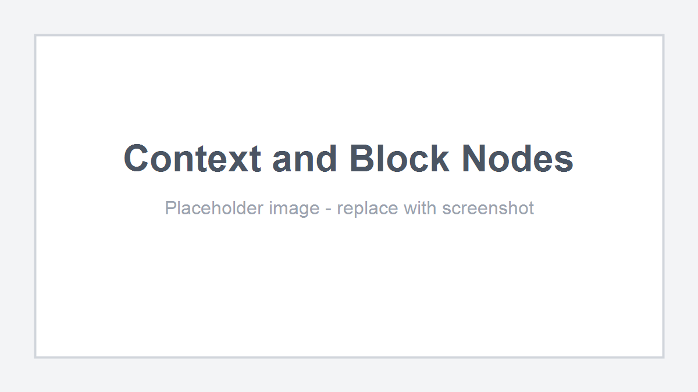

# Context and Block Nodes

Context nodes hold ordered block nodes.

Use them when one graph element needs global settings plus a configurable list of child operations. This is useful for shader stages, render passes, state definitions, rule groups, clauses, or any node that is better edited as a small stack of composable blocks than as many separate top-level nodes.

<figure markdown="span">
    
    <figcaption>
    A shader-style context node. The context represents a vertex shader stage, and its blocks configure parts of that stage.
    </figcaption>
</figure>

## Relationship

A context node is the container. It can have its own title, options, input ports, and output ports, and it owns a vertical block list.

A block node is a child node inside that list. It can also have options and ports, but it is not a top-level canvas node. It cannot be placed outside a compatible context.

Use the split like this:

| Part | Use |
| ---- | --- |
| Context node | Global settings, stage-level configuration, common inputs/outputs, and ownership of the block list. |
| Block node | One ordered operation, clause, state, or configurable piece inside the context. |

For example, a shader graph can use a `Vertex Shader` context for stage settings, then use blocks for vertex position, normal, UV, color, or other stage-specific outputs.

## Editing Blocks

The context UI contains an Add Block button when the context accepts at least one block type.

Adding a block opens the item library filtered to compatible blocks. Blocks are displayed inside the context node and can be reordered in the block list.

Blocks can still participate in graph wiring. Their ports are registered with the graph, so wires can connect to block ports even though the blocks are visually nested inside the context.

## Context Node

A context node extends `ContextNode`.

```java
@NodeAttribute(name = "vertex_shader", group = "shader", graphTypes = {ShaderGraph.class})
public class VertexShaderContext extends ContextNode {
    @Override
    public Component getDisplayName() {
        return Component.literal("Vertex Shader");
    }

    @Override
    public void onDefineOptions(IOptionDefinitionContext context) {
        context.addOption("target", ShaderTarget.class)
                .withDefaultValue(ShaderTarget.VERTEX);
    }

    @Override
    public void onDefinePorts(IPortDefinitionContext context) {
        context.addInputPort("time", Float.class).build();
        context.addOutputPort("position", Vec3.class).build();
    }
}
```

Context options are for settings that apply to the whole group. In a shader graph, this can be the shader stage, target, render state, or other stage-level data.

Context ports are for values shared by the grouped behavior or exposed from the group.

The context also exposes read-only block access:

```java
int count = contextNode.getBlockCount();
IBlockNode block = contextNode.getBlock(0);
List<? extends IBlockNode> blocks = contextNode.getBlocks();
```

## Block Node

A block node extends `BlockNode`.

```java
@UseWithContext({VertexShaderContext.class})
@NodeAttribute(name = "vertex_position", group = "shader/vertex", graphTypes = {ShaderGraph.class})
public class VertexPositionBlock extends BlockNode {
    @Override
    public Component getDisplayName() {
        return Component.literal("Position");
    }

    @Override
    public void onDefinePorts(IPortDefinitionContext context) {
        context.addInputPort("position", Vec3.class).build();
    }
}
```

Blocks behave like nodes for definition purposes: they can define options, ports, previews, and logic. The difference is ownership. A block belongs to one context, has an index inside that context, and is serialized as part of the context node.

```java
IContextNode parent = blockNode.getContextNode();
int index = blockNode.getIndex();
```

## Compatibility

The default context behavior discovers compatible blocks from `@UseWithContext`.

```java
@UseWithContext({MyContextNode.class})
public class MyBlockNode extends BlockNode {
}
```

Override `getSupportBlocks()` when compatibility should be explicit or dynamic:

```java
@Override
public List<Class<? extends BlockNode>> getSupportBlocks() {
    return List.of(MyBlockNode.class);
}
```

`ContextNode.acceptsBlock(...)` checks `@UseWithContext` first, then `getSupportBlocks()`.

## Ordering and Lifecycle

`ContextNodeModel` owns block insertion, removal, movement, serialization, and cascade delete.

Block mutations emit graph topology changes on the parent context. The block UI is rebuilt inside the context element instead of being created as a top-level canvas element.

This matters for copy, paste, serialization, and wires:

* blocks serialize as part of the context node,
* deleting a context deletes its blocks,
* removing a block disconnects its wires,
* block ports remain registered for wire lookup,
* graph-wide node iteration skips blocks.

Use normal nodes when the element should stand alone on the canvas. Use subgraphs when the group should be reusable as another graph. Use context/block nodes when the group is one conceptual node with ordered, editable parts.
