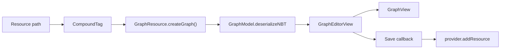

# Editor Resources

Use `GraphResource` when a graph should be edited as an LDLib2 Editor resource.

This is the recommended setup for user-authored graph assets. It gives the graph a resource-panel entry, a default NBT resource shape, a `GraphEditorView`, save handling, subgraph dive, and external subgraph resolution.

## Define a Graph Resource

```java
public class TestGraphResource extends GraphResource<TestGraph> {
    public static final TestGraphResource INSTANCE = new TestGraphResource();

    @Override
    public TestGraph createGraph() {
        return new TestGraph();
    }
}
```

`GraphResource` stores graph data as `CompoundTag`. A new resource is created from `createGraph().graphModel.serializeNBT(...)`.

## Add It to a Project

Expose the graph resource from your editor project:

```java
private final Resources resources = Resources.of(
        TestGraphResource.INSTANCE
);

@Override
public Resources getResources() {
    return resources;
}
```

The editor resource panel will use `GraphResourceProviderContainer`.

## Open and Save

`GraphResourceProviderContainer` opens a `GraphEditorView` for a graph resource.

The editor flow is:



`GraphEditorView` tracks dirty state by comparing serialized graph NBT against the saved snapshot.

The save button writes the current graph back through the callback supplied by the resource container.

`GraphEditorView` also owns subgraph navigation. When a user enters a subgraph, it creates another `GraphView` through the same factory, updates the breadcrumb, and preserves the root editor save workflow.

## Custom GraphView Factory

Override `getGraphViewFactory()` to use a custom `GraphView` subclass.

```java
@Override
public Supplier<? extends GraphView> getGraphViewFactory() {
    return MyGraphView::new;
}
```

The factory is used for the root graph view and for subgraph dive views.

## External Subgraph Resolution

When a graph is opened from a resource, the container installs an `IGraphReferenceResolver` on the graph model.

The resolver can:

* resolve a referenced graph resource path into a fresh `Graph`,
* save an external subgraph when editing through a dive-in view,
* identify the source `GraphResource`.

This is required for external subgraph nodes to rebuild their port shape from the referenced graph.

Graph resources can also be dragged from the resource panel onto an open graph canvas. `GraphView` imports the dropped resource as an external subgraph node that stores the resource path. See [Subgraphs](./subgraphs.md#import-external-subgraphs-from-resources).
