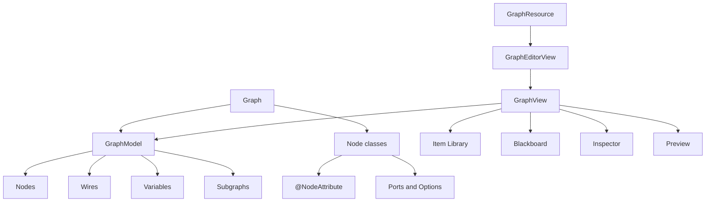

# Node Graph Toolkit

Node Graph Toolkit is LDLib2's framework for building in-game graph editors.

It provides the graph data model, node and port definitions, wires, variables, subgraphs, a blackboard, editor panels, undoable commands, and resource-backed graph editing.

<figure markdown="span">
    
    <figcaption>
    Node Graph Toolkit overview.
    </figcaption>
</figure>

## Main Pieces

`Graph` is the user-facing definition. It decides which node classes and types are supported.

`GraphModel` stores the actual graph state: nodes, ports, wires, variables, subgraphs, placemats, sticky notes, and change tracking.

`GraphEditorView` is the recommended editor UI entry. It wraps `GraphView`, adds save handling, dirty state, breadcrumbs, and subgraph dive support.

`GraphView` is the lower-level graph canvas and panel host. Use it directly only for embedded or test UIs that do not need the full editor workflow.

`GraphResource` integrates graph assets into the LDLib2 Editor resource system.

## Chapter Map

[Getting Started](./getting-started.md){ data-preview } builds a small graph and opens it through `GraphEditorView`.

[Graph Definition](./graph-definition.md){ data-preview } covers `Graph`, `GraphNodeRegistry`, supported nodes, supported types, and validation hooks.

[Nodes and Ports](./nodes-and-ports.md){ data-preview } covers `Node`, node options, input/output ports, orientation, and previews.

[Variables and Blackboard](./variables-and-blackboard.md){ data-preview } covers graph variables, blackboard usage, variable inspectors, and subgraph input/output ports.

[Type Handles](./type-handles.md){ data-preview } covers `TypeHandle`, built-in types, custom type registration, constants, default values, icons, colors, and configurators.

[GraphView](./graph-view.md){ data-preview } covers the low-level graph UI used by `GraphEditorView`.

[Editor Resources](./editor-resources.md){ data-preview } covers `GraphResource`, `GraphEditorView`, save callbacks, and resource-panel editing.

[Subgraphs](./subgraphs.md){ data-preview } covers local and external subgraphs.

[Context and Block Nodes](./context-and-block-nodes.md){ data-preview } covers context nodes that own ordered block lists.

[Commands and Customization](./commands-and-customization.md){ data-preview } covers command interception, capabilities, diagnostics, and UI customization points.

[Glossary](./glossary.md){ data-preview } defines the common model and UI terms.
