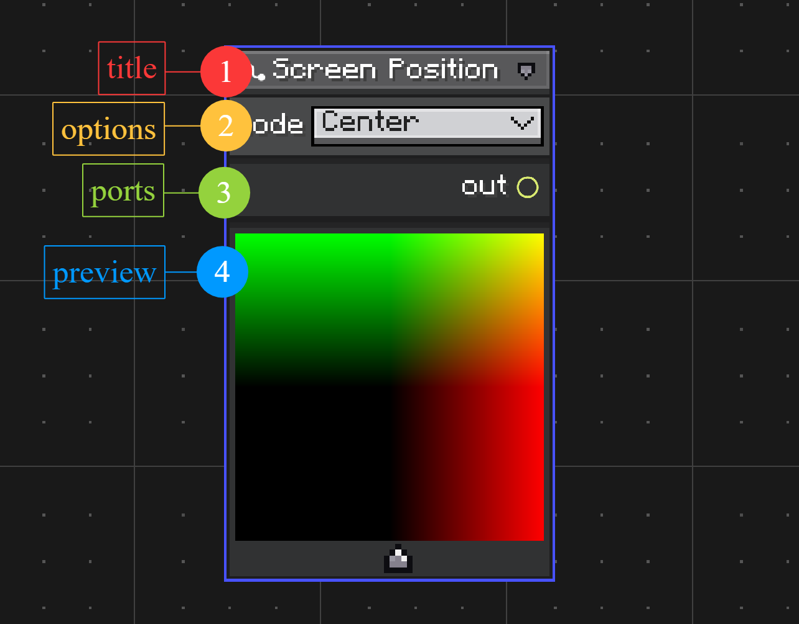
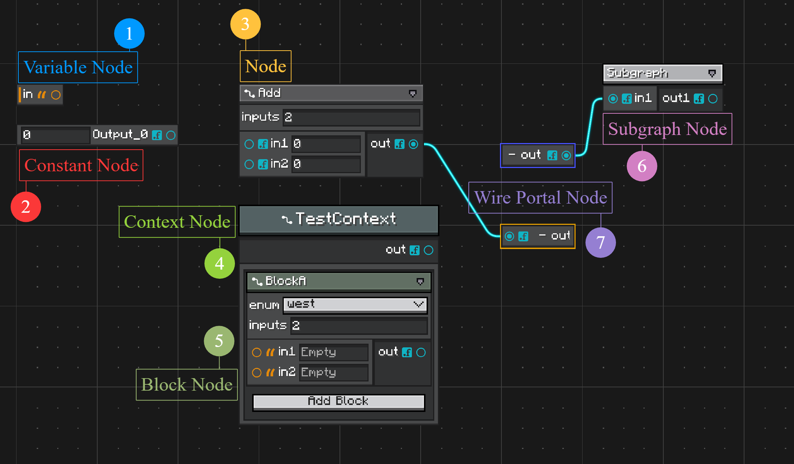

# Nodes and Ports

User-created graph nodes extend `Node`.

```java
public abstract class Node implements INode {
    public abstract Component getDisplayName();

    public void onDefineOptions(IOptionDefinitionContext context) {}

    public void onDefinePorts(IPortDefinitionContext context) {}
}
```

`onDefineOptions(...)` runs before `onDefinePorts(...)`. Use options when the node shape depends on editable values.

## Options

Options are node settings. They can appear in the node header or only in the inspector.

```java
@Override
public void onDefineOptions(IOptionDefinitionContext context) {
    context.addOption("inputs", Integer.class)
            .withDisplayName(Component.literal("Inputs"))
            .withDefaultValue(2);
}
```

Read options while defining ports:

```java
@Override
public void onDefinePorts(IPortDefinitionContext context) {
    getNodeOptionById("inputs").tryGetValue(Integer.class).ifSuccess(value -> {
        int count = (Integer) value;
        for (int i = 0; i < count; i++) {
            context.addInputPort("in" + (i + 1), Float.class);
        }
    });
    context.addOutputPort("out", Float.class);
}
```

Useful option builder methods:

| Method | Use |
| ------ | --- |
| `withDisplayName(Component)` | Label shown in UI. |
| `withTooltips(Tooltips)` | Tooltip text. |
| `withDefaultValue(Object)` | Initial value. |
| `showInInspectorOnly()` | Hide from node header. |
| `withConfigurable(ITypeConfigurable)` | Override editor UI for this option. |
| `withCodec(Codec<?>)` | Override serialization. |
| `withoutSerialization()` | Keep the type id, skip value persistence. |
| `withoutConfigurator()` | Store the value without exposing a UI row. |

## Ports

Ports define graph connectivity.

```java
@Override
public void onDefinePorts(IPortDefinitionContext context) {
    context.addInputPort("a", String.class).build();
    context.addInputPort("b", String.class).build();
    context.addOutputPort("out", String.class).build();
}
```

Input ports can hold embedded constants while unconnected. This is why input builders expose configurator and serialization controls.

```java
context.addInputPort("amount", Float.class)
        .withDefaultValue(1f)
        .build();
```

Useful port builder methods:

| Method | Use |
| ------ | --- |
| `withDisplayName(Component)` | Label shown beside the port. |
| `withConnectorUI(PortConnectorUI)` | Custom connector icon. |
| `withOrientation(PortOrientation)` | Horizontal side port or vertical top/bottom port. |
| `withDefaultValue(Object)` | Initial embedded constant. |
| `withConfigurable(ITypeConfigurable)` | Input only: override editor UI. |
| `withCodec(Codec<?>)` | Input only: override constant serialization. |
| `withoutSerialization()` | Input only: non-persistent value. |
| `withoutConfigurator()` | Input only: hide constant editor. |

## Vertical Ports

Vertical ports render above or below the node body.

```java
context.addInputPort("flow", TypeHandles.EXECUTION_FLOW)
        .withOrientation(PortOrientation.Vertical)
        .build();
```

Vertical input ports hide their inline configurator by default. Override `GraphModel.showVerticalPortConfigurator()` if a graph type needs visible vertical port values.

<figure markdown="span">
    
    <figcaption>
    Standard node layout.
    </figcaption>
</figure>

## Node Anatomy

The marked areas in the screenshot are:

1. **Title**  
   Shows the node display name from `getDisplayName()`. The title row also holds small node controls, such as collapse and preview controls when they are available.

2. **Options**  
   Shows node options defined in `onDefineOptions(...)`. Options are useful for values that change how the node is built, such as enum modes, counts, or configuration fields.

3. **Ports**  
   Shows input and output ports defined in `onDefinePorts(...)`. Ports are connection points for wires. Input ports can also show an embedded constant editor while they are not connected.

4. **Preview**  
   Shows the optional preview panel created by `hasNodePreview()` and `onBuildNodePreview(...)`. Use it for nodes that need visual feedback, such as color, texture, shader, or procedural result nodes.

<figure markdown="span">
    
    <figcaption>
    Common node types in Node Graph Toolkit.
    </figcaption>
</figure>

## Node Types

The graph editor uses several node model types. They share the same canvas and wire system, but they are created and used differently.

1. **Variable Node**  
   Reads from or writes to a graph variable. Create variables in the blackboard, then create variable nodes from that declaration. Variables are covered in [Variables and Blackboard](./variables-and-blackboard.md){ data-preview }.

2. **Constant Node**  
   Provides a fixed value as an output port. Use it when a value should be visible as a node instead of an inline input-port constant. Constant values use `TypeHandle` support and the same configurable system as port values. See [Type Handles](./type-handles.md){ data-preview }.

3. **Node**  
   A normal user-defined node created by extending `Node` and registering it with `@NodeAttribute`. Define its editable options in `onDefineOptions(...)` and its ports in `onDefinePorts(...)`.

4. **Context Node**  
   A node that owns an ordered list of child block nodes. Use it for structures such as sequences, branches, states, or grouped operations. See [Context and Block Nodes](./context-and-block-nodes.md){ data-preview }.

5. **Block Node**  
   A child node that lives inside a context node instead of directly on the graph canvas. Create block node classes by extending `BlockNode` and binding them to compatible contexts with `@UseWithContext`. See [Context and Block Nodes](./context-and-block-nodes.md){ data-preview }.

6. **Subgraph Node**  
   Represents another graph. Its ports are generated from the inner graph's exposed variables. Use it to reuse graph logic or edit nested graphs through `GraphEditorView`'s breadcrumb. See [Subgraphs](./subgraphs.md){ data-preview }.

7. **Wire Portal Node**  
   Routes a wire through a named portal pair, useful when long wires make a graph hard to read. Create portals from wire commands or graph context actions. See [Commands and Customization](./commands-and-customization.md){ data-preview }.

## Node Preview

A node can render a preview panel under its body.

```java
@Override
public boolean hasNodePreview() {
    return true;
}

@Override
public void onBuildNodePreview(NodePreviewContext context) {
    context.content().addChild(createPreviewElement());
}

@Override
public void onUpdateNodePreview(NodePreviewContext context) {
    context.rebuild();
}
```

Use previews for nodes that benefit from visual feedback, such as shader, texture, color, or procedural output nodes.
