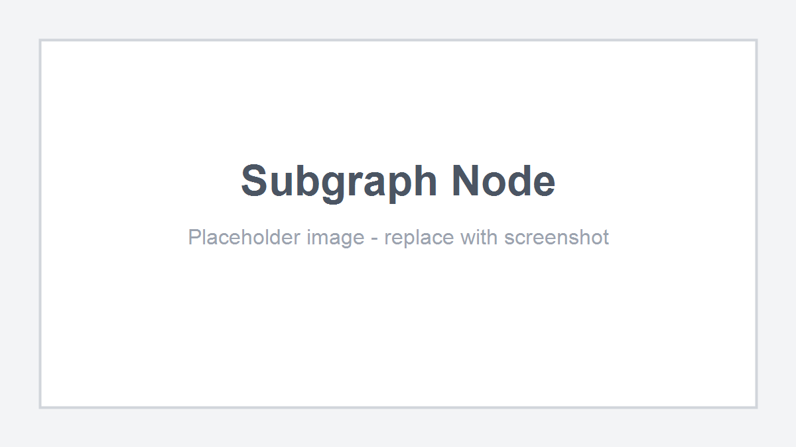

# Subgraphs

A subgraph node represents another graph inside the current graph.

The subgraph node's ports are generated from the inner graph's exposed variables.

<figure markdown="span">
    
    <figcaption>
    Placeholder: replace with a screenshot of a subgraph node and its inner graph.
    </figcaption>
</figure>

## Local Subgraphs

Local subgraphs are stored inline in the parent graph.

`SubgraphNodeModel.Kind.LOCAL` points to a graph in the parent model's `localSubGraphs` list by UID.

Use local subgraphs when the inner graph belongs only to the parent graph.

## External Subgraphs

External subgraphs point to an `IResourcePath`.

`SubgraphNodeModel.Kind.EXTERNAL` resolves through `GraphModel.getReferenceResolver()`.

Outside an editor context, the resolver can be `null`. In that case, the subgraph node reuses its cached port shape so existing wires can survive.

## Variable Ports

Subgraph node ports are generated from the inner graph's variables:

| Inner variable | Outer subgraph node |
| -------------- | ------------------- |
| `VariableKind.INPUT` | Input port. |
| `VariableKind.OUTPUT` | Output port. |

`READ_WRITE` variables create both directions with suffixed port ids.

Use this graph hook to limit exposed variable directions:

```java
@Override
public Set<VariableKind> getSupportedSubgraphVariableKinds() {
    return Set.of(VariableKind.INPUT, VariableKind.OUTPUT);
}
```

Return an empty set to disable variable-backed subgraph ports.

## Cross-Type Subgraphs

Same-type local subgraphs are allowed by default.

For cross-type subgraphs, the host graph must opt in:

```java
@Override
public boolean acceptsSubgraphGraph(Graph other) {
    return other instanceof MaterialGraph;
}
```

This applies to imported external references and foreign local subgraphs.

## External Save Broadcasts

`SubgraphRegistry` broadcasts when an external graph resource is saved.

Subscribers are:

* root `GraphModel` instances that need to redefine subgraph node ports,
* editor listeners that may reload or refresh open graph views.

`GraphEditorView` registers while a graph is loaded and unregisters when cleared.
