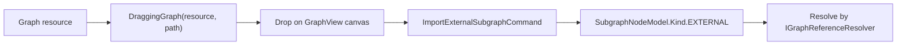

# Subgraphs

A subgraph node represents another graph inside the current graph.

The subgraph node's ports are generated from the inner graph's exposed variables.

<figure markdown="span">
    
    <figcaption>
    A subgraph node in the parent graph. Double-click the node to dive into its inner graph.
    </figcaption>
</figure>

Use `GraphEditorView` when users need to enter subgraphs. The double-click action is handled by the subgraph node element and asks the nearest `GraphEditorView` to open the inner graph as a new breadcrumb level.

<figure markdown="span">
    
    <figcaption>
    Inside a subgraph. Use exposed variables to define the subgraph node ports, and use the breadcrumb path to return to the parent graph.
    </figcaption>
</figure>

Inside the subgraph, ports are not edited directly on the subgraph node. Define variables in the blackboard, then set their flow direction in the inspector:

* `Input` creates an input port on the parent-facing subgraph node.
* `Output` creates an output port on the parent-facing subgraph node.
* `Input + Output` creates both ports.

See [Variables and Blackboard](./variables-and-blackboard.md#direction-and-subgraph-ports){ data-preview } for the exact direction mapping.

## Local Subgraphs

Local subgraphs are stored inline in the parent graph.

`SubgraphNodeModel.Kind.LOCAL` points to a graph in the parent model's `localSubGraphs` list by UID.

Use local subgraphs when the inner graph belongs only to the parent graph.

## External Subgraphs

External subgraphs point to an `IResourcePath`.

`SubgraphNodeModel.Kind.EXTERNAL` resolves through `GraphModel.getReferenceResolver()`.

Outside an editor context, the resolver can be `null`. In that case, the subgraph node reuses its cached port shape so existing wires can survive.

## Import External Subgraphs from Resources

For resource-backed graph assets, drag a graph resource from the editor resource panel onto the graph canvas.

The editor flow is:



`GraphResourceProviderContainer` keeps the dragged resource path, so the dropped node stores a stable external reference instead of copying the graph NBT.

The drop is rejected when:

* the graph does not allow subgraph creation,
* the resource is dropped outside the graph content area,
* the resource is the same path as the opened root graph,
* the resource belongs to another graph type and the host graph does not accept it through `acceptsSubgraphGraph(...)`.

After import, the node behaves like any other subgraph node. Double-click it to edit the referenced graph. When editing an external subgraph through a dive-in view, `GraphEditorView` saves that level back through the reference resolver and `SubgraphRegistry` refreshes other open graphs that reference the same resource.

## Variable Ports

Subgraph node ports are generated from the inner graph's variables:

| Inner variable | Outer subgraph node |
| -------------- | ------------------- |
| `VariableKind.INPUT` | Input port. |
| `VariableKind.OUTPUT` | Output port. |

`READ_WRITE` variables create both directions with suffixed port ids.

Use this graph hook to limit exposed variable directions:

```java
@Override
public Set<VariableKind> getSupportedSubgraphVariableKinds() {
    return Set.of(VariableKind.INPUT, VariableKind.OUTPUT);
}
```

Return an empty set to disable variable-backed subgraph ports.

## Cross-Type Subgraphs

Same-type local subgraphs are allowed by default.

For cross-type subgraphs, the host graph must opt in:

```java
@Override
public boolean acceptsSubgraphGraph(Graph other) {
    return other instanceof MaterialGraph;
}
```

This applies to imported external references and foreign local subgraphs.

## External Save Broadcasts

`SubgraphRegistry` broadcasts when an external graph resource is saved.

Subscribers are:

* root `GraphModel` instances that need to redefine subgraph node ports,
* editor listeners that may reload or refresh open graph views.

`GraphEditorView` registers while a graph is loaded and unregisters when cleared.
