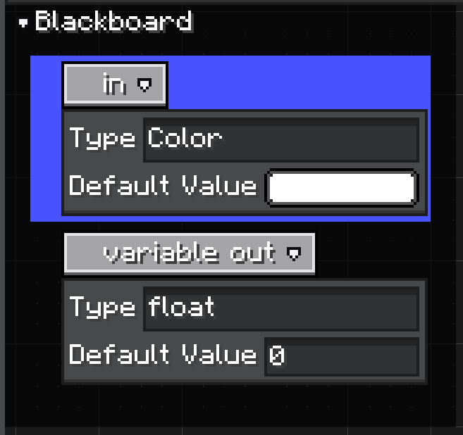
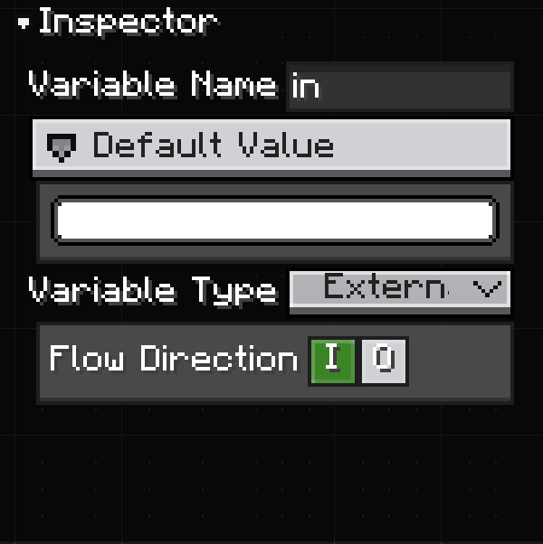

# Variables and Blackboard

Variables are graph-level declarations. They appear in the blackboard and can be referenced by variable nodes.

```java
graph.graphModel.createVariable("speed", Float.class, 1f, VariableKind.LOCAL);
```

Use variables when a value belongs to the whole graph instead of one node. Typical uses:

* share a value between multiple nodes,
* expose an input value when the graph is used as a subgraph,
* expose an output value from a subgraph back to the parent graph,
* define graph-level defaults edited by the inspector.

## Blackboard

The blackboard is the built-in UI for graph variables.

<figure>

<figcaption>
Blackboard variable declarations.
</figcaption>
</figure>

Each row is a variable declaration. The row shows the variable name and can expand to show its type and default value. Selecting a variable shows the full editable state in the inspector.

`GraphView` creates a `Blackboard` panel by default. `GraphEditorView` includes that graph view and is the recommended way to use it in an editor.

## Variable Inspector

<figure>

<figcaption>
Inspector for a selected graph variable.
</figcaption>
</figure>

The inspector is where variable declarations become useful editor data:

| Field | Use |
| ----- | --- |
| Variable Name | The declaration name. Variable nodes and subgraph ports use this name for display. |
| Default Value | The initial value stored in the declaration's `Constant`. |
| Variable Type | The variable scope/type mode shown by the editor. Exposed variables can be used outside the graph. |
| Flow Direction | Whether the variable is an input, output, both, or local-only value for subgraph usage. |

Changing the name, type, or direction updates variable nodes that reference the declaration. If the variable is exposed through a subgraph node, the subgraph node ports are redefined too.

## Direction and Subgraph Ports

Variable direction is stored as `ModifierFlags` and exposed through `VariableKind`.

```java
public enum VariableKind {
    LOCAL,
    INPUT,
    OUTPUT
}
```

| UI meaning | Source model | Subgraph node result |
| ---------- | ------------ | -------------------- |
| Local | `ModifierFlags.NONE` / `VariableKind.LOCAL` | No subgraph port. |
| Input | `ModifierFlags.READ` / `VariableKind.INPUT` | Input port on the subgraph node. |
| Output | `ModifierFlags.WRITE` / `VariableKind.OUTPUT` | Output port on the subgraph node. |
| Input + Output | `ModifierFlags.READ_WRITE` | Both input and output ports. |

An input variable means the parent graph can pass a value into the subgraph.

An output variable means the subgraph can publish a value back to the parent graph.

See [Subgraphs](./subgraphs.md) for how exposed variables become ports on `SubgraphNodeModel`.

## Create Variables in Code

Use `createVariable(...)` on the graph model:

```java
graph.graphModel.createVariable(
        "speed",
        Float.class,
        1f,
        VariableKind.INPUT
);
```

The type can also be provided as a `TypeHandle`:

```java
graph.graphModel.createVariable(
        "color",
        TypeHandles.COLOR,
        -1,
        VariableKind.OUTPUT
);
```

If `kind` is `null`, LDLib2 creates a local variable.

## Variable Nodes

Variable nodes are references to a variable declaration. They do not own the variable data.

Use them when node logic needs to read a graph variable or write to one. If the declaration type changes, variable node ports update from the declaration.

Variable nodes are separate from subgraph ports:

* variable nodes are used inside the graph,
* exposed variable declarations generate ports on the parent-facing subgraph node.

## Supported Variable Types

`Graph.getVariableSupportTypes()` controls which types appear in the blackboard and variable inspector.

```java
@Override
public @Nullable List<TypeHandle> getVariableSupportTypes() {
    return List.of(TypeHandles.FLOAT, TypeHandles.COLOR, TypeHandles.BOOL);
}
```

Return `null` to reuse `getSupportTypes()`.

See [Type Handles](./type-handles.md) for built-in handles, custom registration, icons, default values, and configurators.
