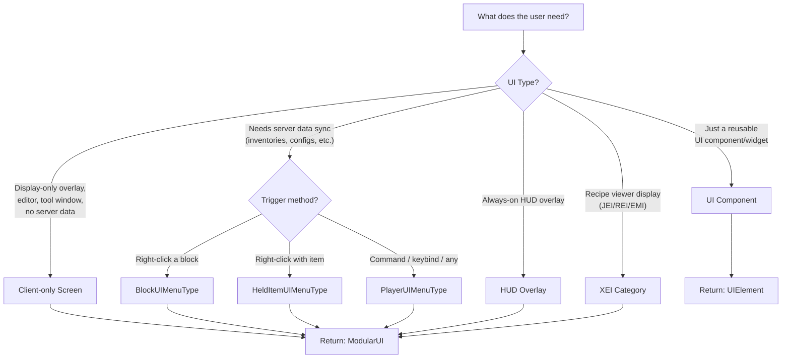

# LDLib2 UI — Agent Guide

> **This document is for AI agents.** It provides a structured workflow for building UIs with LDLib2.
> Follow the decision tree, use the minimal templates, then navigate to detailed pages as needed.

---

## Step 1: Determine Language / Format

Ask the user which format they want. This determines syntax for all subsequent code.

| Format | When to use | Language-specific doc |
|--------|------------|---------------------|
| **Kotlin** | Mod development with Kotlin DSL (most concise) | [kotlin_support.md](./kotlin_support.md) |
| **Java** | Mod development with Java | [getting_start.md](./getting_start.md) |
| **KubeJS** | Modpack scripting, no compilation needed | [kjs_support.md](./kjs_support.md) |
| **XML** | Declarative UI structure, visual editing | [xml.md](./xml.md) + [XSD schema](https://raw.githubusercontent.com/Low-Drag-MC/LDLib2/refs/heads/1.21/ldlib2-ui.xsd) |

> **XML note:** XML defines only the UI tree and styles. You still need Java/Kotlin/KubeJS code to load the XML, do data bindings, and wrap it in a `ModularUI`. Guide the agent to read the XSD file for available tags and attributes.

---

## Step 2: Determine UI Type



**Key rule:** If the UI needs `Player` data or server-side state, it **must** be a Menu-based UI with `ModularUI.of(ui, player)`.

---

## Step 3: Minimal Templates

Each template is a complete, runnable starting point. Pick the one matching Step 2.

### Client-only Screen

=== "Java"

    ```java
    ModularUI createUI() {
        var root = new UIElement().addClass("panel_bg").addChildren(
            new Label().setText("Hello")
        );
        return ModularUI.of(UI.of(root, StylesheetManager.INSTANCE.getStylesheetSafe(StylesheetManager.GDP)));
    }
    // Open: Minecraft.getInstance().setScreen(new ModularUIScreen(createUI(), Component.empty()));
    ```

=== "Kotlin"

    ```kotlin
    fun createUI(): ModularUI {
        val root = element({ cls = { +"panel_bg" } }) {
            label({ text("Hello") })
        }
        return ModularUI(UI.of(root, StylesheetManager.GDP))
    }
    // Open: Minecraft.getInstance().setScreen(ModularUIScreen(createUI(), Component.empty()))
    ```

=== "KubeJS"

    ```javascript
    // Client-only screen must be opened from client_scripts
    let root = new UIElement().addClass("panel_bg").addChildren(
        new Label().setText("Hello")
    );
    let mui = ModularUI.of(UI.of(root));
    // Open via client-side trigger
    ```

### Menu-based UI (Server-synced)

For Menu UIs, use the built-in factories. See [factory.md](./factory.md) for full details.

=== "Java (Block)"

    ```java
    public class MyBlock extends Block implements BlockUIMenuType.BlockUI {
        @Override
        public ModularUI createUI(BlockUIMenuType.BlockUIHolder holder) {
            var root = new UIElement().addClass("panel_bg").addChildren(
                new Label().setText("Block UI"),
                new InventorySlots()
            );
            return ModularUI.of(
                UI.of(root, StylesheetManager.INSTANCE.getStylesheetSafe(StylesheetManager.GDP)),
                holder.player
            );
        }
        // Open: BlockUIMenuType.openUI((ServerPlayer) player, pos);
    }
    ```

=== "Kotlin (Block)"

    ```kotlin
    class MyBlock : Block(...), BlockUIMenuType.BlockUI {
        override fun createUI(holder: BlockUIMenuType.BlockUIHolder): ModularUI {
            val root = element({ cls = { +"panel_bg" } }) {
                label({ text("Block UI") })
                inventorySlots()
            }
            return ModularUI(UI.of(root, StylesheetManager.GDP), holder.player)
        }
        // Open: BlockUIMenuType.openUI(player as ServerPlayer, pos)
    }
    ```

=== "KubeJS (Block)"

    ```javascript
    // startup_scripts/main.js — runs on both sides
    LDLib2UI.block("mymod:my_block_ui", event => {
        event.modularUI = ModularUI.of(UI.of(
            new UIElement().addClass("panel_bg").addChildren(
                new Label().setText("Block UI"),
                new InventorySlots()
            )
        ), event.player);
    });
    // server_scripts: LDLib2UIFactory.openBlockUI(event.player, event.block.pos, "mymod:my_block_ui");
    ```

> **Other triggers:** Replace `BlockUIMenuType` with `HeldItemUIMenuType` (item) or `PlayerUIMenuType` (arbitrary). See [factory.md](./factory.md).

### HUD Overlay

```java
// Client-side only. Register in RegisterGuiLayersEvent.
var muiCache = Suppliers.memoize(() -> ModularUI.of(UI.of(
    new UIElement().layout(l -> l.widthPercent(100).heightPercent(100).paddingAll(10))
)));
event.registerAboveAll(MyMod.id("my_hud"), (ModularHudLayer) muiCache::get);
```

See [hud.md](./hud.md) for details.

### XML-based UI

```xml
<?xml version="1.0" encoding="UTF-8" ?>
<ldlib2-ui xmlns:xsi="http://www.w3.org/2001/XMLSchema-instance"
           xsi:noNamespaceSchemaLocation="https://raw.githubusercontent.com/Low-Drag-MC/LDLib2/refs/heads/1.21/ldlib2-ui.xsd">
    <stylesheet location="ldlib2:lss/mc.lss"/>
    <root class="panel_bg">
        <label text="Hello from XML"/>
        <button text="Click me"/>
    </root>
</ldlib2-ui>
```

```java
// Load and use
var xml = XmlUtils.loadXml(ResourceLocation.parse("mymod:my_ui.xml"));
var ui = UI.of(xml);
// Query elements: ui.select("#my_id"), ui.select(".my_class > button")
return ModularUI.of(ui, player); // or ModularUI.of(ui) for client-only
```

> **For XML auto-completion and validation**, read the [XSD schema](https://raw.githubusercontent.com/Low-Drag-MC/LDLib2/refs/heads/1.21/ldlib2-ui.xsd) to know all available tags, attributes, and structure.

---

## Step 4: Data Binding Patterns

This is the most critical knowledge for producing correct UI code. There are 3 patterns:

### Pattern A: Client-only (no server sync)

Use `bindDataSource` / `bindObserver` or Kotlin's `dataSource` / `observer`. No network involved.

```java
// Consumer: display dynamic data
new Label().bindDataSource(SupplierDataSource.of(() -> Component.literal("Value: " + myVar)));
// Producer: react to user input
new TextField().bindObserver(value -> myVar = value);
```

### Pattern B: Bidirectional sync (Menu UI)

Use `DataBindingBuilder` + `.bind()`. Server getter/setter only — client side is automatic.

```java
new Switch().bind(DataBindingBuilder.bool(() -> serverBool, v -> serverBool = v).build());
new TextField().bind(DataBindingBuilder.string(() -> serverStr, v -> serverStr = v).build());
new ItemSlot().bind(itemHandler, 0); // inventory shorthand
new FluidSlot().bind(fluidTank, 0);  // fluid shorthand
```

Kotlin shorthand: `switch { bind(::serverBool) }`, `textField { bind(::serverStr) }`

### Pattern C: Server-to-client read-only

Use `S2C` variants. Client cannot modify the value.

```java
new Label().bind(DataBindingBuilder.componentS2C(() -> Component.literal(serverData)).build());
```

Kotlin: `label { bindS2C({ Component.literal(serverData) }) }`

> **For complex bindings** (custom types, RPCEvent, List sync, remote getter/setter): read [data_bindings.md](./preliminary/data_bindings.md).

---

## Step 5: Navigation Map

Use this table to find detailed documentation by need.

### Core Concepts

| Need | Read | Path |
|------|------|------|
| How ModularUI works | [ModularUI](./preliminary/modularui.md) | `docs/ldlib2/ui/preliminary/modularui.md` |
| Screen vs Menu | [Screen & Menu](./preliminary/screen_and_menu.md) | `docs/ldlib2/ui/preliminary/screen_and_menu.md` |
| UI Factories (Block/Item/Player) | [Factory](./factory.md) | `docs/ldlib2/ui/factory.md` |
| Layout (flexbox, grid, size, padding) | [Layout](./preliminary/layout.md) | `docs/ldlib2/ui/preliminary/layout.md` |
| Stylesheet / LSS | [Stylesheet](./preliminary/stylesheet.md) | `docs/ldlib2/ui/preliminary/stylesheet.md` |
| Events (mouse, keyboard, lifecycle) | [Events](./preliminary/event.md) | `docs/ldlib2/ui/preliminary/event.md` |
| Data Bindings & RPC | [Data Bindings](./preliminary/data_bindings.md) | `docs/ldlib2/ui/preliminary/data_bindings.md` |
| Style Animation | [Style Animation](./preliminary/style_animation.md) | `docs/ldlib2/ui/preliminary/style_animation.md` |
| HUD Overlays | [HUD](./hud.md) | `docs/ldlib2/ui/hud.md` |
| XEI (JEI/REI/EMI) | [XEI](./xei_support.md) | `docs/ldlib2/ui/xei_support.md` |
| XML UI | [XML](./xml.md) | `docs/ldlib2/ui/xml.md` |
| Kotlin DSL | [Kotlin](./kotlin_support.md) | `docs/ldlib2/ui/kotlin_support.md` |
| KubeJS bindings | [KubeJS](./kjs_support.md) | `docs/ldlib2/ui/kjs_support.md` |

### Components Quick Reference

| Component | Class | Key method | Doc |
|-----------|-------|-----------|-----|
| Base element | `UIElement` | `.layout()`, `.style()`, `.addClass()` | [element.md](./components/element.md) |
| Label | `Label` | `.setText()`, `.bind()` | [label.md](./components/label.md) |
| Button | `Button` | `.setText()`, `.setOnClick()`, `.setOnServerClick()` | [button.md](./components/button.md) |
| Text field | `TextField` | `.setText()`, `.bind()`, `.setNumbersOnlyInt()` | [text-field.md](./components/text-field.md) |
| Text area | `TextArea` | `.setText()`, `.bind()` | [text-area.md](./components/text-area.md) |
| Toggle | `Toggle` | `.setText()`, `.bind()` | [toggle.md](./components/toggle.md) |
| Switch | `Switch` | `.bind()` | [switch.md](./components/switch.md) |
| Selector | `Selector` | `.setCandidates()`, `.bind()` | [selector.md](./components/selector.md) |
| Progress bar | `ProgressBar` | `.setProgress()`, `.bind()`, `.label()` | [progress-bar.md](./components/progress-bar.md) |
| Scroller | `Scroller` / `Scroller.Horizontal` | `.bind()` | [scroller.md](./components/scroller.md) |
| Item slot | `ItemSlot` | `.bind(handler, slot)`, `.setItem()` | [item-slot.md](./components/item-slot.md) |
| Fluid slot | `FluidSlot` | `.bind(tank, slot)`, `.setFluid()` | [fluid-slot.md](./components/fluid-slot.md) |
| Inventory slots | `InventorySlots` | (auto player inventory) | [inventory-slots.md](./components/inventory-slots.md) |
| Tab / TabView | `Tab`, `TabView` | `.addTab()` | [tab.md](./components/tab.md), [tab-view.md](./components/tab-view.md) |
| Toggle group | `ToggleGroup` | `.addToggle()` | [toggle-group.md](./components/toggle-group.md) |
| Scroller view | `ScrollerView` | (scrollable container) | [scroller-view.md](./components/scroller-view.md) |
| Split view | `SplitView` | (resizable split) | [split-view.md](./components/split-view.md) |
| Color selector | `ColorSelector` | `.bind()` | [color-selector.md](./components/color-selector.md) |
| Tag field | `TagField` | `.bind()` | [tag-field.md](./components/tag-field.md) |
| Search | `SearchComponent` | `.bind()` | [search-component.md](./components/search-component.md) |
| Tree list | `TreeList` | — | [tree-list.md](./components/tree-list.md) |
| Scene (3D) | `Scene` | — | [scene.md](./components/scene.md) |
| Graph view | `GraphView` | — | [graph-view.md](./components/graph-view.md) |
| Code editor | `CodeEditor` | — | [code-editor.md](./components/code-editor.md) |
| Inspector | `Inspector` | — | [inspector.md](./components/inspector.md) |
| Template | `Template` | (load from XML) | [template.md](./components/template.md) |
| Bindable value | `BindableValue<T>` | `.bind()` (hidden sync helper) | [bindable-value.md](./components/bindable-value.md) |
| Rich text | `Text` | `.setText()` | [text.md](./components/text.md) |

### Textures Quick Reference

| Texture | Class | Doc |
|---------|-------|-----|
| Sprite (image) | `SpriteTexture` | [sprite.md](./textures/sprite.md) |
| Color rectangle | `ColorRectTexture` | [color-rect.md](./textures/color-rect.md) |
| Color border | `ColorBorderTexture` | [color-border.md](./textures/color-border.md) |
| SDF rectangle | `SDFRectTexture` | [sdf-rect.md](./textures/sdf-rect.md) |
| Resource rect | `RectTexture` | [rect.md](./textures/rect.md) |
| Item stack | `ItemStackTexture` | [item-stack.md](./textures/item-stack.md) |
| Fluid stack | `FluidStackTexture` | [fluid-stack.md](./textures/fluid-stack.md) |
| Text | `TextTexture` | [text.md](./textures/text.md) |
| Animation | `AnimationTexture` | [animation.md](./textures/animation.md) |
| Group | `GroupTexture` | [group.md](./textures/group.md) |
| Shader | `ShaderTexture` | [shader.md](./textures/shader.md) |
| UI Resource | `UIResourceTexture` | [ui-resource.md](./textures/ui-resource.md) |
| LSS texture syntax | — | [lss.md](./textures/lss.md) |

---

## Step 6: Pre-completion Checklist

Before returning code to the user, verify:

- [ ] **UI type matches need**: Client-only Screen has no `player` param; Menu UI has `player` param
- [ ] **Data bindings are correct**: Server data uses `DataBindingBuilder.xxx().build()` + `.bind()`; client-only data uses `bindDataSource`/`bindObserver`
- [ ] **Factory is registered**: Menu UIs need a factory registration (Block/Item/Player) or manual MenuType
- [ ] **KubeJS script placement**: `LDLib2UI.*` handlers must run on both sides — prefer `startup_scripts/`
- [ ] **XML files** are placed under `assets/<modid>/ui/` and loaded via `ResourceLocation`
- [ ] **Stylesheet applied**: Use `StylesheetManager.GDP`, `.MC`, or `.MODERN` for built-in themes, or provide custom LSS
- [ ] **Output format matches request**: Return `ModularUI` for full UIs, `UIElement` for reusable components
