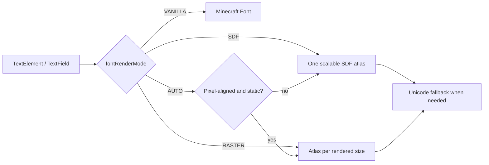

# Smooth Font Rendering

<VersionBadge version="2.2.31" label="Since" icon="tag" />

LDLib2 can render UI text through its own font pipeline. It chooses a renderer for each text draw, keeps glyphs in atlases, and falls back to Minecraft's Unicode font when a glyph is unavailable. `Label`, `TextField`, `TextArea`, and `CodeEditor` use this automatically.



<figure>

<figcaption>
The real-client font capture in <code>AUTO</code> mode. It checks Unicode fallback, text styles, several sizes, and both Minecraft and LDLib2 font families.
</figcaption>
</figure>

## Choose a mode

The client config entry is `font.fontRenderMode`; its default is `AUTO`.

| Mode | Best for | Trade-off |
| --- | --- | --- |
| `VANILLA` | Compatibility or comparing output with Minecraft | LDLib2 does not render text itself. |
| `SDF` | Scaled, rotated, skewed, or animated text | Smooth at every transform; small stationary text can look softer and corners round slightly. |
| `RASTER` | Stationary text aligned to the pixel grid | Sharpest output; every rendered size needs an atlas and is baked on first use. |
| `AUTO` | Most UI | Uses raster for small, pixel-aligned static text and SDF for transformed text. |

`/ldlib2_font mode` is a development-only command that cycles the mode and reinitializes the current screen. Change the normal client config for persistent settings.

::: warning

When Modern UI is installed, LDLib2 deliberately uses the fallback path instead of its own smooth renderer. Do not depend on an LDLib2-specific glyph atlas being present in that environment.

:::

## Config reference

| Config key | Default | Effect |
| --- | --- | --- |
| `fontAtlasSize` | `1024` | Glyph-atlas page edge in pixels. Larger pages reduce draw calls but use more GPU memory. |
| `sdfEmSize` | `48` | Resolution used to generate SDF glyphs. Raise it for sharper large corners at the cost of atlas space. |
| `sdfSharpness` | `1.0` | Anti-aliasing width multiplier. Above `1` is crisper; below `1` is softer. |
| `sdfWeight` | `0.0` | Stroke thickening in pixels. Raise slightly if small text is too thin. |
| `fontRasterMaxSize` | `256` | Largest device-pixel line height rendered as raster. Larger text uses SDF as a memory guard. |
| `fontRasterEvictSeconds` | `30` | Removes unused raster-size atlases after this period. |
| `textLayoutCache` | `true` | Reuses glyph layout for equivalent text between frames. Disable only when diagnosing stale text styling. |

## Custom drawing

Use `LDLibFonts.font()` when custom code needs the same font selection as LDLib2 UI. Use `LDLibFonts.drawText(...)` for `Component` or retained `FormattedCharSequence` values; it can reuse the layout cache.

```java
var font = LDLibFonts.font();
LDLibFonts.drawText(graphics, font, Component.literal("Status"), 8, 8, 0xFFFFFFFF, true);
```

The cache benefits most when the text is unchanged across frames. Keep dynamic counters and animated labels simple, and test with `textLayoutCache` disabled if a renderer change appears stale.
