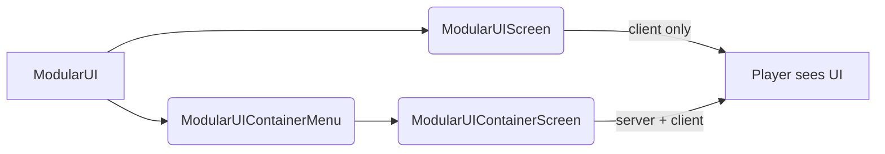
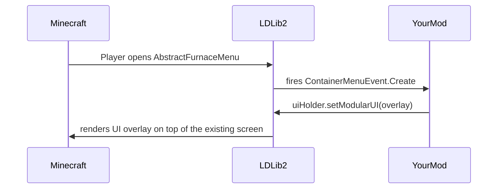

# Screen and Menu

{{ version_badge("2.2.1", label="Since", icon="tag") }}

A `ModularUI` is a UI tree — it describes *what* the UI looks like and *how* it behaves. To actually display it to the player, it must be hosted inside a Minecraft **Screen** or **Menu**.

LDLib2 provides two ready-made hosts and a set of factory helpers to make this as straightforward as possible.

---

## Overview



| Host | Sync | Use when |
| ---- | ---- | -------- |
| `ModularUIScreen` | Client-only | Display-only overlays, HUD widgets, or editor windows that need no server data |
| `ModularUIContainerMenu` + `ModularUIContainerScreen` | Server ↔ Client | Any UI that reads or writes server-side data (inventories, machine configs, etc.) |

---

## Client-only Screen

`ModularUIScreen` extends Minecraft's `Screen` directly. It is client-side only — no menu is opened on the server, and data bindings that require server sync will not work.

```java
// Build your UI
var modularUI = ModularUI.of(UI.of(root));

// Wrap it in a Screen and open it
Minecraft.getInstance().setScreen(new ModularUIScreen(modularUI, Component.literal("My UI")));
```

```kotlin
val modularUI = ModularUI(UI.of(root))
Minecraft.getInstance().setScreen(ModularUIScreen(modularUI, Component.literal("My UI")))
```

!!! note
    Use `ModularUIScreen` for client-side tools like editors, configuration overlays, or any UI that does not interact with the server.

---

## Server-synced Screen & Menu

For UIs that need to read or write server-side data, LDLib2 uses the standard Minecraft **Menu** (container) system. The server creates a `ModularUIContainerMenu`, and the client automatically opens the paired `ModularUIContainerScreen`.

### `IContainerUIHolder`

You describe your UI by implementing `IContainerUIHolder` on any server-side object (a block entity, an item, or a plain class):

```java
public class MyBlockEntity extends BlockEntity implements IContainerUIHolder {

    @Override
    public ModularUI createUI(Player player) {
        // Called on the server to build the UI
        return ModularUI.of(UI.of(
            element({ cls = { +"panel_bg" } }) {
                // ... your elements
            }
        ), player);
    }

    @Override
    public boolean isStillValid(Player player) {
        // Return false to close the UI, e.g. if the block was broken
        return !isRemoved();
    }
}
```

```kotlin
class MyBlockEntity : BlockEntity(...), IContainerUIHolder {

    override fun createUI(player: Player): ModularUI {
        // Called on the server to build the UI
        val root = element({ cls = { +"panel_bg" } }) {
            // ... your elements
        }
        return ModularUI(UI.of(root, StylesheetManager.MODERN), player)
    }

    override fun isStillValid(player: Player) = !isRemoved
}
```

!!! note ""
    `createUI` is called **on the server**. The resulting `ModularUI` is then synchronized to the client automatically. Any `DataBindingBuilder` bindings you set up inside it will be kept in sync between the two sides.

### Opening the menu

Once you have an `IContainerUIHolder`, open the menu using `player.openMenu(menuProvider)` with a standard `MenuProvider` that creates a `ModularUIContainerMenu`. The [built-in factories](#built-in-menu-factories) below handle all of this for you.

---

## Built-in Menu Factories

LDLib2 provides three pre-built factory helpers — `BlockUIMenuType`, `HeldItemUIMenuType`, and `PlayerUIMenuType` — for the most common use cases. KubeJS users can access all three through the `LDLib2UI` event group and `LDLib2UIFactory` bindings.

See [UI Factory](../factory.md){ data-preview } for full documentation, including KubeJS examples and script placement guidance.

---

## Injecting into Existing Menus

LDLib2 fires a `ContainerMenuEvent.Create` event **every time any `AbstractContainerMenu` is opened**, including menus from vanilla and other mods.
By handling this event you can attach a `ModularUI` overlay to any existing screen without modifying its original code.

```java
@SubscribeEvent
public static void onContainerMenuCreate(ContainerMenuEvent.Create event) throws Exception {
    if (event.menu instanceof SomeVanillaMenu menu
            && menu instanceof IModularUIHolderMenu uiHolder) {
        var player = event.player;

        // Build whatever UI you want and inject it
        var mui = ModularUI.of(UI.of(
            // your overlay root element
        ), player);
        uiHolder.setModularUI(mui);
    }
}
```

!!! warning ""
    The menu must implement `IModularUIHolderMenu` for injection to work.
    LDLib2 automatically mixins this interface onto all `AbstractContainerMenu` subclasses, so every menu in the game already supports it.

### Example: Augmenting the Vanilla Furnace

The following example (taken from `CommonListeners`) adds an overlay label showing remaining burn time to the standard furnace screen, and a priority text field to the AE2 drive screen — neither screen was modified directly:

```java
@SubscribeEvent
public static void onContainerMenuCreateEvent(ContainerMenuEvent.Create event) throws Exception {
    // Attach a burn-time label to any furnace screen
    if (event.menu instanceof AbstractFurnaceMenu furnaceMenu
            && furnaceMenu instanceof IModularUIHolderMenu uiHolderMenu) {
        var player = event.player;
        var field = AbstractFurnaceMenu.class.getDeclaredField("data");
        field.setAccessible(true);
        ContainerData data = (ContainerData) field.get(furnaceMenu);

        var mui = ModularUI.of(UI.of(
            new UIElement().layout(l -> l.width(176).height(166)).addChildren(
                new UIElement()
                    .addChildren(
                        new Label().bind(DataBindingBuilder.componentS2C(() ->
                            Component.literal("burn time: %.2f / %.2f s"
                                .formatted(data.get(2) / 20f, data.get(3) / 20f))
                        ).build())
                    )
                    .layout(l -> l.positionType(TaffyPosition.ABSOLUTE)
                                  .widthPercent(100).paddingAll(5).top(-15))
                    .style(s -> s.background(MCSprites.BORDER))
            )
        ), player);
        uiHolderMenu.setModularUI(mui);
    }
}
```



!!! tip
    This pattern is powerful for adding contextual information overlays, quick-access controls, or debugging panels to any screen in the game — including those from other mods.