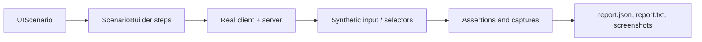

# UI Test Harness

<VersionBadge version="2.2.34" label="Since" icon="tag" />

The UI test harness runs scenarios in a real Minecraft client. It creates an isolated world, opens real UIs, sends input through the normal screen path, waits for server synchronization, records assertions, and writes screenshots and reports.



<figure>

<figcaption>
An actual <code>snake_hud</code> scenario capture. The harness opened this HUD in a real client, drove its controls, and wrote the image beside <code>report.txt</code> and <code>report.json</code>.
</figcaption>
</figure>

## 1. Register a scenario

Put scenarios in `src/main/java`, not `src/test`, and register them in the client-only scenario registry.

```java
@LDLRegisterClient(name = "furnace_ui", group = "mymod", registry = UIScenario.REGISTRY,
        environment = RegistrationEnvironment.DEV_ONLY)
public class FurnaceUiScenario implements UIScenario {
    private static final BlockPos POS = new BlockPos(8, 65, 8);

    @Override
    public void configure(ScenarioOptions options) {
        options.tags("machine").guiScale(3);
    }

    @Override
    public void define(ScenarioBuilder s) {
        s.clearArea(POS, 2)
         .setBlock(POS, MyBlocks.FURNACE.get())
         .awaitClientBlockEntity(POS)
         .useBlock(POS)
         .awaitScreen(ModularUIContainerScreen.class)
         .awaitModularUI()
         .click("#btn_start")
         .waitForTextContains("#status_label", "Burning")
         .screenshot("running")
         .teardown("close", ctx -> ctx.requirePlayer().closeContainer());
    }
}
```

`RegistrationEnvironment.DEV_ONLY` prevents scenarios from shipping in a production build.

## 2. Run it

```text
gradlew runClient -PldTest=furnace_ui
```

| Option | Meaning |
| --- | --- |
| `-PldTest=all` | Run every registered scenario. |
| `-PldTest=name1,name2` | Run selected scenarios. |
| `-PldTest=group:mymod` / `tag:fast` / `regex:.*_ui` | Select by group, tag, or name pattern. |
| `-PldTestKeepOpen` | Keep the client open for iteration. |
| `-PldTestGuiScale=3` | Set the run-wide GUI scale. |
| `-PldTestInputMode=REAL` | Use the physical OS cursor. This requires foreground focus. |

Reports are written to `build/ldlib2-uitest/`: `report.json`, `report.txt`, and `screenshots/`. `verifyUiTest` runs after `runClient`; a missing report is a failure.

For rapid iteration, keep the game open and run `/ldlib2_autotest list` or `/ldlib2_autotest run furnace_ui` in-game.

## 3. Build reliable steps

| Need | Builder methods |
| --- | --- |
| Prepare a world | `setBlock`, `clearArea`, `withBlockEntity`, `giveItem` |
| Open UI | `openScreen`, `openModularUI`, `useBlock`, `awaitScreen`, `awaitModularUI` |
| Interact | `hover`, `click`, `drag`, `scroll`, `typeInto`, `key` |
| Wait | `frames`, `ticks`, `waitUntil`, `waitForText`, `waitForSync` |
| Assert | `check`, `checkText`, `checkVisible`, `checkValue`, `checkBounds` |
| Capture | `screenshot`, `screenshotElement` |

Targets use LDLib2 CSS selectors: tag names, `.class`, `#id`, descendant and child selectors, plus state pseudo-classes. Prefer stable IDs such as `#btn_start`. Selector lists, attribute selectors and `:nth-child` are not supported; use `ctx.query(...)` for those cases.

::: tip Background runs

The default synthetic input mode does not take focus or move the physical mouse. Use `REAL` only to test OS-level behavior. The harness also blocks accidental OS input during an active run.

:::

::: warning Wait for state, not frames

One builder step runs per rendered frame, while game and data-bound UI state may update at 20 ticks per second. Prefer `waitForSync`, `waitForText`, or `waitUntil` to an arbitrary frame delay.

:::
