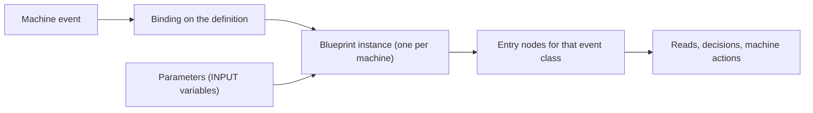

# Blueprint Concepts

<VersionBadge version="21.1.1" label="MBD2" icon="tag" />

Five things decide how a blueprint behaves: which events it hooks, which machine its nodes act on, which values the machine can set from outside, how it is attached, and what happens when it breaks.

## Entry nodes

A blueprint runs only from an **event entry node**. The `mbd2/event` group has one per machine event, and a graph with none is dead — MBD2 logs a warning when it loads:

> `Machine blueprint … has no event entry nodes — it will never run.`

Every event listed on the [KubeJS events page](../KubeJS/event.md) has an entry node, plus one KubeJS does not expose: **Use Item On** (right click with an item in hand). Two exceptions are worth remembering:

- **Fuel Burning Finish** never fires in `21.1.1`, for the same reason its KubeJS handler does not.
- `Client Tick`, `Custom Data Update` and `Custom Keyframe` run on the client, and `Build UI` runs on **both** sides — the machine UI is constructed on the server and on every client that opens it. Nodes that write server state are skipped on the client rather than throwing, and client-only nodes such as `Play State Sound` are skipped on the server; every action node declares which side it is for.

Several entry nodes for the same event are allowed and **all of them run**, in node-creation order, which is not shown on the canvas. MBD2 warns about it; do not let two of them write the same thing.

## The machine a node acts on

Machine nodes take an optional `machine` input. Leave it unwired and the node acts on **the blueprint's own machine** — which is what a blueprint almost always wants. Wire it to reach another one:

| Node | Gives you |
| --- | --- |
| **This Machine** | This blueprint's machine, as an explicit value |
| **Machine At Position** | The machine at a world position, if there is one |
| **As Multiblock Controller** / **As Multiblock Part** | The controller or part view of a machine |
| **Controller Machine** / **Part Machine** | Across a formed structure, in the `mbd2/multiblock` group |

The same rule applies to the `target` on an Info node: unwired means this machine, this machine's recipe logic, this machine's definition.

## Parameters

A blueprint exposes a parameter by declaring an **`INPUT` graph variable**. There is no separate manifest. The variable's name, type and default become one row in the machine's Inspector, so a pack author configures the blueprint without opening it.

<figure>

<figcaption>Each binding under **Machine Settings → Blueprints**. `Parameters` is generated from the graph's `INPUT` variables.</figcaption>
</figure>

Values are stored as serialised graph constants, so a `BlockPos` parameter and a `BlockPos` constant node round-trip through the same codec.

Variables of the other kinds are ordinary graph state: a `SetVar` is *this machine's* value for *this* blueprint and persists across ticks for as long as the machine is loaded. It is not saved with the block — use the machine's custom data for anything that must survive a chunk unload, as `heat_buildup` does.

## Reference or inline

| Mode | Stored | Use when |
| --- | --- | --- |
| Reference (default) | The resource path, e.g. `built-in(mbd2:overclock)` | The blueprint is shared across machines and edited in one place |
| **Embed a copy** | A snapshot of the whole graph | The machine must be self-contained — shipped to someone without your `.bp` file |

A referenced blueprint whose file is missing shows as `Missing: <path>` in the Inspector and does nothing. Built-ins always resolve, including on a dedicated server with no content directory.

## Ordering

A machine's blueprint list is an **ordered pipeline**. For a value-modifying event each blueprint reads what the previous one wrote, so binding `redstone_control`, then `overclock`, then `chance_output` is three bindings rather than one graph with switches. For a cancellable event, cancelling is a union: any blueprint may cancel and all of them still run.

Bind a blueprint that *rewrites the recipe* after anything that *chooses* it, and before anything that *reads the final duration*.

## Execution and failure

One executor per machine per blueprint, built on the first event it receives — not at definition load, because a graph's constants (items, blocks, fluids) only decode once registries are frozen.

A node that throws is caught. The blueprint logs once, with a stack trace, and is silent afterwards:

> `Machine blueprint … failed handling MachineTickEvent; further failures from this blueprint will not be logged`

A broken blueprint therefore costs you its behaviour, not the machine's tick or the server. Check `logs/latest.log` after any graph edit — the failure is reported once, at the first occurrence, and never again until the machine reloads.

## Building UI from a graph

Blueprints can hook `Build UI` and build machine UI with generic UI nodes — load a template, select by id, add a child, attach a stylesheet, set a class, listen for a click. The [Auto IO panel](./built-in.md#auto-io-panel) built-in is the worked example, and it is built entirely from general nodes: there is no "auto IO panel" node.

Two constraints shape any UI blueprint:

- **The client cannot read runtime values.** [Runtime values](../editor/runtime-values.md) are server-side and never synced. Publish what the panel must draw through the machine's `@DescSynced` custom data instead.
- **Merge, do not replace.** Another blueprint, or the editor-authored UI, may already own the screen. Load a shared container by a known id and append to it.
