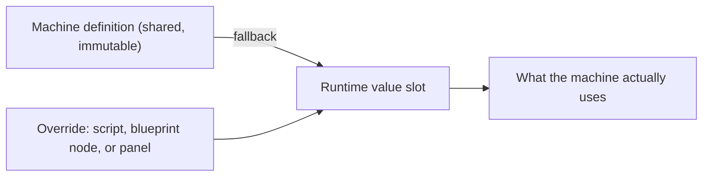

# Runtime Values

<VersionBadge version="21.1.1" label="Since" icon="tag" />

A machine definition is shared by every machine placed from it. A **runtime value** is a per-machine override of one setting on that definition: the tier of *this* crusher, the auto-IO sides of *this* tank, the transfer rate of *this* energy buffer.

Nothing has to be authored for a slot to exist. Every overridable setting already has one, and until something writes it the machine reads the definition exactly as before.



## What a slot holds

One leaf value — a boolean, a number, an enum, a string list, a box. Compound settings such as auto IO are a **bundle of leaf slots**, so overriding one side leaves the other five reading the definition.

| Behaviour | Detail |
| --- | --- |
| Fallback | No override → the definition's authored value |
| Persistence | Saved with the block entity |
| Sync | **Never sent between sides.** See below |
| Cost | Zero bandwidth; no per-tick dirty sweep |
| Unknown keys | A payload for a key this build does not know is kept verbatim and written back |

::: warning Server-side only
Overrides are never synchronised. A client that has written nothing reads the definition, which is the same answer it gave before this system existed. A client-side write is legitimate for a client-only value (a render toggle), but it lives only as long as that client block entity — a chunk reload drops it.

A UI that must **show** an override — the [auto IO panel](../blueprints/built-in.md#auto-io-panel) does — has to publish it through the machine's `@DescSynced` custom data instead.
:::

## Machine slots

| Key | Type | Overrides |
| --- | --- | --- |
| `machine_level` | int | Machine tier |
| `drop_machine_item` | bool | Whether breaking drops the machine item |
| `signal_connection.{front,back,left,right,top,bottom}` | bool | Redstone connection per side |
| `part.can_share` | bool | Whether several controllers may use this part |
| `recipe_logic.enable` | bool | Whether recipe logic runs |
| `recipe_logic.damping` | int | Progress lost per waiting tick |
| `recipe_logic.always_search` | bool | Re-search after every completed recipe |
| `recipe_logic.always_modify` | bool | Re-apply modifiers every cycle |
| `recipe_logic.consume_inputs_after_working` | bool | Defer input consumption to completion |
| `multiblock.show_ui_when_click_structure` | bool | Multiblock controllers only |

## Trait slots

Every trait carries the recipe-handler triple and, where the trait supports it, capability IO and auto IO:

| Key | Type | On |
| --- | --- | --- |
| `recipe_handler_io` | `IO` | Every recipe-capability trait |
| `distinct` | bool | " |
| `slot_names` | string list | " |
| `capability_io.{internal,front,back,left,right,top,bottom}` | `IO` | Traits exposing a block capability |
| `auto_io.{enable,front,back,left,right,top,bottom,interval}` | bool / `IO` / int | Traits doing auto IO |
| `auto_world_input.{enable,range,interval,speed}` | bool / box / int | Item and fluid traits |
| `auto_world_output.{enable,range,interval,speed}` | " | " |

Plus the trait's own settings:

| Trait | Keys |
| --- | --- |
| `item_slot` | `allow_same_items`, `slot_limit`, `filter.enable` |
| `fluid_tank` | `allow_same_fluids`, `capacity`, `filter.enable` |
| `forge_energy_storage` | `capacity`, `max_receive`, `max_extract` |
| `entity_handler` | `area` |
| `chemical_tank` | `allow_same_chemicals`, `capacity`, `filter.enable` |
| `ars_source_storage` | `capacity`, `max_receive`, `max_extract`, `expose_to_devices` |
| `ars_nearby_source` | `radius`, `scan_interval`, `particles` |
| `aura_handler` | `radius` |
| `ae2_me_interface`, `ae2_me_pattern_provider` | `item_capacity`, `fluid_capacity` |
| `pneumatic_pressure_air_handler` | `volume`, `max_pressure`, `danger_pressure`, `critical_pressure`, `connection_io.{...}` |

The authoritative list for any machine is `machine.runtimeValues.slots()`, or the **Runtime Value Names** blueprint node.

## From a blueprint

The `mbd2/machine` and `mbd2/machine/action` groups carry the whole surface — see the [node reference](../blueprints/nodes.md#mbd2-machine-and-mbd2-machine-action). Typed getters (`Get Runtime Int`, `Get Runtime IO`, …), typed setters (`Set Runtime Value (Number)`, …), `Is Runtime Value Overridden`, `Clear Runtime Value`, `Clear All Runtime Values`, plus the auto-IO and capability-IO shortcuts.

## From KubeJS

The string-addressed door, on the machine and on any trait:

```js
MBDMachineEvents.onPlaced('example:crusher', wrapper => {
  const machine = wrapper.event.machine

  machine.runtimeValues.set('machine_level', 3)
  console.info(`${machine.getMachineLevel()} (authored ${machine.runtimeValues.authored('machine_level')})`)

  const slots = machine.getTraitByName('item_slot')
  slots.runtimeValues.set('auto_io.enable', true)
  slots.runtimeValues.set('auto_io.front', 'OUT')      // enum by name
  slots.runtimeValues.set('auto_io.interval', 10)
})
```

Convenience methods exist for the common ones:

```js
machine.setMachineLevel(5)
machine.clearMachineLevel()

const slots = machine.getTraitByName('item_slot')
slots.setAutoIOEnabled(true)
slots.setAutoIOSide('up', IO.OUT)     // world direction, resolved against the machine's facing
slots.setAutoIOInterval(7)
slots.setCapabilityIOSide('north', IO.NONE)
slots.clearAutoIO()
```

And the typed field chain, if you already hold the slot:

```js
slots.autoIO.enable.setValue(false)
slots.autoIO.front.setValue(IO.OUT)
console.info(`${slots.autoIO.interval.get()} ${slots.autoIO.enable.isOverridden()}`)
```

::: warning Use `setValue`, not `set`, on a slot object
`RuntimeValue.set(T)` erases to `set(Object)` and Rhino will not bind a JS primitive to it — `slot.set(false)` throws `Can't find method ...set(boolean)`. `setValue(Object)` coerces and is the script-facing entry point. `runtimeValues.set(key, value)` is not generic and binds fine.
:::

## Coercion and errors

| Written | Slot type | Result |
| --- | --- | --- |
| `7` or `7.0` | int | `7` |
| `7.9` | int | throws — no silent truncation |
| `'OUT'` | `IO` | `IO.OUT`, matched case-insensitively |
| `'true'` / `'false'` | bool | as written; any other string throws |
| `'input,catalyst'` | string list | `["input", "catalyst"]`, trimmed, blanks dropped |
| `null` | anything | throws — use `clear()` |

An unknown key throws with the available keys in the message, so a typo is immediate rather than silent.

## Where they fit

| Requirement | Use |
| --- | --- |
| Every machine of this type behaves this way | The definition, in the editor |
| This placed machine behaves differently | A runtime value |
| The player configures it in game | A runtime value, written from a [blueprint UI](../blueprints/built-in.md#auto-io-panel) |
| The value must be visible on the client | Custom data, not a runtime value |
| The value must survive on a client | Neither — it is server state |
