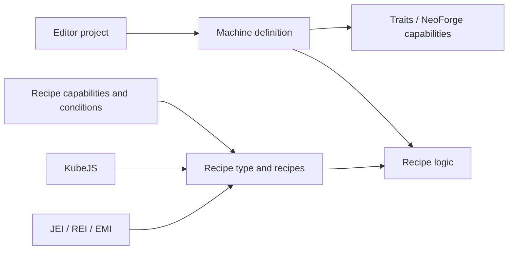

# Multiblocked2

<VersionBadge version="21.0.11" label="Documented version" icon="tag" />

Multiblocked2 (MBD2) lets pack authors create single-block machines and multiblocks in an in-game editor, then connect them to recipes, traits, and optional mod integrations.

<figure>

<figcaption>The MBD2 1.21.1 editor workspace with a new single-block machine project open.</figcaption>
</figure>

::: warning Version scope
This manual targets Minecraft `1.21.1` and MBD2 `21.0.11`. Older 1.20.1 examples may use APIs or integrations that are no longer exposed.
:::

## Choose a path

| Goal | Start here |
| --- | --- |
| Create a first machine without code | [Getting started](./getting-started.md) |
| Register a machine, recipe type, and recipe end to end | [Java and KubeJS tutorials](./tutorials/) |
| Configure a project in the editor | [Editor](./editor/) |
| Define recipes and requirements | [Recipe system](./recipes/) |
| Script recipes or machine behavior | [KubeJS](./KubeJS/) |
| Extend MBD2 from a mod | [Java extensions](./java/) |

## How the parts fit together

## Current integration status

| Integration | Status in 21.0.11 | What MBD2 exposes |
| --- | --- | --- |
| JEI, REI, EMI | Supported | Recipe and multiblock information displays |
| KubeJS | Supported | Recipe schemas, registry events, machine events |
| Mekanism | Supported | Chemical and heat traits, capabilities, heat condition |
| Create | Supported | Rotation capability, condition, kinetic trait |
| PneumaticCraft | Supported | Pressure/air and heat traits, capabilities, conditions |
| Nature's Aura | Supported | Aura trait and recipe capability |
| AE2 | Supported | ME Interface and Pattern Provider traits |
| GeckoLib, Jade | Supported | Animated machine rendering; machine information provider |
| Botania, GTCEu, Embers, Photon | Not publicly exposed | Source is present in places, but key registrations are disabled; do not build pack content on it |

Read [Integrations](./integrations/) before depending on an optional mod.
