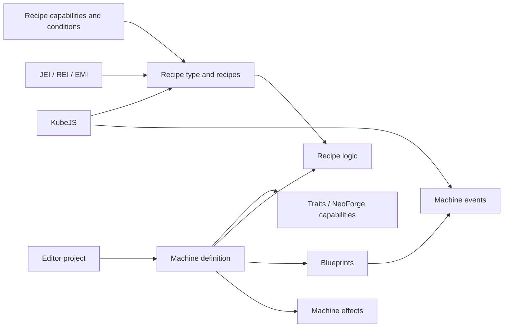

# Multiblocked2

<VersionBadge version="21.1.1" label="Documented version" icon="tag" />

Multiblocked2 (MBD2) lets pack authors create single-block machines and multiblocks in an in-game editor, then connect them to recipes, traits, node-graph behaviour, effects, and optional mod integrations.

<figure>

<figcaption>The MBD2 1.21.1 editor with a new single-block machine project open.</figcaption>
</figure>

::: warning Version scope
This manual targets Minecraft `1.21.1` and MBD2 `21.1.1`. Older 1.20.1 examples may use APIs or integrations that are no longer exposed.
:::

## Choose a path

| Goal | Start here |
| --- | --- |
| Create a first machine without code | [Getting started](./getting-started.md) |
| Register a machine, recipe type, and recipe end to end | [Tutorials](./tutorials/) |
| Configure a project in the editor | [Editor](./editor/) |
| Define recipes and requirements | [Recipe system](./recipes/) |
| Give a machine behaviour without scripting | [Blueprints](./blueprints/) |
| Script recipes or machine behaviour | [KubeJS](./KubeJS/) |
| Extend MBD2 from a mod | [Java extensions](./java/) |

## How the parts fit together

## Where behaviour can live

| Layer | Ships with | Best for |
| --- | --- | --- |
| Recipe conditions and modifiers | The recipe type | Eligibility, overclock, parallel |
| [Blueprints](./blueprints/) | The machine definition | Machine behaviour a pack should get for free |
| [Runtime values](./editor/runtime-values.md) | One placed machine | Per-machine configuration a player can change |
| [KubeJS](./KubeJS/) | The pack | Recipes, and behaviour a pack author overrides |
| [Java](./java/) | A mod | New storage models, content types, conditions |

## Integration status

| Integration | Adds |
| --- | --- |
| KubeJS | Recipe schemas, registry events, machine events, script renderers |
| JEI / REI / EMI | Recipe and multiblock displays |
| Mekanism | Chemical and heat traits, capabilities, temperature condition |
| Create | Rotation capability and condition, kinetic machine type |
| PneumaticCraft | Pressure/air and heat traits, capabilities, conditions |
| Nature's Aura | Aura trait and recipe capability |
| Ars Nouveau | Source buffer and nearby-jar traits, capability, condition |
| AE2 | ME Interface and Pattern Provider traits |
| GeckoLib | Animated machine rendering and a client keyframe event |
| Jade | Machine information provider |
| Photon | [Machine effects](./editor/machine-fx.md) |
| KilaGraph | [Blueprints](./blueprints/) |
| Botania, GTCEu, Embers | **Not exposed** — classes remain, registrations are commented out |

Read [Integrations](./integrations/) before depending on an optional mod.
