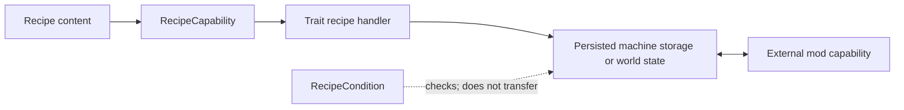

# Integrations

<VersionBadge version="21.1.1" label="MBD2" icon="tag" />

MBD2 integrations are a pipeline, not a single switch. A recipe capability describes content, a machine Trait supplies the runtime handler and optional external capability, and a condition only observes state. A working recipe normally needs the first two.

<figure>

<figcaption>The live Add Trait registry in a maximized editor; optional entries appear only when their mod is loaded.</figcaption>
</figure>

## Choose a page

| Support | Adds | Detailed guide |
| --- | --- | --- |
| Built in | Item, durability, fluid, FE, entity | [Built-in capabilities](./built-in-capabilities.md) |
| Mekanism | Chemicals and heat | [Mekanism](./mekanism.md) |
| Create | Rotation, RPM/stress content and condition | [Create](./create.md) |
| PneumaticCraft | Pressure/air and heat | [PneumaticCraft](./pneumaticcraft.md) |
| Nature's Aura | World aura transfer | [Nature's Aura](./natures-aura.md) |
| Ars Nouveau | Source buffer or nearby jars, plus a condition | [Ars Nouveau](./ars-nouveau.md) |
| Applied Energistics 2 | ME interface and pattern-provider bridges | [Applied Energistics 2](./applied-energistics-2.md) |

Photon adds no recipe capability — it supplies [machine effects](../editor/machine-fx.md). JEI/REI/EMI, Jade, GeckoLib, KubeJS, and dormant source paths remain in the [status matrix](./status.md).

## Universal setup checklist

1. Install the optional mod on client and server, then fully restart. Optional registry entries are discovered only when that mod ID is loaded.
2. In `/mbd2_editor`, add the documented Trait to the machine and configure its recipe IO, GUI IO, capability IO, filters, capacity, and auto IO independently.
3. Add the corresponding capability content to the recipe type/recipe. A capability row alone never creates a tank, inventory, or network node.
4. Give multiple handlers distinct names and bind recipe content with `slotName` when routing matters.
5. Test simulation and execution, input and output, per-tick content, persistence after restart, external pipes/networks, and the exact mod versions in the pack.

::: warning Source is not support
An integration class can remain in the repository while its annotation or bootstrap path is disabled. Only entries listed as active in the status matrix are tutorial-safe for 21.1.1.
:::
