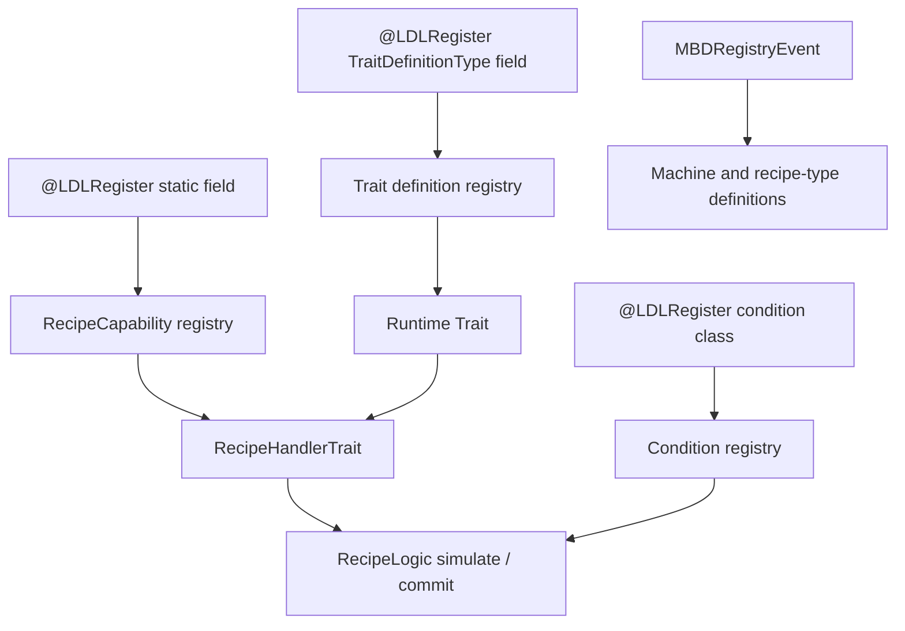

# Java Extensions

<VersionBadge version="21.0.11" label="MBD2" icon="tag" />

Use Java when a pack needs a new storage model, recipe content type, condition, machine subclass, or external-mod capability. MBD2 separates the editor-facing definition from the runtime object, and separates recipe content from the trait that handles it.

<figure>

<figcaption>Successfully registered Java TraitDefinitionTypes become editor entries; recipe capabilities and conditions follow their own registries.</figcaption>
</figure>

## Choose an extension point

| Requirement | Implement | Registration |
| --- | --- | --- |
| Load an editor-authored machine from your mod JAR | `MBDRegistryEvent.Machine` listener | NeoForge mod event bus |
| Add a new machine project/definition family | `MachineDefinitionType<T>` and definition subclass | `@LDLRegister` static field |
| Add storage, behavior, or a block capability | `TraitDefinition` + `Trait` | `TraitDefinitionType` static field |
| Add a recipe content domain | `RecipeCapability<T>` + `IContentSerializer<T>` | `RecipeCapability` static field |
| Let a trait consume/produce that content | `IRecipeHandlerTrait<T>` or `RecipeHandlerTrait<T>` | Returned by the runtime trait |
| Add an environmental/runtime prerequisite | `RecipeCondition` | Annotation on the condition class |

Start with [Gradle dependency setup](./dependency-setup.md), then read [registration and lifecycle](./registration-and-lifecycle.md). After the workspace resolves MBD2 and LDLib2, follow the complete [custom capability](./custom-recipe-capability.md), [custom trait](./custom-trait.md), and [custom condition](./custom-condition.md) tutorials.

::: warning API level
These pages describe MBD2 `21.0.11`. The registries are frozen after MBD2's construction work; do not register these objects from common setup, server start, or a KubeJS server script.
:::
