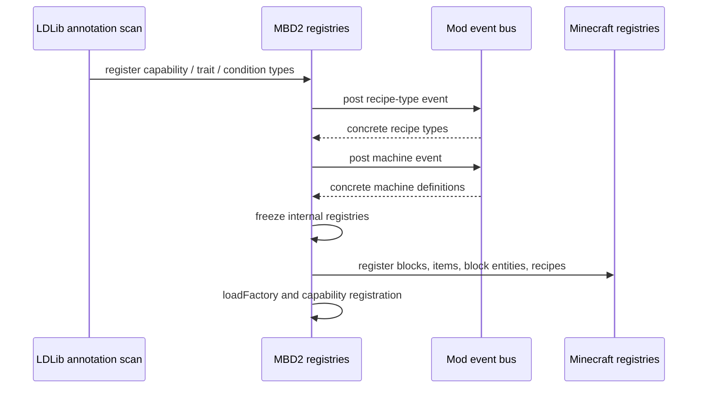

# Registration and Lifecycle

<VersionBadge version="21.1.1" label="MBD2" icon="tag" />

MBD2 has two registration paths. Annotation-scanned extension types are discovered before MBD2 freezes its internal registries. Concrete machine and recipe-type definitions are supplied through MBD2 mod-bus events.

## Annotation-scanned registries

| Registry ID | Annotation target | Registered value |
| --- | --- | --- |
| `mbd2:recipe_capability` | `public static` field | `RecipeCapability<?>` |
| `mbd2:trait_definition_type` | `public static` field | `TraitDefinitionType<?>` |
| `mbd2:recipe_condition` | concrete class with a no-argument constructor | `RecipeCondition` factory |
| `mbd2:machine_definition_type` | `public static` field | `MachineDefinitionType<?>` |

```java
@LDLRegister(
    name = "heat_units",
    registry = "mbd2:recipe_capability",
    modID = "examplemod" // optional soft-dependency guard
)
public static final HeatUnitsCapability CAP = new HeatUnitsCapability();
```

The registered `name` must be stable. Recipes, editor product files, codecs, and KubeJS lookups persist it. `modID` means “register only when this mod is loaded”; omit it for your own always-present extension.

## Definition events

Register listeners on the NeoForge mod event bus supplied to your `@Mod` constructor:

```java
@Mod(ExampleMod.MOD_ID)
public final class ExampleMod {
    public static final String MOD_ID = "examplemod";

    public ExampleMod(IEventBus modBus) {
        modBus.addListener(ExampleMod::registerMachines);
        modBus.addListener(ExampleMod::registerRecipeTypes);
    }

    private static void registerMachines(MBDRegistryEvent.Machine event) {
        event.registerFromResource(
            ExampleMod.class,
            "single_machine",
            "examplemod/mbd/machines/heat_press.sm"
        );
    }

    private static void registerRecipeTypes(MBDRegistryEvent.MBDRecipeType event) {
        event.registerFromResource(
            ExampleMod.class,
            "examplemod/mbd/recipe_types/heat_press.rt"
        );
    }
}
```

The corresponding resources are `/assets/examplemod/mbd/machines/heat_press.sm` and `/assets/examplemod/mbd/recipe_types/heat_press.rt` in the JAR. Use type `single_machine` for `.sm` products and `multiblock` for `.mb` products.

## Runtime order



Never cache a machine block or block-entity type before `MBDMachineDefinition#onRegistry` has run. Query it from the registered definition after registry construction.
