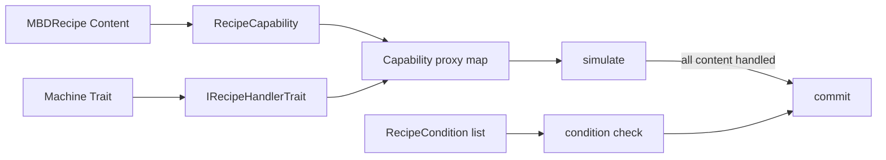

# Capabilities, Handlers, and Conditions

<VersionBadge version="21.1.1" label="MBD2" icon="tag" />

An MBD2 recipe is not a direct inventory operation. It contains typed `Content`; recipe logic routes each content list to compatible `IRecipeHandler` instances supplied by machine traits, then evaluates conditions against the machine and world.

## Three concepts that must match

| Concept | Owns | Example |
| --- | --- | --- |
| `RecipeCapability<T>` | Content type, codec, editor/XEI display, KubeJS conversion | `forge_energy` owns integer FE content |
| Trait/handler | Machine storage and actual input/output operation | Forge energy trait exposes `ForgeEnergyRecipeHandler` |
| `RecipeCondition` | A non-consuming predicate | Redstone signal is between 7 and 15 |

A registered capability without a handler can be authored but never completes. A trait whose recipe IO is `IN` cannot satisfy output content. A condition never substitutes for missing input.

Continue to the [capability reference](./capability-reference.md), [condition reference](./condition-reference.md), or [Java extension engine](../java/).
