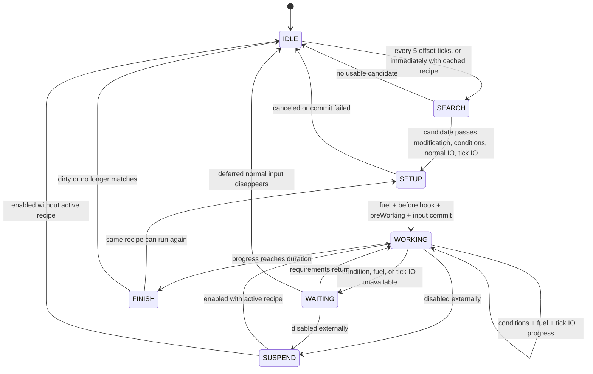
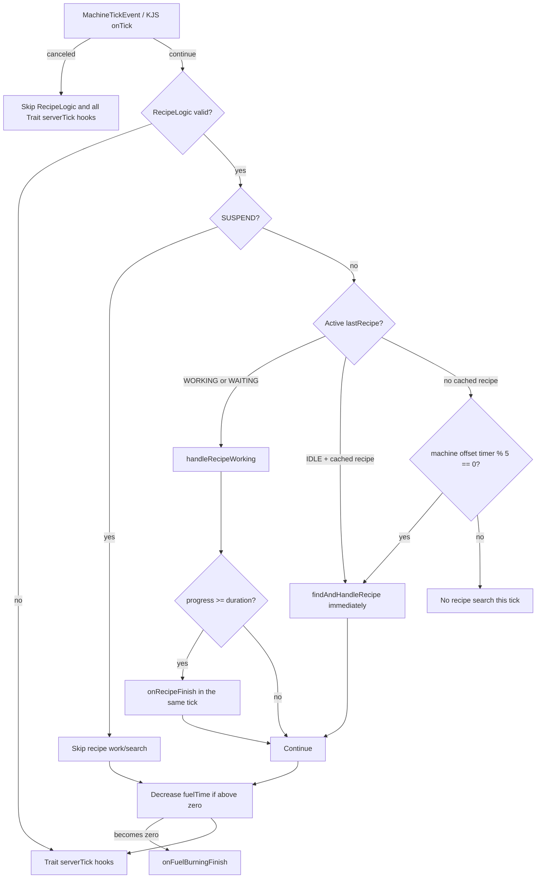

# RecipeLogic Lifecycle

<VersionBadge version="21.1.1" label="MBD2" icon="tag" />

`RecipeLogic` is the server-side scheduler for one machine. It decides when to search, validates and modifies candidates, simulates all handlers, acquires fuel, commits recipe IO, advances progress, waits or damps, completes outputs, and decides whether the same recipe can immediately run again.

This page follows the actual 21.1.1 call order. Event names such as `onBeforeRecipeWorking` are easy to misread; use the injection table rather than inferring timing from the name.

## State and persisted fields

- `status`

  Current scheduler state: `IDLE`, `WORKING`, `WAITING`, or `SUSPEND`.

- `lastRecipe`

  Effective recipe after machine modifiers. It may be a generated copy that does not exist in `RecipeManager`.

- `lastOriginRecipe`

  Stable ID of the original recipe before modification. MBD2 uses it to rebuild the effective recipe for another cycle.

- `progress` and `duration`

  Completed working ticks and the effective recipe duration.

- `consumeInputsAfterWorking`

  Whether non-per-tick inputs are deferred until the recipe completes.

- `fuelTime` and `fuelMaxTime`

  Remaining fuel ticks and the duration of the fuel recipe that supplied them.

- `lastFuelRecipe`

  Effective fuel recipe most recently consumed.

- `recipeDirty`

  Forces a new recipe search instead of immediately reusing `lastRecipe`.

- `lastFailedMatches`

  Search matches that failed modification, conditions, or final validation and are cached for retry.

These execution fields are persisted. Status, waiting reason, recipe progress, and fuel progress are also used by UI/Jade synchronization.



## One server tick

`MBDMachine#serverTick` first publishes the cancelable `MachineTickEvent`. If it is not canceled, `internalServerTick` runs `RecipeLogic#serverTick`, then every attached Trait's `serverTick`.



Fuel countdown is outside the `SUSPEND` check. Existing fuel therefore burns down while the machine is `WAITING`, `SUSPEND`, or even no longer processing a recipe.

## Search pipeline

### 1. Reuse before global search

`findAndHandleRecipe` first tries `lastRecipe` when `recipeDirty == false`. Reuse requires all three checks to succeed:

1. `lastRecipe.matchRecipe(machine)` — simulate non-per-tick inputs **and output capacity**.
2. `lastRecipe.matchTickRecipe(machine)` — simulate per-tick inputs and outputs.
3. `lastRecipe.checkConditions(logic)` — evaluate grouped/reversed conditions.

If reuse fails or the recipe is dirty, the cached effective recipe and origin ID are cleared before a new search.

### 2. Recipe-type search

`MBDRecipeType#searchRecipe`:

1. Returns no candidates if the holder has no recipe capability proxies.
2. Reads every recipe of that exact `MBDRecipeType` from `RecipeManager`.
3. Simulates normal IO through `matchRecipe`.
4. Simulates per-tick IO through `matchTickRecipe`.
5. Sorts candidates by ascending integer `priority`; lower numbers are tried first.

Conditions and machine modifiers are not applied by `searchRecipe`; they belong to candidate validation.

::: warning Async searching
When `ConfigHolder.ASYNC_RECIPE_SEARCHING` is enabled, the initial `searchRecipe` simulation runs on `Util.backgroundExecutor`. Custom handler simulation must be read-only and safe for this access pattern. When the future completes, the server thread rechecks candidates and performs all modification/setup commits.
:::

### 3. Candidate validation and modification

For every search match, `checkMatchedRecipeAvailable` performs:

```text
origin recipe
  -> onBeforeRecipeModify (mutable, cancelable)
  -> configured getModifiedRecipe / parallel calculation
  -> onAfterRecipeModify (mutable)
  -> conditions
  -> normal IO simulation
  -> per-tick IO simulation
  -> setupRecipe
```

Returning/carrying `null` rejects that candidate. A candidate that matched the initial search but fails modification, conditions, or later revalidation is stored in `lastFailedMatches`. While idle with no active recipe, MBD2 searches on the machine's staggered five-tick interval and retries this cached set.

`lastOriginRecipe` is assigned only after setup produced a `WORKING` recipe. It preserves the original `RecipeManager` ID even when `lastRecipe` is a modified copy.

## Handler simulation and routing

For each capability, MBD2 separates unlabelled contents from `slotName` groups. It tries handlers registered for the exact requested `IO`, then `IO.BOTH` handlers. Distinct handlers are tested first and must be able to satisfy the entire applicable group alone.

During matching, every handler receives `simulate = true`. A `null` return means all remaining content was handled; a non-null list is passed to later handlers. Commit repeats the route with `simulate = false`.

Output matching is capacity reservation by simulation, not an early output insertion. Custom handlers must return the same remainder for the same state in simulation and commit, or setup can consume only part of a recipe.

## Setup and normal input consumption

`setupRecipe(effectiveRecipe)` has this exact order:

1. `handleFuelRecipe()` acquires fuel if required.
2. `machine.beforeWorking(recipe)` publishes `onBeforeRecipeWorking`; cancellation aborts setup.
3. `recipe.preWorking(machine)` calls `preWorking` on all relevant input/output handlers.
4. Read the machine's `consumeInputsAfterWorking` setting.
5. If inputs are not deferred, commit non-per-tick `IO.IN`.
6. Store `lastRecipe`, set `status = WORKING`, reset `progress = 0`, and copy `duration`.

::: warning Fuel precedes the before-working event
Fuel can already be consumed before `onBeforeRecipeWorking` is canceled. Do not use that event as the normal eligibility check. Put eligibility in `RecipeCondition` or reject the candidate during recipe modification.
:::

With `consumeInputsAfterWorking = true`, setup does not consume normal inputs. Every working tick re-runs `matchRecipe`; if the required normal input or output capacity disappears, `interruptRecipe()` discards progress and returns to `IDLE`. The inputs are finally committed immediately before normal outputs.

## A working or waiting tick

`handleRecipeWorking` runs for both `WORKING` and `WAITING` recipes:

1. If normal inputs are deferred, re-simulate all normal IO; failure interrupts the recipe.
2. Recheck every `RecipeCondition`.
3. Ensure fuel exists, acquiring a new fuel recipe when `fuelTime == 0`.
4. Simulate per-tick IO.
5. On success, commit per-tick `IO.IN`, then per-tick `IO.OUT`.
6. Set status to `WORKING`.
7. Publish `onRecipeWorking` with the progress value **before increment**.
8. If not canceled, increment `progress` and `totalContinuousRunningTime`.
9. On a failed condition/fuel/tick check, set `WAITING`, store a reason, and publish `onRecipeWaiting`.
10. If waiting damping is enabled, reduce progress by `recipeDampingValue` without going below zero.
11. Run handler `postWorking` when leaving `WORKING`, or handler `preWorking` when entering/re-entering `WORKING`.

::: warning `onRecipeWorking` is after tick IO
Canceling `onRecipeWorking` interrupts the recipe, but that tick's per-tick inputs and outputs have already committed. Use a condition or handler simulation to prevent a tick from running; use this event for observation or a post-IO side effect.
:::

When a waiting recipe becomes available, it is retried every server tick. Its first successful resumed tick commits tick IO and increments progress; handler `preWorking` is called at the end of that transition.

## Fuel engine

Fuel is enabled on the main `MBDRecipeType` by its `FuelRecipeConfig`. The configured list contains other MBD recipe-type IDs used as fuel sources.

When fuel is required and `fuelTime == 0`, `handleFuelRecipe`:

1. Searches all recipes from the configured fuel recipe types.
2. Simulates their normal and per-tick IO and sorts by ascending priority.
3. Publishes `onFuelRecipeModify`; cancellation or `null` skips that fuel candidate.
4. Checks the modified fuel recipe's conditions.
5. Commits its **non-per-tick inputs**.
6. Sets `fuelMaxTime = fuelRecipe.duration`, `fuelTime = fuelMaxTime`, and stores `lastFuelRecipe`.

The current engine does not commit fuel-recipe outputs, and although tick contents participate in fuel matching, `handleFuelRecipe` only commits normal inputs. Author fuel recipes as duration plus normal inputs; do not rely on fuel outputs or per-tick fuel content.

At the end of every valid server tick, positive `fuelTime` decreases by one. When it becomes zero, `MBDMachine#onFuelBurningFinish(lastFuelRecipe)` posts a `MachineFuelBurningFinishEvent` to the NeoForge event bus. That call omits `postCustomEvent()`, so in `21.1.1` neither the KubeJS `onFuelBurningFinish` handler nor the blueprint **Fuel Burning Finish** entry node receives it — only Java `NeoForge.EVENT_BUS` listeners do. A new fuel recipe is not searched until a main recipe setup or working tick calls `handleFuelRecipe` again.

## Completion and the next execution

When `progress >= duration`, completion happens in the same server tick:

1. `machine.afterWorking()` publishes `onAfterRecipeWorking`.
2. If inputs were deferred, commit normal `IO.IN`, clear the flag, then publish `onConsumeInputsAfterWorking`.
3. Call handler `postWorking` for input and output handlers.
4. Commit non-per-tick `IO.OUT`.
5. Publish `onRecipeFinish`.
6. Decide whether the next run may reuse the recipe.

Step 1 happens **before** the outputs exist and step 5 **after**, which is the whole difference between them: a bonus product added in `onAfterRecipeWorking` lands in a slot the recipe's own output is about to want.

Next-run selection is controlled by two machine settings:

| Setting | Effect after completion |
| --- | --- |
| `alwaysSearchRecipe` | Marks the cached recipe dirty, forcing a fresh recipe-type search |
| `alwaysModifyRecipe` | Reloads `lastOriginRecipe` from `RecipeManager` and reapplies machine modifiers |

If the recipe is not dirty, MBD2 rechecks normal IO, tick IO, and conditions. A successful recipe calls `setupRecipe(lastRecipe)` immediately; its first progress tick occurs on the next server tick. Otherwise status becomes `IDLE`, progress/duration reset, and the next server tick either retries the cached recipe or begins a fresh search.

Use `alwaysSearchRecipe` when another recipe with better priority may become available after each cycle. Use `alwaysModifyRecipe` when overclock, parallel, tier, or machine data can change the effective recipe between cycles. Leaving both disabled is fastest when the same effective recipe should repeat.

## Machine event injection points

| Hook/event | Exact point | Cancellation/mutation | Recommended use |
| --- | --- | --- | --- |
| `onTick` | Before recipe logic and all Trait server ticks | Cancel skips both | Coarse machine pause/control; keep cheap |
| `onBeforeRecipeModify` | Before configured modifiers/parallel for each candidate | Mutable recipe; cancel rejects | Rare dynamic candidate rejection or preprocessing |
| `onAfterRecipeModify` | After modifiers/parallel, before conditions and final simulation | Mutable recipe | Observe/finalize an effective recipe; prefer configured modifiers for normal overclock |
| `onFuelRecipeModify` | After fuel match, before condition and fuel input commit | Mutable/cancelable | Adjust fuel duration/input or reject a fuel candidate |
| `onBeforeRecipeWorking` | After fuel acquisition, before handler `preWorking` and normal input commit | Cancel aborts setup | Setup notification; not eligibility or fuel-safe cancellation |
| `onRecipeStatusChanged` | Whenever `setStatus` changes state | Read `oldStatus`/`newStatus` | Animation, sound, telemetry; do not infer from the logic's not-yet-assigned field |
| `onRecipeWorking` | After successful condition/fuel checks and per-tick IO commit, before progress increment | Cancel interrupts | Observe completed tick IO or trigger a post-IO effect |
| `onRecipeWaiting` | After status/reason becomes waiting | Observation | UI, diagnostics, throttled feedback |
| `onAfterRecipeWorking` | Completion before deferred inputs/outputs, and also interruption | Observation | Cleanup paired with setup; distinguish finish from interrupt if outputs matter |
| `onConsumeInputsAfterWorking` | Deferred inputs were just committed at completion | Observation | Only fires when the machine defers inputs |
| `onRecipeFinish` | After the outputs have been produced | Observation | "A craft completed" — bonus products, counters, sounds |
| `onFuelBurningFinish` | Fuel counter reaches zero at end of server tick | Observation | **Java `NeoForge.EVENT_BUS` listeners only** — not delivered to KubeJS or blueprints in 21.1.1 |

Every row above except `onFuelBurningFinish` reaches both KubeJS and [blueprints](../blueprints/). If you need a reliable "fuel ran out" signal today, poll `machine.recipeLogic.fuelTime` or react to the `WAITING` status instead.

## Where behavior belongs

| Requirement | Preferred extension point |
| --- | --- |
| World/machine eligibility | `RecipeCondition` |
| Consume or produce a resource | `IRecipeHandlerTrait` simulate/commit |
| Overclock, parallel, duration/content transformation | Recipe modifiers / `getModifiedRecipe` |
| Reserve/release external transaction state | Handler `preWorking` / `postWorking` |
| Visual state and telemetry | Status and waiting events |
| One-off post-tick behavior | `onRecipeWorking`, remembering tick IO already committed |
| Something that happens once a craft is done | `onRecipeFinish` |
| Per-machine configuration | [Runtime values](../editor/runtime-values.md) |

Do not move resource accounting into generic events. Conditions can be evaluated repeatedly, searches can be asynchronous, and working events may happen after IO; the handler contract is the only layer designed for simulation followed by authoritative commit.
