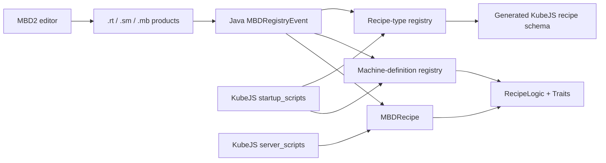

# End-to-End Registration Tutorials

<VersionBadge version="21.0.11" label="MBD2" icon="tag" />

These tutorials connect registration phase, authored definition, recipe creation, restart/reload behavior, and runtime verification. Follow one path from beginning to end before combining APIs.

<figure>

<figcaption>Every tutorial ultimately produces a registered definition that opens and behaves like this editor-authored machine.</figcaption>
</figure>

## Pick a tutorial

| Goal | Tutorial |
| --- | --- |
| Ship definitions and built-in recipes inside a Java mod | [Java: machine, recipe type, and recipe](./java-end-to-end.md) |
| Learn the exact KubeJS startup/server split | [KubeJS: registry and recipe scripts](./kubejs-end-to-end.md) |
| Build a complete editor machine but keep pack recipes scriptable | [Editor + Java + KubeJS hybrid](./hybrid-editor-kubejs.md) |

::: warning KubeJS-only boundary
KubeJS can create base `single`/`multiblock` definitions, but 21.0.11 does not expose a supported complete machine-authoring API for states, renderers, Traits, UI, recipe logic, or multiblock patterns. A KubeJS-created shell proves registration; an operational processing machine should come from the editor or Java.
:::
