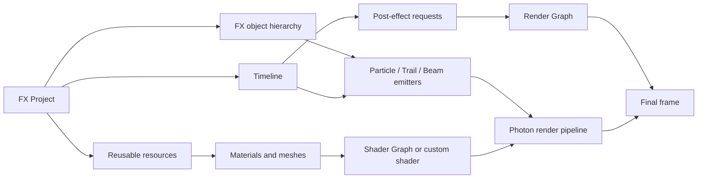

# Photon2

<VersionBadge version="2.0.0" label="Since" icon="tag" />

Photon is an in-game real-time VFX toolkit for Minecraft. It combines particle emitters, trails, beams, a non-linear Timeline, Shader Graph materials, and graph-based post-processing in one editor.

<figure>

<figcaption>
The maximized Photon editor running the real tornado project. Hierarchy, Scene, Inspector, Resources, and Timeline stay visible together.
</figcaption>
</figure>

## Photon 2.2 Showcase

<iframe width="100%" height="420" src="https://www.youtube.com/embed/jr800pFgZBw" title="Photon 2.2 showcase" frameborder="0" allow="accelerometer; autoplay; clipboard-write; encrypted-media; gyroscope; picture-in-picture; web-share" allowfullscreen></iframe>

The 2.2 release expands Photon from a particle editor into a complete VFX pipeline: Timeline sequencing, Shader Graph materials, Fullscreen Shader Graphs, Render Graph post effects, custom GPU data, force fields, mesh particles, and distributable FX Packs.

## Classic Introduction Video

The original video remains available. It focuses on the foundational particle workflow and complements the 2.2 showcase above; its interface and feature coverage reflect the earlier release.

<iframe width="100%" height="420" src="https://www.youtube.com/embed/1fXFaWheYvc?si=veqThF1redsFnSHm" title="Photon classic introduction video" frameborder="0" allow="accelerometer; autoplay; clipboard-write; encrypted-media; gyroscope; picture-in-picture; web-share" referrerpolicy="strict-origin-when-cross-origin" allowfullscreen></iframe>

## Choose a Path

| Goal | Start here |
| --- | --- |
| Create a first effect in the editor | [Getting Started](./getting-started.md) |
| Learn particle emitters and modules | [Particle System](./particle-system/) |
| Sequence effects and properties | [Timeline](./timeline/) |
| Build materials and GPU effects | [Shaders and GPU](./shaders-and-gpu/) |
| Create fullscreen effects | [Post Processing](./post-processing/) |
| Load and control effects from a mod | [Java API](./java-api/) |

## How the Parts Fit Together

An exported `.fx` stores the authored object tree and Timeline. At runtime, `FX#createRuntime()` creates an independent playable instance. The runtime emits its objects into the client particle engine and submits active post-process clips once per frame.

## Main Features

- **Particle authoring:** particle, trail, beam, and AraTrail emitters with curves, gradients, collision, sub-emitters, UV animation, custom renderers, and simulation spaces.
- **Timeline:** animation, activation, control, speed, signal, audio, group, and post-process tracks.
- **Shader Graph:** visual vertex and fragment shaders with scene inputs, particle inputs, reusable functions, and live previews.
- **GPU data:** per-emitter custom streams readable from Shader Graph or GLSL.
- **Post-processing:** fullscreen passes composed in a Render Graph, including weighted blending, priorities, custom textures, mask groups, and custom depth.
- **Distribution:** plain `.fx` exports and self-contained `.fxpack` resource packs.
- **Java integration:** built-in block/entity executors or direct control through `FXRuntime`.

## Requirements

- Minecraft `1.21.1`
- NeoForge `21.1+`
- A compatible Photon `2.2.x` and LDLib2 version
- A client environment: Photon rendering and playback APIs are client-side

::: warning Photon 1.x
This manual documents Photon 2.x. The original Photon 1.x wiki remains available in the [legacy repository wiki](https://github.com/Low-Drag-MC/Photon/wiki).
:::
