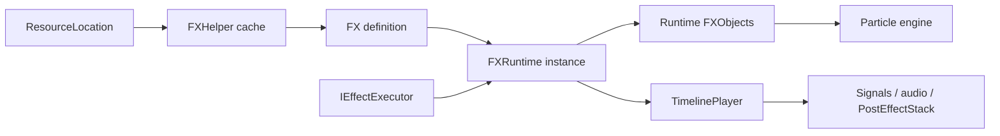

# Java and Runtime API


*The Java API loads the same authored FX used by the editor and owns a separate runtime instance for each playback.*

Photon's public playback API is client-only. Load an immutable-ish `FX` definition, create or let an executor create an `FXRuntime`, and keep all world/render mutations on the client thread.

## Dependency

```gradle
repositories {
    maven { url = "https://maven.firstdark.dev/snapshots" }
}

dependencies {
    implementation("com.lowdragmc.ldlib2:ldlib2-neoforge-${minecraft_version}:${ldlib2_version}:all")
    implementation("com.lowdragmc.photon:photon-neoforge-${minecraft_version}:${photon_version}") {
        transitive = false
    }
}
```

Photon 2.2.4 targets Minecraft 1.21.1/NeoForge 21.1 and requires the matching LDLib2 line. Use the published metadata/current mod file for exact dependency ranges instead of copying an old example version.



## Minimal Playback

```java
FX fx = FXHelper.getFX(ResourceLocation.parse("mymod:fire"));
if (fx != null) {
    new BlockEffectExecutor(fx, level, pos).start();
}
```

`FX`, `FXRuntime`, executors, particle objects, shader resources, and post processing are annotated or designed for client distribution. Do not reference them from code that a dedicated server must class-load; place integrations in client-only classes/events.

## In This Section

- [Loading, Listing, and Caching FX](./loading-listing-and-caching.md)
- [Built-in Effect Executors](./built-in-executors.md)
- [FXRuntime Lifecycle](./fxruntime-lifecycle.md)
- [Runtime Data Injection](./runtime-data-injection.md)
- [Runtime Objects and Transforms](./runtime-objects-and-transforms.md)
- [Custom Executors, Timeline, and Signals](./custom-executors-timeline-and-signals.md)
- [Post Processing API](./post-processing-api.md)
- [Extension, Serialization, and Debugging](./extension-serialization-and-debugging.md)
