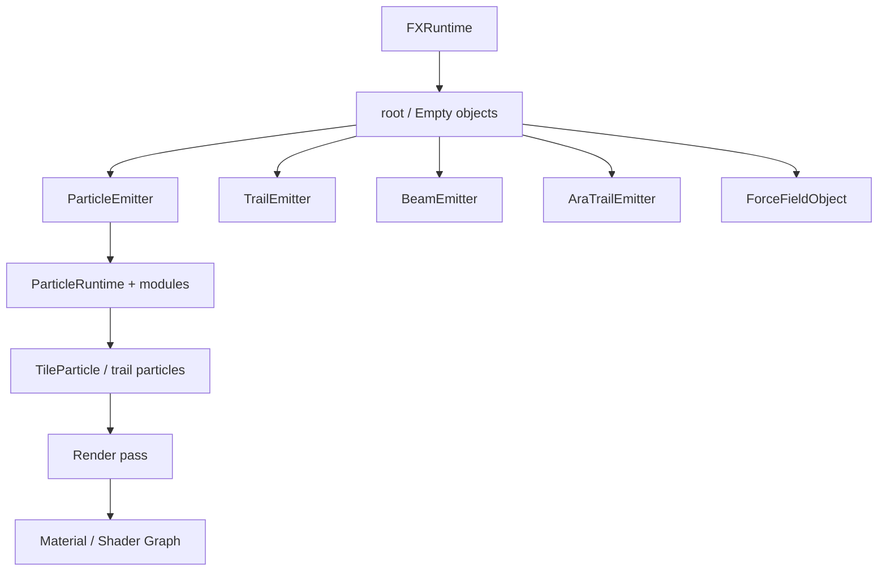

# Particle System

Photon builds an effect from a hierarchy of FX objects. Emitters simulate particles; renderer settings convert their state into draw calls; materials decide how those vertices become pixels; the Timeline can override the same runtime values over time.

<figure>

<figcaption>The real tornado project shows the object, material, live Scene, Resources, and Timeline working together.</figcaption>
</figure>

## FX Object Types

| Type | Use |
| --- | --- |
| Empty | Group children and provide an animatable transform. |
| Particle Emitter | Spawn many independent tile/model particles and optional particle trails. |
| Trail Emitter | Build a continuous ribbon or tube from a moving emitter. |
| Beam Emitter | Render a beam between endpoints or along a raycast. |
| AraTrail Emitter | Simulate a physically moving trail with segment properties. |
| Force Field | Apply directional, gravity, drag, and vortex influence through External Forces. |

## Recommended Reading Order

1. [Hierarchy and Transforms](./hierarchy-and-transforms.md)
2. [Curves, Gradients, and Value Functions](./value-functions.md)
3. [Particle Emitter](./particle-emitter.md)
4. [Emission and Shapes](./emission-and-shapes.md)
5. [Simulation and Forces](./simulation-and-forces.md)
6. [Lifetime and Speed Modules](./lifetime-and-speed-modules.md)
7. [Rendering, Materials, and Meshes](./rendering-materials-and-meshes.md)

## Runtime Model

Authored settings remain config data. Each emitted object creates a runtime layer whose values fall back to that config. Timeline tracks and Java code write runtime slots without mutating the reusable FX definition. This is why one `.fx` can play many independent instances.

::: tip Debug one system at a time
Start with a plain texture material, constant values, and one module. Add curves, trails, custom shaders, and post effects only after emission and motion look correct.
:::
