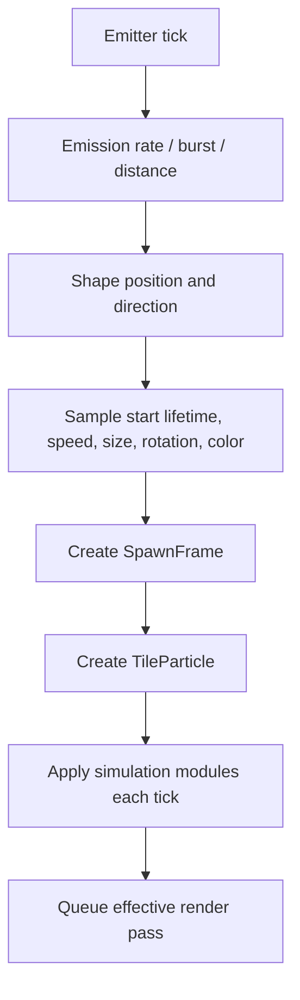

# Particle Emitter Core


*The Inspector exposes Duration, Looping, Lifetime, Speed, Size, Color, Simulation Space, and Max Particles.*

`ParticleEmitter` spawns independent `TileParticle` instances. Its `ParticleConfig` holds authored values; each emitted instance owns a `ParticleRuntime` that combines top-level values, module runtimes, custom data, and renderer overrides.

## Core Settings

| Setting | Meaning |
| --- | --- |
| `duration` | Emitter cycle length in ticks. |
| `looping` | Start another cycle after duration. |
| `prewarm` | Simulate initial ticks before the first visible frame. |
| `startDelay` | Function sampled for each emitter start. |
| `startLifetime` | Lifetime assigned to a new particle. |
| `startSpeed` | Initial velocity magnitude along the shape direction. |
| `startSize` | Initial X/Y/Z size. |
| `startRotation` | Initial X/Y/Z rotation. |
| `startColor` | Initial particle color; multiplied by later color modules/material logic. |
| `maxParticles` | Upper bound for live particles from this emitter. |
| `parallelUpdate` | Allow eligible particle updates to run in parallel. |

## Spawn Flow



The `SpawnFrame` captures the emitter transform and simulation-space conversion at birth. Local/world/custom behaviour is therefore consistent even when the effect root moves later.

## Duration and Completion

A non-looping emitter stops spawning after its duration, but the FX remains alive while previously spawned particles or trails are still playing. A looping emitter does not finish naturally; its owning executor must destroy it when appropriate.

## Prewarm

Prewarm is useful for looping smoke, aura, or ambient emitters that should look established immediately. It costs simulation work at start and should be kept small for effects spawned frequently.

## Parallel Update

Parallel update improves large independent particle systems. Photon keeps world/light access and sub-emitter spawning behind safe handshakes, but custom logic must not introduce unsafe shared mutable state. For small queues, scheduling overhead can exceed the work saved.

## Runtime Access

```java
ParticleEmitter emitter = (ParticleEmitter) runtime.findObject("sparks");
emitter.runtime().startSpeed.set(new Constant(0.2f));
emitter.runtime().maxParticles.set(256);
```

Clear an override to return to the authored setting. See [Runtime Data Injection](../java-api/runtime-data-injection.md).
