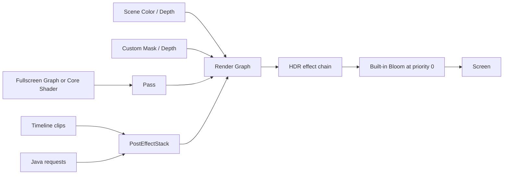

# Post Processing

<VersionBadge version="2.2.0" label="Since" icon="tag" />

Photon post processing runs one or more full-screen passes over the captured scene. A Fullscreen Shader Graph defines one pass; a Render Graph connects passes and declares the final effect; Timeline or Java submits weighted requests.

*Post processing starts from the captured Scene Color/Depth and transforms it through the active Render Graph.*

## Resource Roles

| Resource/runtime | Role |
| --- | --- |
| Fullscreen Shader Graph | Pixel algorithm and exposed samplers/uniforms |
| Core Shader Pass | Hand-written JSON/VSH/FSH alternative |
| Render Graph | Pass order, temporary targets, inputs, output, priority |
| Post Process Clip | Effect path, fade/weight, parameters, mask filter |
| `PostEffectStack` | Merge requests and execute each effect on the global axis |

The system is request-based. An effect runs only on frames where Timeline, Java, preview, or another owner submits it. Stopping submission removes the effect on the next frame; it is not a persistent global toggle.

## Continue Reading

- [Authoring a Post Effect](./authoring-a-post-effect.md)
- [Render Graph and Passes](./render-graph-and-passes.md)
- [Fullscreen Graphs and Custom Textures](./fullscreen-graphs-and-textures.md)
- [Hand-written Fullscreen Shaders](./handwritten-fullscreen-shaders.md)
- [Built-in Effects, Blending, and Masks](./built-in-effects-blending-and-masks.md)
