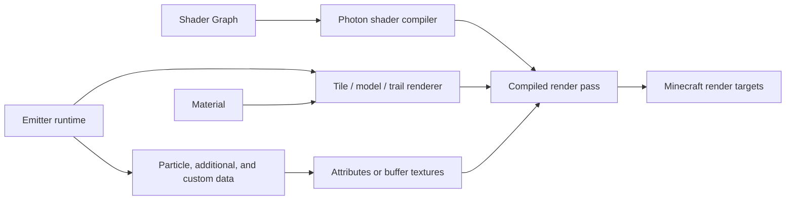

# Shaders, Materials, and GPU Data

<VersionBadge version="2.2.0" label="Shader Graph and GPU streams" icon="tag" />

Photon separates *what an emitter draws* from *how its pixels are shaded*. A Material selects textures, render state, and a shader. Shader Graph builds that shader visually. GPU Data supplies values that change for every particle or trail point.

<figure>

<figcaption>The real particle graph is open beside its live Scene, Material resources, Inspector, and Timeline.</figcaption>
</figure>

## Choose an Authoring Path

| Need | Use |
| --- | --- |
| Texture, blend, depth, and ordinary particles | Texture or Sprite Material |
| Visual per-pixel logic without GLSL | Shader Graph Material |
| Existing Core Shader JSON/VSH/FSH | Custom Shader Material |
| Scene-color or full-screen processing | Fullscreen Graph and Render Graph |
| Per-particle animation inside the shader | Additional GPU Data |
| Values controlled by Timeline or Java | Custom Data streams |

Shader Graph is the preferred path for new effects because it declares its required streams and works across Photon render contexts. Hand-written shaders remain useful when porting a shader or when graph nodes cannot express an operation.

## In This Section

- [Material System](./material-system.md)
- [Shader Graph: Getting Started](./shader-graph-getting-started.md)
- [Stages, Functions, and Subgraphs](./stages-functions-and-subgraphs.md)
- [Core Node Reference](./core-node-reference.md)
- [Photon Node Reference](./photon-node-reference.md)
- [Custom Shader Material](./custom-shaders-uniforms-and-samplers.md)
- [Hand-written Core Shaders and ExtendedShader](./extended-shader.md)
- [Built-in Uniform and Sampler Reference](./custom-shader-builtins.md)
- [Vertex Formats and GPU Instancing](./vertex-formats-and-instancing.md)
- [Additional GPU Data](./additional-gpu-data.md)
