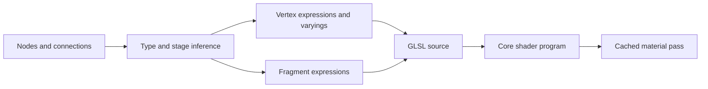

# Graph Stages, Outputs, Functions, and Subgraphs

*The grouped Distortion, Outline, Dissolve, and Alpha branches demonstrate how reusable logic converges on graph outputs.*

Shader Graph compiles one graph into a Minecraft render pass. Knowing where an expression runs prevents most compile and interpolation problems.

## Vertex and Fragment Stages

| Stage | Runs | Suitable work |
| --- | --- | --- |
| Vertex | Once per input vertex | position deformation, instance data reads, coarse calculations |
| Fragment | Once per covered pixel | texture/color, alpha/discard, normal/fog/lighting, depth fade |

Photon reads Additional and Custom Data in the vertex stage. If the value is needed by a fragment node, the compiler creates a varying automatically. This is why graph nodes can be connected across stages without manually declaring `out`/`in` variables.

## Outputs

- **Position** changes the final vertex position. Keep coordinate space explicit before connecting it.
- **Base Color** is the ordinary shaded color.
- **Emission** adds unlit/HDR energy.
- **Alpha** controls transparency and blending.
- **Discard/Alpha Clip** removes pixels below a condition instead of merely making them transparent.

Do not use Discard as a substitute for the correct blend/depth state. A cutout can write depth; a translucent edge normally should not.

## Function Graphs

A Shader Function Graph packages a reusable calculation. Expose typed inputs and outputs, save it as a resource, then instantiate it from particle graphs. Functions are suited to UV distortion, palette mapping, dissolve masks, or a shared lighting model.

Function graphs do not own material render state. Texture/uniform parameters remain on the calling graph/material. Avoid recursive function references; Photon reports them as graph compile errors.

## Compilation Flow

## Common Errors

| Message/symptom | Check |
| --- | --- |
| Type mismatch | Vector width and implicit casts at the failing port |
| Missing required output | Fragment output connections and graph type |
| Unknown function/resource | Function graph path and FX Pack dependency |
| Shader compiles but renders zero | Unsupported Additional Data channel or CPU path |
| Old result after edit | Save graph, reload shader, then clear Photon FX cache |
