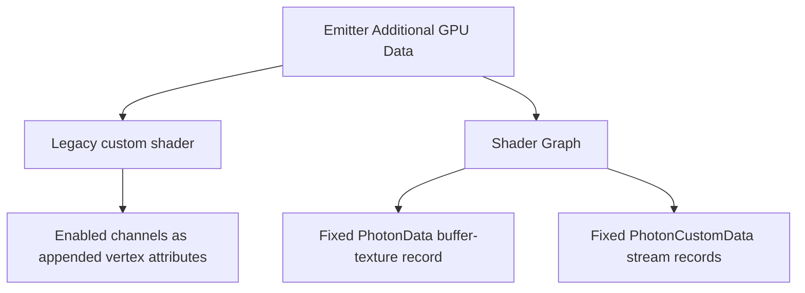

# Vertex Formats and GPU Instancing

<VersionBadge version="2.2.0" label="GPU instancing" icon="tag" />

*The instance project exercises the particle instance format while the full editor keeps Scene, Inspector, Resources, and Timeline visible.*

Photon batches equal geometry/material state and draws many instances together. Base mesh vertices describe a quad, model, or trail segment; per-instance records supply transform, color, UV, light, and optional data.

## Render Variants

| Define | Geometry | Base instance content |
| --- | --- | --- |
| `PARTICLE_INSTANCE` | billboard/tile quad | position, rotation, size, color, UV/light |
| `PARTICLE_MODEL_INSTANCE` | model mesh | transform, color, UV/light with model attributes |
| `TRAIL_INSTANCE` | flat/tube trail segment | endpoints, width/color/UV per point |
| `BEAM_INSTANCE` | ray/beam segment | start/end, width/color/UV |
| `ARATRAIL_INSTANCE` | physics trail segment | adjacent point data and interpolation |

Non-instanced CPU paths still expose Particle Data, but Additional and Custom Data graph accessors return zero there. Enable GPU instancing when a graph relies on those streams.

## Two Data Layouts

The legacy attribute layout contains only inspector-enabled channels, in registry order. Turning a channel on can move later attribute locations. A hand-written shader and emitter configuration must therefore agree exactly.

Shader Graph uses a fixed `vec4` slot layout per emitter kind, indexed by `gl_InstanceID`. The compiler records which channels are read and uploads the effective mask. One compiled graph can serve emitters with different inspector toggles.

## Batching Limits

A draw batch breaks when geometry, material program, texture/sampler state, render layer, or required layout differs. Multi-material models require separate passes. Large custom data and many transparent layers also increase upload and sorting cost even when instance count is low.

Use the profiler and render statistics rather than assuming instancing is always faster. For a handful of particles, setup cost may dominate; for hundreds of identical quads/models, it normally wins.

## Shader Author Checklist

- Shader Graph uses Photon accessors. The legacy Custom Shader Material path must declare attribute locations matching the emitter toggles.
- Do not index `PhotonData` with vertex id; it is indexed by `gl_InstanceID`.
- Treat unsupported channels as zero and provide a sensible fallback.
- Keep transparent sort/layer requirements consistent so emitters can batch.
- Test tile, model, trail, and beam separately; their base inputs are not interchangeable.

See [Additional GPU Data](./additional-gpu-data.md) for the Custom Data location formula and complete shader code.
