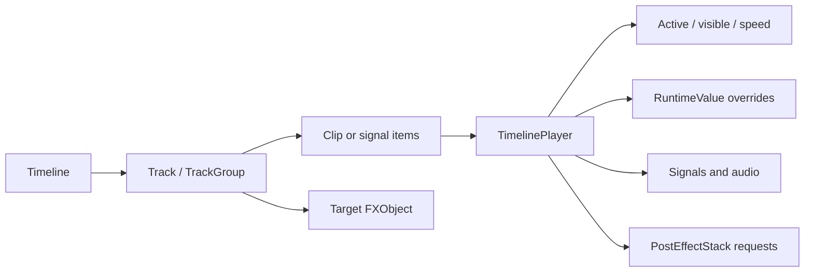

# Timeline

<VersionBadge version="2.2.0" label="Since" icon="tag" />

Timeline sequences an FX with tracks and clips. It can gate objects, restart them with deterministic seeds, animate transforms and emitter runtime properties, change simulation speed, dispatch signals, play sounds, and request post effects.

<figure>

<figcaption>The maximized editor shows the Timeline in context with the animated Scene, target Inspector, Resources, and Hierarchy.</figcaption>
</figure>

## Built-in Track Types

| Track | Controls |
| --- | --- |
| Activator | Whether one target object is active during clip ranges. |
| Control | Which object/subtree is restarted and played by each clip. |
| Animation | Transform or registered emitter Runtime properties. |
| Speed | Hierarchical simulation `timeScale`. |
| Signal | Named events with `CompoundTag` data. |
| Audio | Sound, volume/pitch envelopes, and optional target position. |
| Post Process | Per-frame weighted post-effect requests and parameter overrides. |
| Group | Organizes tracks and applies hierarchy/mute structure. |

## Runtime Clock

The always-on FX root advances `TimelinePlayer` once per particle-engine tick. A per-frame pass samples fractional time for smooth transform animation and submits active post-process clips. This keeps simulation deterministic at ticks while rendering interpolated motion.

## Empty Timelines

Legacy and simple effects may have no Timeline data. An empty Timeline adds no playback work and the FX finishes according to its emitters exactly as before.

## Continue Reading

- [Editor and Playback](./editor-and-playback.md)
- [Tracks and Clips](./tracks-and-clips.md)
- [Animation and Recording](./animation-and-recording.md)
- [Activator, Control, and Speed](./activator-control-and-speed.md)
- [Signals, Audio, Groups, and Post Process](./signals-audio-groups-and-post.md)
