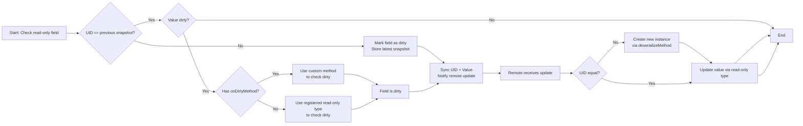

# 注释{{ version_badge("2.1.0", label="Since", icon="tag") }}
我们在此页面中显示所有注释及其用法。
!!!注意“LDLib开发工具”{宽度=“60%”对齐=右}
如果您打算使用 LDLib2 进行开发，我们强烈建议您安装我们的 IDEA 插件[LDLib Dev Tool](https://plugins.jetbrains.com/plugin/28032-ldlib-dev-tool)。该插件有：
    - 代码高亮    - 语法检查    - CDOE跳跃    - 自动完成    - 其他的    
这极大地帮助您利用 LDLib2 的功能。特别是LDLib2的所有注解都已支持使用。
## 常用注解
###`@DescSynced`注释一个字段，该字段的值（服务器端）要同步到客户端（具体为`remote`）
``` java
@DescSynced
int a;

@DescSynced
private ItemStack b = ItemStack.EMPTY;

@DescSynced
private List<ResourceLocation> c = new ArrayList<>();
```

---

###`@Persisted`注释一个字段，该字段的值（服务器端）将被写入/读取到BlockEntities的nbt。
`String key()`代表nbt中的标签名称。默认值——使用字段名称。
``` java
@Persisted(key = "fluidAmount")
int value = 100;
@Persisted
boolean isWater = true;
```

它的 nbt/json 如下所示：```json
{
  "fluidAmount": 100,
  "isWater": true
}
```

`boolean subPersisted()` 如果为 true，它将根据其 `non-null` 实例包装字段的内部值。
这对于不允许创建新实例的`final` 实例非常有用。如果字段设置`subPersisted = true`，LDLib2将执行以下操作：
- 如果该字段继承自`INBTSerializable<?>`，它将尝试使用其api进行序列化。- 否则，它将序列化字段的内部值并将其包装为映射。
```java
@Persisted(subPersisted = true) // @Persisted is also fine here, because INBTSerializable is also supported as a read-only field.
private final INBTSerializable<CompoundTag> stackHandler = new ItemStackHandler(5);
@Persisted(subPersisted = true)
private final TestContainer testContainer = new TestContainer();

public static class TestContainer {
    @Persisted
    private Vector3f vector3fValue = new Vector3f(0, 0, 0);
    @Persisted
    private int[] intArray = new int[]{1, 2, 3};
}
```

它的 nbt/json 如下所示：```json
{
    "stackHandler": {
        "Size": 5,
        "Items": [],
    },
    "testContainer": {
        "vector3fValue": [0, 0, 0],
        "intArray": [1, 2, 3],
    }
}
```

---

###`@LazyManaged`将字段标记为延迟管理的注释。这意味着该字段只会手动或自动标记为脏。该注解对于不经常更新的字段，或者批量更新的字段很有用。
``` java
@DescSynced
@Persisted
int a;

@DescSynced 
@Persisted
@LayzManaged
int b;

public void setA(int value) {
    this.a = value;  // will be sync/persist automatically, in general
}

public void setB(int value) {
    this.b = value;
    markDirty("b"); // mannually notify chagned
}
```

---

###`@ReadOnlyManaged`该注解用于标记由用户管理的只读字段。
`read-only` 类型（例如`IManaged` 和`INBTSerializable<?>`）要求字段非空并且字段实例不会更改（最终字段）。
!!!注意“`read-only` 类型是什么？”`read-only` 类型指的是始终非空且不可变的字段，并且不确定如何创建该类型的新实例。更多详细信息可以在[Types Support](./types_support.md){ data-preview }中找到。
因为我们不知道如何为这些类型创建新实例。在这种情况下，您可以使用此注释并提供方法来使用 `serializeMethod()` 存储来自服务器的唯一 ID，并使用 `deserializeMethod()` 在客户端创建一个新实例。 
此外，您还可以通过`onDirtyMethod()`提供一种方法来自我控制该字段是否已更改。
- `onDirtyMethod`：指定自定义脏检查的方法。返回是否改变。    ```java
    boolean methodName();
    ```
- `serializeMethod`：返回给定实例的唯一ID（`Tag`）。    ```java
    Tag methodName(@Nonnull T obj);
    ```
- `deserializeMethod`：通过给定的uid创建一个实例。    ```java
    T methodName(@Nonnull Tag tag)
    ```

同步过程（持久化类似）


1. 为了检查 `read-only` 字段是否有内部更改，LDLib2 将首先检查唯一 id 是否等于之前的快照。    - 如果`not`，则将该字段标记为脏，并存储最新的快照。    - 如果`true`，则转至步骤 2。2. 检查该值与之前的快照相比是否脏。    - 如果`onDirtyMethod`未设置，LDLib2将根据注册的`read-only`类型检查dirty。    - 如果`true`，则使用自定义方法检查是否脏。3. 如果场地脏了。 LDLib2 将同步 uid 和值数据，并要求远程（客户端）更新值。4. 当远程接收到更改时，它会首先检查 uid。    - 如果不相等，则先基于`deserializeMethod`创建一个新实例。    - 然后根据注册的`read-only`类型更新值。
例子
```java
@Persisted
@DescSync
@ReadOnlyManaged(serializeMethod = "testGroupSerialize", deserializeMethod = "testGroupDeserialize")
private final List<TestGroup> groupList = new ArrayList<>();

public static class TestGroup implements IPersistedSerializable {
    @Persisted
    private Range rangeValue = Range.of(0, 1);
    @Persisted
    private Direction enumValue = Direction.NORTH;
    @Persisted
    private Vector3i vector3iValue = new Vector3i(0, 0, 0);
}

public IntTag testGroupSerialize(List<TestGroup> groups) {
    return IntTag.valueOf(groups.size());
}

public List<TestGroup> testGroupDeserialize(IntTag tag) {
    var groups = new ArrayList<TestGroup>();
    for (int i = 0; i < tag.getAsInt(); i++) {
        groups.add(new TestGroup());
    }
    return groups;
}
```
!!!笔记在此示例中，`onDirtyMethod` 是不必要的。因为`TestGroup`继承自`IPersistedSerializable`，而`IPersistedSerializable`又继承自`INBTSerializable<?>`。因此，它是受支持的`read-only` 类型。
---

###`@RPCMethod`注释一个方法，可以在服务器和远程之间发送RPC数据包。您可以自由定义方法的参数，只要参数支持同步即可，并将 rpc 发送到类中的任何位置。传播事件很有用（`c->s` / `s->c`）。!!!笔记如果 `RPCSender` 被定义为方法的第一个参数。 LDLib2 将提供发件人信息。
确保所有参数都与带注释的方法的参数匹配。
```java
@RPCMethod
public void rpcTestA(RPCSender sender, String message) {
    if (sender.isServer()) {
        LDLib2.LOGGER.info("Received RPC from server: {}", message);
    } else {
        LDLib2.LOGGER.info("Received RPC from client: {}", message);
    }
}

@RPCMethod
public void rpcTestB(ItemStack item) {
    LDLib2.LOGGER.info("Received RPC: {}", item);
}

// methods to send rpc
public void sendMsgToPlayer(ServerPlayer player, String msg) {
    rpcToServer(player, "rpcTestA", msg)
}

public void sendMsgToAllTrackingPlayers(ServerPlayer player, String msg) {
    rpcToTracking("rpcTestA", msg)
}

public void sendMsgToServer(ItemStack item) {
    rpcToServer("rpcTestB", item)
}
```

* `rpcToTracking`：如果此块已在远程玩家中加载（跟踪），则发送给所有远程玩家。* `rpcToPlayer`：发送给特定玩家* `rpcToServer`：发送到服务器。
```java
@RPCMethod
public void rpcTest(String msg) {
    if (level.isClient) { // receive 
        LDLib2.LOGGER.info("Received RPC from server: {}", message);
    } else { // send
        rpcToTracking("rpcTest", msg)
    }
}
```
在此示例中，您可以在一个方法中发送和接收消息，这是一种简洁的方法。
---

###`@UpdateListener`使用此注解添加远端同步接收的监听器。
指定当从服务器更新带注释的字段时要调用的方法的名称（远程端）。
第一个参数是旧值，第二个参数是新值。
```java
@DescSynced
@UpdateListener(methodName = "onIntValueChanged")
private int intValue = 10;

private void onIntValueChanged(int oldValue, int newValue) {
    LDLib2.LOGGER.info("Int value changed from {} to {}", oldValue, newValue);
}
```

---

###`@ConditionalSynced`一般来说，所有用 `@DescSynced` 注释的字段如果发生更改都会同步。但是，您可能想要控制是否同步，例如条件同步。
LDLib2 提供此注释允许您细粒度控制字段是否应该同步。
```java
@Configurable
@ConditionalSynced(methodName = "shouldSync")
int intField = 10;

public boolean shouldSync(int value) {
    return value > 0;
}
```

---

###`@SkipPersistedValue`一般来说，所有用`@Persisted`注解的字段都会在持久化过程中被序列化。但是，您可能希望跳过序列化，例如减少输出大小、跳过未更改的值等。
LDLib2 提供此注释允许您细粒度控制字段是否应该序列化。
```java
@Persisted
int intField = 10;

@SkipPersistedValue(field = "intField")
public boolean skipIntFieldPersisted(int value) {
    // 10 is the initial value of this class, there is no need to store it.
    return value == 10;
}
```

---

## `BlockEntity` 独家!!!笔记这些注解是专门为`BlockEntity`设计的，使用前请检查[Manage BlockEntity](./blockentity.md){ data-preview }。
###`@DropSaved`有时，您希望在打破块时将字段值存储到放置项中。此注释用于标记要保存到放置项的字段。然而，在使用它之前还需要额外的代码工作。```java
public class MyBlock extends Block {
    @Override
    public void setPlacedBy(Level level, BlockPos pos, BlockState state, @Nullable LivingEntity placer, ItemStack stack) {
        if (!level.isClientSide) {
            if (level.getBlockEntity(pos) instanceof IPersistManagedHolder persistManagedHolder) {
                // you can use other DataComponents if you want.
                Optional.ofNullable(stack.get(DataComponents.CUSTOM_DATA)).ifPresent(customData -> {
                    persistManagedHolder.loadManagedPersistentData(customData.copyTag());
                });
            }
        }
    }

    @Override
    protected List<ItemStack> getDrops(BlockState state, LootParams.Builder params) {
        var opt = Optional.ofNullable(params.getOptionalParameter(LootContextParams.BLOCK_ENTITY));
        if (opt.isPresent() && opt.get() instanceof IPersistManagedHolder persistManagedHolder) {
            var drop = new ItemStack(this);
            var tag = new CompoundTag();
            persistManagedHolder.saveManagedPersistentData(tag, true);
            drop.set(DataComponents.CUSTOM_DATA, CustomData.of(tag));
            // you can move this part to LootTable if you want.
            return List.of(drop);
        }
        return super.getDrops(state, params);
    }

    @Override
    public ItemStack getCloneItemStack(BlockState state, HitResult target, LevelReader level, BlockPos pos, Player player) {
        // if you want to clone an item with drop data, don't forget it
        if (level.getBlockEntity(pos) instanceof IPersistManagedHolder persistManagedHolder) {
            var clone = new ItemStack(this);
            var tag = new CompoundTag();
            persistManagedHolder.saveManagedPersistentData(tag, true);
            clone.set(DataComponents.CUSTOM_DATA, CustomData.of(tag));
            return clone;
        }
        return super.getCloneItemStack(state, target, level, pos, player);
    }
}

public class MyBlockEntity extends BlockEntity implements ISyncPersistRPCBlockEntity {
    @Persisted
    private int intValue = 10;
    @Persisted
    @DropSaved
    private ItemStack itemStack = ItemStack.EMPTY;
}
```
经过上述设置后，MyBlockEntity中`itemStack`的值将在break和clone时存储在itemstack中。并且放置后将恢复存储在 itemstack 中的值。
---

###`@RequireRerender`当带注释的字段更新时（从服务器同步）将安排块渲染更新。要使用此功能，您的 BlockEntity 必须继承自`IBlockEntityManaged`。
```java
public class MyBlockEntity extends BlockEntity implements ISyncPersistRPCBlockEntity {
    @Persisted
    @DescSync
    @RequireRerender
    private int color = -1;
}
```
它实际上等于```java
public class MyBlockEntity extends BlockEntity implements ISyncPersistRPCBlockEntity {
    @Persisted
    @DescSync
    private int color = -1;

    public MyBlockEntity(BlockPos pos, BlockState state) {
        super(...)
        ...
        addSyncUpdateListener("color", this::onColorUpdated); // add a listener
    }

    private Consumer<Object> onColorUpdated(ManagedKey managedKey, Object currentValue) {
        return newValue -> scheduleRenderUpdate();
    }

    public void scheduleRenderUpdate() {
        var level = getLevel();
        if (level != null) {
            if (level.isClientSide) {
                var state = getBlockState();
                level.sendBlockUpdated(getBlockPos(), state, state, 1 << 3); // notify chunk rerender
            }
        }
    }
}
```