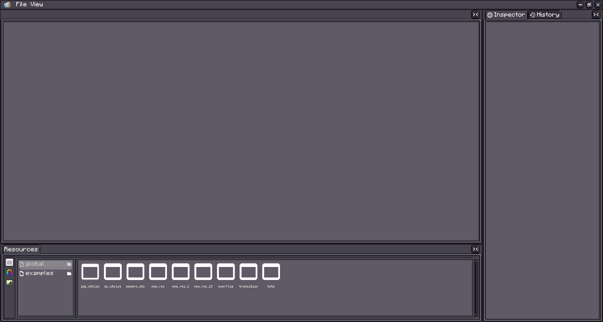
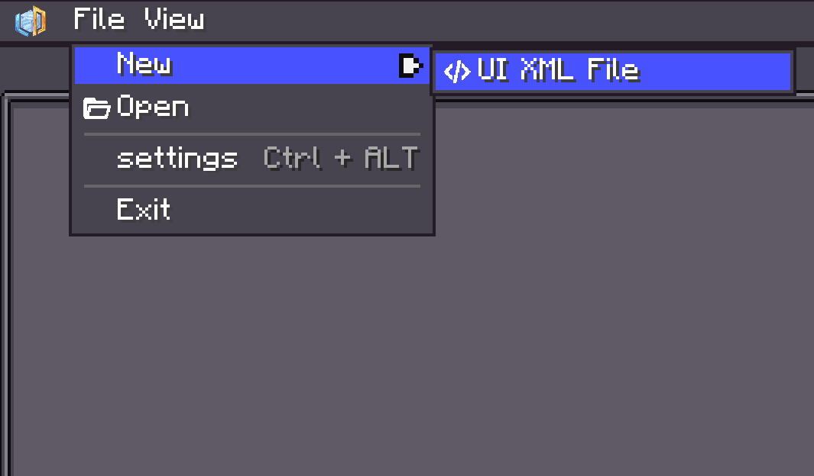
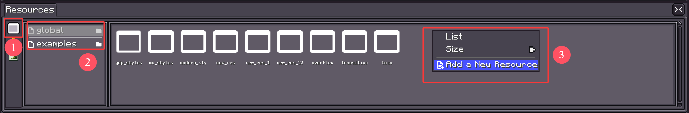

# UI 编辑器

{{ version_badge("2.1.5", label="Since", icon="tag") }}

!!! warning inline end
    此命令只能在`单人游戏`世界中使用。

LDLib2 提供了可视化编辑器来支持 UI 创建。使用以下命令打开 UI 编辑器。

```shell
/ldlib2_ui_editor
```

<figure markdown="span">
  { width="80%" }
</figure>

UI 编辑器支持两种可视化创建 UI 的方式：

* `UI XML`
* `UI Template`

---

## UI XML

点击 **`File → New → UI XML File`** 创建一个新的 UI XML 文件。  
你也可以点击 **`Open`** 加载现有的 XML 文件。

<figure markdown="span">
  { width="80%" }
</figure>

<figure markdown="span">
  { width="80%" }
</figure>

打开后，你可以编辑 XML 并在编辑器中直接**实时预览**你的 UI。更多 XML 详情，请查看 [UI Xml](./xml.md){ data-preview }

!!! tip
    你也可以使用外部 IDE（如 VS Code 或 IntelliJ IDEA）编辑 XML 文件。  
    当你保存更改时，预览会自动更新。

---

## UI Template

**UI Template** 与 **UI XML** 类似，用于定义 UI 内容  
（包括**样式**和**组件树**）。

主要区别在于：

- UI Template 可以使用 **UI 编辑器**进行**可视化编辑**。
- 保存的 UI Template 可以作为**模板组件**在其他 **UI XML** 文件或 **UI Template** 中复用。

与 UI XML 文件不同，**UI Template 由 LDLib2 的资源系统管理**。  
要创建一个，请使用**资源面板**：

<figure markdown="span">
  { width="100%" }
</figure>

**步骤：**

1. 选择 **UI** 资源类别。
2. 选择或创建一个**资源提供者**。
3. 右键创建一个 **UI Template**，然后双击进入编辑模式。

### 编辑你的 Template

打开 UI Template 后，你将看到以下编辑器界面：

<figure markdown="span">
  { width="100%" }
</figure>

1. **样式配置器**  
   编辑内置样式，添加或移除外部样式表，检查已应用的样式。

2. **UI 树**  
   显示完整的 UI 层次结构。  
   你可以通过右键菜单创建或移除组件，选择多个元素，或拖拽重新排列层次结构。

3. **元素配置器**  
   显示当前选中元素的可配置属性。

4. **预览**  
   提供 UI 的实时预览。

使用 UI 编辑器，你可以可视化地配置**布局**、**样式**和其他设置。  
如果你理解了*基础*部分介绍的概念，编辑器应该很容易上手。  
对于具有特殊配置选项的组件，请参阅它们各自的文档页面。

### 加载 UI Template 并设置

有两种方法可以加载并使用你的模板来构建 UI。

1. 你可以将其移动到你的 assets 目录中，并通过 `ResourceLocation` 加载。
2. 如果资源在 ldlib2 文件夹下，你可以右键点击资源来获取资源路径并加载它。

<figure markdown="span">
  { width="100%" }
</figure>

=== "Java"

    ```java
    @Override
    public ModularUI createUI(Player player) {
        var ui = Optional.ofNullable(UIResource.INSTANCE.getResourceInstance()
                // resource location based
                .getResource(new FilePath(ResourceLoaction.parse("ldlib2:resources/examples/example_layout.ui.nbt"))))

                // file based
                //.getResource(new FilePath(new File(LDLib2.getAssetsDir(), "ldlib2/resources/examples/example_layout.ui.nbt"))) // LDLib2.getAssetsDir() = ".minecraft/ldlib2/assets"

                .map(UITemplate::createUI)
                .orElseGet(UI::empty);

        // find elemetns and do data bindings or logic setup here
        var buttons = ui.select(".button_container > button").toList(); // by selector
        var container = ui.selectRegex("container").findFirst().orElseThrow(); // by id regex

        return ModularUI.of(ui, player);
    }
    ```

=== "KubeJS"

    ```js
    function createUIFromUIResource(path) {
        return UIResource.INSTANCE.getResourceInstance().getResource(path).createUI();
    }

    function createUI(player) {
        // file based
        let ui = createUIFromUIResource("file(./ldlib2/assets/ldlib2/resources/global/modern_styles.ui.nbt)")

        // resource location based
        // let ui = createUIFromUIResource("pack(ldlib2:resources/global/modern_styles.ui.nbt)")

        // find elemetns and do data bindings or logic setup here
        let buttons = ui.select(".button_container > button").toList(); // by selector
        let container = ui.selectRegex("container").findFirst().orElseThrow(); // by id regex

        return ModularUI.of(ui, player)
    }
    ```

### 加载事件

保存的 **UI Template** 仅定义视觉结构和样式——默认情况下不包含运行时逻辑。  
在大多数情况下，你加载模板后需要在代码中手动附加处理程序或绑定。

然而，如果你想**在不同的上下文中复用相同的 UI**，每次都重复相同的设置逻辑会变得很繁琐。

为了解决这个问题，**LDLib2 提供了一个钩子事件**，让你可以**在 UI Template 调用 `createUI()` 时注入逻辑**，这样你可以在创建过程中自动配置返回的 `UI`。

```java
@SubscribeEvent
public static void onUICreated(UITemplate.CreateUI event) {
    var template = event.template;
    var ui = event.ui;
    // do initialization here
}
```

---

## UI 模拟

点击编辑器顶部的**绿色播放按钮**进入**模拟模式**。  
这允许你与 UI 交互并验证其行为。

<figure markdown="span">
  { width="100%" }
</figure>
