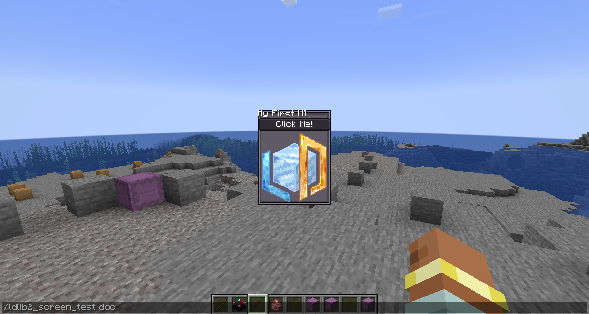
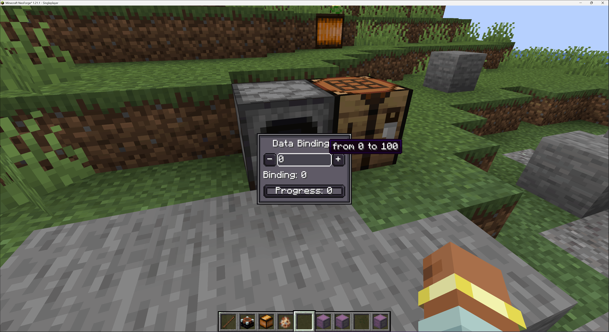

# 入门指南
{{ version_badge("2.1.0", label="Since", icon="tag") }}

在本节中，我们将通过一些示例逐步引导你入门。

### 教程 1：创建并显示一个 `ModularUI`

让我们从一个简单的 UI 开始。
`ModularUI` 作为 UI 的运行时管理器，负责处理所有你定义的元素的生命周期、渲染和交互。
它接受一个 `UI` 实例，以及一个可选的 `Player` 作为输入。
详见 [ModularUI 页面](./preliminary/modularui.md){ data-preview }。

```java
private static ModularUI createModularUI() {
    // create a root element
    var root = new UIElement();
    root.addChildren(
            // add a label to display text
            new Label().setText("My First UI"),
            // add a button with text
            new Button().setText("Click Me!"),
            // add an element to display an image based on a resource location
            new UIElement().layout(layout -> layout.width(80).height(80))
                    .style(style -> style.background(
                            SpriteTexture.of("ldlib2:textures/gui/icon.png"))
                    )
    ).style(style -> style.background(Sprites.BORDER)); // set a background for the root element
    // create a UI
    var ui = UI.of(root);
    // return a modular UI for runtime instance
    return ModularUI.of(ui);
}
```

接下来，我们需要显示我们的 UI。
与大多数强制你使用专用 screen 类的 UI 库不同，
LDLib2 提供了一种通用方案，可以在你选择的任何 screen 中渲染和交互 `ModularUI`。
这意味着你可以在 screen 的初始化阶段创建和初始化 `ModularUI`，如下所示。

```java
@OnlyIn(Dist.CLIENT)
public class MyScreen extends Screen {
    // .....

    // initial
    @Override
    public void init() {
        super.init();
        var modularUI = createModularUI();
        modularUI.setScreenAndInit(this);
        this.addRenderableWidget(modularUI.getWidget());
    }

    // .....
}
```

!!! info "快速测试"
    如果你不想处理 `screen` 和显示的代码，我们还为你提供了 `ModularUIScreen`。
    详见 [screen 和 menu 页面](./preliminary/screen_and_menu.md){ data-preview }。

    ```java
    public static void openScreenUI() {
        var modularUI = createModularUI();
        minecraft.setScreen(new ModularUIScreen(modularUI, Component.empty()));
    }
    ```
    
<figure markdown="span">
  { width="80%" }
</figure>

---

### 教程 2：更好的布局和样式
好的，它能工作了——但布局和样式仍然不够理想。
例如，我们想为根元素添加内边距，在组件之间引入一些间距，并将标签居中对齐。
得益于 yoga，我们不需要处理布局代码。详见 [布局页面](./preliminary/layout.md){ data-preview }。
让我们通过改进布局和样式来优化 UI。

```java hl_lines="7-8 17-18" 
private static ModularUI createModularUI() {
    // create a root element
    var root = new UIElement();
    root.addChildren(
            // add a label to display text
            new Label().setText("My First UI")
                    // center align text
                    .textStyle(textStyle -> textStyle.textAlignHorizontal(Horizontal.CENTER)),
            // add a button with text
            new Button().setText("Click Me!"),
            // add an element to display an image based on a resource location
            new UIElement().layout(layout -> layout.width(80).height(80))
                    .style(style -> style.background(
                            SpriteTexture.of("ldlib2:textures/gui/icon.png"))
                    )
    ).style(style -> style.background(Sprites.BORDER)); // set a background for the root element
    // set padding and gap for children elements
    root.layout(layout -> layout.paddingAll(7).gapAll(5));
    // create a UI
    var ui = UI.of(root);
    // return a modular UI for runtime instance
    return ModularUI.of(ui);
}
```

<figure markdown="span">
  { width="80%" }
</figure>

---

### 教程 3：组件交互和 UI 事件

让我们看看如何与组件进行交互。这里我们以按钮为例，`#!java setOnClick()` 由按钮提供。
我们引入两个按钮，分别使图像旋转 ±45°。

```java hl_lines="15-26"
private static ModularUI createModularUI() {
    // create a root element
    var root = new UIElement();
    // add an element to display an image based on a resource location
    var image = new UIElement().layout(layout -> layout.width(80).height(80))
            .style(style -> style.background(
                    SpriteTexture.of("ldlib2:textures/gui/icon.png"))
            );
    root.addChildren(
            // add a label to display text
            new Label().setText("Interaction")
                    // center align text
                    .textStyle(textStyle -> textStyle.textAlignHorizontal(Horizontal.CENTER)),
            image,
            // add a container with the row flex direction
            new UIElement().layout(layout -> layout.flexDirection(YogaFlexDirection.ROW)).addChildren(
                    // a button to rotate the image -45°
                    new Button().setText("-45°")
                            .setOnClick(e -> image.transform(transform -> 
                                    transform.rotation(transform.rotation()-45))),
                    new UIElement().layout(layout -> layout.flex(1)), // occupies the remaining space
                    // a button to rotate the image 45°
                    new Button().setText("+45°")
                            .setOnClick(e -> image.transform(transform -> 
                                    transform.rotation(transform.rotation() + 45)))
            )
    ).style(style -> style.background(Sprites.BORDER)); // set a background for the root element
    // set padding and gap for children elements
    root.layout(layout -> layout.paddingAll(7).gapAll(5));
    // create a UI
    var ui = UI.of(root);
    // return a modular UI for runtime instance
    return ModularUI.of(ui);
}
```

<figure markdown="span">
  { width="80%" }
</figure>

在上一步中，我们使用 `Button#setOnClick()` 来处理交互。
虽然这很方便，但这只是 Button 组件提供的 API 方法。

LDLib2 本身提供了完整且灵活的 UI 事件系统。
任何 UIElement 都可以监听输入事件，如鼠标点击、悬停、命令、生命周期、拖拽、焦点、键盘输入等。详见 [事件页面](./preliminary/event.md){ data-preview }。

通过将基本 UIElement 与事件监听器和样式结合，你可以实现完全自定义的交互组件——包括按钮。


```java hl_lines="17-26"
private static ModularUI createModularUI() {
    // create a root element
    var root = new UIElement();
    // add an element to display an image based on a resource location
    var image = new UIElement().layout(layout -> layout.width(80).height(80))
            .style(style -> style.background(
                    SpriteTexture.of("ldlib2:textures/gui/icon.png"))
            );
    root.addChildren(
            // add a label to display text
            new Label().setText("UI Event")
                    // center align text
                    .textStyle(textStyle -> textStyle.textAlignHorizontal(Horizontal.CENTER)),
            image,
            // add a container with the row flex direction
            new UIElement().layout(layout -> layout.flexDirection(YogaFlexDirection.ROW)).addChildren(
                    // implement the button by using ui events
                    new UIElement().addChild(new Label().setText("-45°").textStyle(textStyle -> textStyle.adaptiveWidth(true)))
                            .layout(layout -> layout.justifyItems(YogaJustify.CENTER).paddingHorizontal(3))
                            .style(style -> style.background(Sprites.BORDER1))
                            .addEventListener(UIEvents.MOUSE_DOWN, e -> image.transform(transform ->
                                    transform.rotation(transform.rotation()-45)))
                            .addEventListener(UIEvents.MOUSE_ENTER, e ->
                                    e.currentElement.style(style -> style.background(Sprites.BORDER1_DARK)), true)
                            .addEventListener(UIEvents.MOUSE_LEAVE, e ->
                                    e.currentElement.style(style -> style.background(Sprites.BORDER1)), true),
                    new UIElement().layout(layout -> layout.flex(1)), // occupies the remaining space
                    // a button to rotate the image 45°
                    new Button().setText("+45°")
                            .setOnClick(e -> image.transform(transform ->
                                    transform.rotation(transform.rotation() + 45)))
            )
    ).style(style -> style.background(Sprites.BORDER)); // set a background for the root element
    // set padding and gap for children elements
    root.layout(layout -> layout.paddingAll(7).gapAll(5));
    // create a UI
    var ui = UI.of(root);
    // return a modular UI for runtime instance
    return ModularUI.of(ui);
}
```

<figure markdown="span">
  { width="80%" }
</figure>

---

## 教程 4：UI 样式表

在 [教程 2](#教程-2更好的布局和样式) 中，我们通过在代码中直接配置布局和样式来改善外观。
虽然这种方式有效，但随着 UI 变得复杂，内联的布局和样式定义会很快变得冗长且难以维护。

为了解决这个问题，LDLib2 引入了一个名为 `LSS`（LDLib2 StyleSheet）的样式表系统。
LSS 允许你以类似 CSS 的声明式方式描述布局和样式属性，将视觉设计与 UI 结构分离。详见 [样式表页面](./preliminary/stylesheet.md){ data-preview }。

在下面的示例中，我们使用 LSS 重新实现第 3 步中的布局和样式逻辑：

* 示例 1 展示了直接在 UI 元素上绑定 LSS
* 示例 2 展示了如何定义独立的样式表并将其应用到 UI

=== "example 1"

    ```java
    private static ModularUI createModularUI() {
        var root = new UIElement();
        root.addChildren(
                new Label().setText("LSS example")
                        .lss("horizontal-align", "center"),
                new Button().setText("Click Me!"),
                new UIElement()
                        .lss("width", 80)
                        .lss("height", 80)
                        .lss("background", "sprite(ldlib2:textures/gui/icon.png)")
        );
        root.lss("background", "built-in(ui-gdp:BORDER)");
        root.lss("padding-all", 7);
        root.lss("gap-all", 5);
        var ui = UI.of(root);
        return ModularUI.of(ui);
    }
    ```

=== "example 2"

    ```java
    private static ModularUI createModularUI() {
        // set root with an ID
        var root = new UIElement().setId("root");
        root.addChildren(
                new Label().setText("LSS example"),
                new Button().setText("Click Me!"),
                // set the element with a class
                new UIElement().addClass("image")
        );
        var lss = """
            // id selector
            #root {
                background: built-in(ui-gdp:BORDER);
                padding-all: 7;
                gap-all: 5;
            }
            
            // class selector
            .image {
                width: 80;
                height: 80;
                background: sprite(ldlib2:textures/gui/icon.png);
            }
            
            // element selector
            #root label {
                horizontal-align: center;
            }
            """;
        var stylesheet = Stylesheet.parse(lss);
        // add stylesheets to ui
        var ui = UI.of(root, stylesheet);
        return ModularUI.of(ui);
    }
    ```

!!! info "内置样式表"
    除了自定义 LSS 定义外，LDLib2 还提供了几个**内置样式表**主题，涵盖了大多数常见的 UI 组件：

    - `#!java StylesheetManager.GDP`
    - `#!java StylesheetManager.MC`
    - `#!java StylesheetManager.MODERN`

    这些内置样式表允许你以最少的设置为整个 UI 应用一致的视觉风格。
    你可以通过 `StylesheetManager` 访问和管理它们，它作为所有可用样式表包的中央注册表。

```java
private static ModularUI createModularUI() {
    var root = new UIElement();
    root.layout(layout -> layout.width(100));
    root.addChildren(
            new Label().setText("Stylesheets"),
            new Button().setText("Click Me!"),
            new ProgressBar().setProgress(0.5f).label(label -> label.setText("Progress")),
            new Toggle().setText("Toggle"),
            new TextField().setText("Text Field"),
            new UIElement().layout(layout -> layout.setFlexDirection(YogaFlexDirection.ROW)).addChildren(
                    new ItemSlot().setItem(Items.APPLE.getDefaultInstance()),
                    new FluidSlot().setFluid(new FluidStack(Fluids.WATER, 1000))
            ),
            // list all stylesheets
            new Selector<ResourceLocation>()
                    .setSelected(StylesheetManager.GDP, false)
                    .setCandidates(StylesheetManager.INSTANCE.getAllPackStylesheets().stream().toList())
                    .setOnValueChanged(selected -> {
                        // switch to the selected stylesheet
                        var mui = root.getModularUI();
                        if (mui != null) {
                            mui.getStyleEngine().clearAllStylesheets();
                            mui.getStyleEngine().addStylesheet(StylesheetManager.INSTANCE.getStylesheetSafe(selected));
                        }
                    })
    );
    root.addClass("panel_bg");
    // use GDP stylesheets by default
    var ui = UI.of(root, StylesheetManager.INSTANCE.getStylesheetSafe(StylesheetManager.GDP)));
    return ModularUI.of(ui);
}
```

<figure markdown="span">
  { width="80%" }
</figure>

---

## 教程 5：数据绑定

LDLib2 为大多数数据驱动的 UI 组件提供了内置的数据绑定支持。
这允许 UI 元素与底层数据保持同步，而无需手动更新逻辑。
绑定系统基于 `#!java IObserver<T>` 和 `#!java IDataProvider<T>`。
详见 [数据绑定页面](./preliminary/data_bindings.md){ data-preview }。

在本示例中：

- 一个共享的 AtomicInteger 作为唯一数据源
- 按钮直接修改数值
- TextField 通过观察者更新数值
- Label 和进度条在数据变化时自动刷新

```java
private static ModularUI createModularUI() {
    // a value holder
    var valueHolder = new AtomicInteger(0);

    var root = new UIElement();
    root.addChildren(
            new Label().setText("Data Bindings")
                    .textStyle(textStyle -> textStyle.textAlignHorizontal(Horizontal.CENTER)),
            new UIElement().layout(layout -> layout.flexDirection(YogaFlexDirection.ROW)).addChildren(
                    // button to decrease the value
                    new Button().setText("-")
                            .setOnClick(e -> {
                                if (valueHolder.get() > 0) {
                                    valueHolder.decrementAndGet();
                                }
                            }),
                    new TextField()
                            .setNumbersOnlyInt(0, 100)
                            .setValue(String.valueOf(valueHolder.get()))
                            // bind an Observer to update the value holder
                            .bindObserver(value -> valueHolder.set(Integer.parseInt(value)))
                            // bind a DataSource to notify the value changes
                            .bindDataSource(SupplierDataSource.of(() -> String.valueOf(valueHolder.get())))
                            .layout(layout -> layout.flex(1)),
                    // button to increase the value
                    new Button().setText("+")
                            .setOnClick(e -> {
                                if (valueHolder.get() < 100) {
                                    valueHolder.incrementAndGet();
                                }
                            })
            ),
            // bind a DataSource to notify the value changes for label and progress bar
            new Label().bindDataSource(SupplierDataSource.of(() -> Component.literal("Binding: ").append(String.valueOf(valueHolder.get())))),
            new ProgressBar()
                    .setProgress(valueHolder.get() / 100f)
                    .bindDataSource(SupplierDataSource.of(() -> valueHolder.get() / 100f))
                    .label(label -> label.bindDataSource(SupplierDataSource.of(() -> Component.literal("Progress: ").append(String.valueOf(valueHolder.get())))))
    ).style(style -> style.background(Sprites.BORDER));
    root.layout(layout -> layout.width(100).paddingAll(7).gapAll(5));
    return ModularUI.of(UI.of(root));
}
```

<figure markdown="span">
  { width="80%" }
</figure>

---

## 教程 6：用于 Menu 的 `ModularUI`

在之前的教程中，我们专注于在客户端 screen 中渲染 `ModularUI`。
这对于纯视觉或仅客户端的界面效果很好。

然而，Minecraft 中大多数实际的 GUI 都是服务器-客户端同步的。
当 GUI 涉及游戏逻辑或持久化数据时，服务器必须保持权威性。
在原版 Minecraft 中，这是通过 `Menu` 来处理的，它管理服务器和客户端之间的同步。

与仅支持客户端渲染的 UI 库不同，LDLib2 为服务器支持的 Menu 提供一流的支持。
你可以直接将 `ModularUI` 与 Menu 一起使用，无需额外的网络或同步代码。

让我们创建一个简单的基于 Menu 的 UI 来显示玩家的物品栏。

```java
private static ModularUI createModularUI(Player player) {
    var root = new UIElement();
    root.addChildren(
            new Label().setText("Menu UI"),
            // add player invotry 
            new InventorySlots()
    ).addClass("panel_bg");

    var ui = UI.of(root, StylesheetManager.INSTANCE.getStylesheetSafe(StylesheetManager.GDP));
    // pass the player to the Modular UI
    return ModularUI.of(ui, player);
}
```

你必须使用 `Player` 创建 `ModularUI`，这对于基于 Menu 的 UI 是必需的。此外，不仅是 screen，你还应该为你的 `Menu` 初始化 `ModularUI`：

* 初始化应该在创建之后、写入额外数据缓冲区之前完成。
* 如有必要，不要忘记为你的 screen 设置正确的图像尺寸。

```java
public class MyContainerMenu extends AbstractContainerMenu {
    // you can do initialization in the constructor
    public MyContainerMenu(...) {
        super(...)
        
        var modularUI = createModularUI(player)
        // we have added mixin to make the AbstractContainerMenu implementing the interface
        if (this instanceof IModularUIHolderMenu holder) {
            holder.setModularUI(modularUI);
        }
    }

    // .....
}

public class MyContainerScreen extends AbstractContainerScreen<MyContainerMenu> {
    @Override
    public void init() {
        // the modular widget has already added + init by events
        this.imageWidth = (int) getMenu().getModularUI().getWidth();
        this.imageHeight = (int) getMenu().getModularUI().getHeight();
        super.init();
    }

    // .....
}
```

!!! info "快速测试"
    要使用和打开基于 Menu 的 UI，你需要注册自己的 `MenuType`，LDLib2 还提供了 `ModularUIContainerScreen` 和 `ModularUIContainerMenu` 来帮助你快速设置。详见 [screen 和 menu 页面](./preliminary/screen_and_menu.md){ data-preview }。

    或者，你可以使用提供的 [工厂](./factory.md){ data-preview } 来更快地开始。
    它们允许你以最少的设置为方块、物品或玩家创建基于 Menu 的 UI——无需处理手动注册或样板代码。
    在本例中，我们使用 `PlayerUIMenuType` 进行快速演示。

    ```java
    public static final ResourceLocation UI_ID = LDLib2.id("unique_id");

    // register your ui somewhere, e.g. during your mod initialization.
    public static void registerPlayerUI() {
        PlayerUIMenuType.register(UI_ID, ignored -> player -> createModularUI(player));
    }
    
    public static void openMenuUI(Player player) {
        PlayerUIMenuType.openUI(player, UI_ID);
    }
    ```

<figure markdown="span">
  { width="80%" }
</figure>

---

## 教程 7：Screen 和 Menu 之间的通信

虽然 `InventorySlots` 开箱即用，但它们是预打包的内置组件。
在实际项目中，你通常需要更多地控制客户端 screen 和服务器端 menu 之间的数据和事件流。

ModularUI 提供了跨客户端和服务器的 `数据绑定` 和 `事件分发` 的完整支持。
这允许客户端的 UI 交互安全地触发服务器上的逻辑，服务器端状态变化自动更新 UI。
详见 [数据绑定页面](./preliminary/data_bindings.md){ data-preview }。

在这里，我们专注于实用模式来帮助你快速入门。

```java
// represents data on the server
private final ItemStackHandler itemHandler = new ItemStackHandler(2);
private final FluidTank fluidTank = new FluidTank(2000);
private boolean bool = true;
private String string = "hello";
private float number = 0.5f;

private static ModularUI createModularUI(Player player) {
    // create a root element
    var root = new UIElement();
    root.addChildren(
            // add a label to display text
            new Label().setText("Data Between Screen and Menu"),
            // bind storage to slots
            new UIElement().addChildren(
                    new ItemSlot().bind(itemHandler, 0),
                    new ItemSlot().bind(new ItemHandlerSlot(itemHandler, 1).setCanTake(p -> false)),
                    new FluidSlot().bind(fluidTank, 0)
            ).layout(l -> l.gapAll(2).flexDirection(YogaFlexDirection.ROW)),
            // bind value to the components
            new UIElement().addChildren(
                    new Switch().bind(DataBindingBuilder.bool(() -> bool, value -> bool = value).build()),
                    new TextField().bind(DataBindingBuilder.string(() -> string, value -> string = value).build()),
                    new Scroller.Horizontal().bind(DataBindingBuilder.floatVal(() -> number, value -> number = value).build()),
                    // read-only (s->c), always get data from the server and display on the client
                    new Label().bind(DataBindingBuilder.componentS2C(() -> Component.literal("s->c only: ")
                            .append(Component.literal(String.valueOf(bool)).withStyle(ChatFormatting.AQUA)).append(" ")
                            .append(Component.literal(string).withStyle(ChatFormatting.RED)).append(" ")
                            .append(Component.literal("%.2f".formatted(number)).withStyle(ChatFormatting.YELLOW)))
                            .build())
            ).layout(l -> l.gapAll(2)),
            // trigger ui events on the server side
            new Button().addServerEventListener(UIEvents.MOUSE_DOWN, e -> {
                if (fluidTank.getFluid().getFluid() == Fluids.WATER) {
                    fluidTank.setFluid(new FluidStack(Fluids.LAVA, 1000));
                } else {
                    fluidTank.setFluid(new FluidStack(Fluids.WATER, 1000));
                }
            }),
            // you could also use button.setOnServerClick(e -> { ... })
            new InventorySlots()
    );
    root.addClass("panel_bg");

    // pass the player to the Modular UI
    return ModularUI.of(UI.of(root, StylesheetManager.INSTANCE.getStylesheetSafe(StylesheetManager.MODERN)), player);
}
```

<figure markdown="span">
  { width="80%" }
</figure>

---

## 结语

这还远未结束。为什么不试试强大的 [UI 编辑器](./ui_editor/index.md){ data-preview } 呢？
