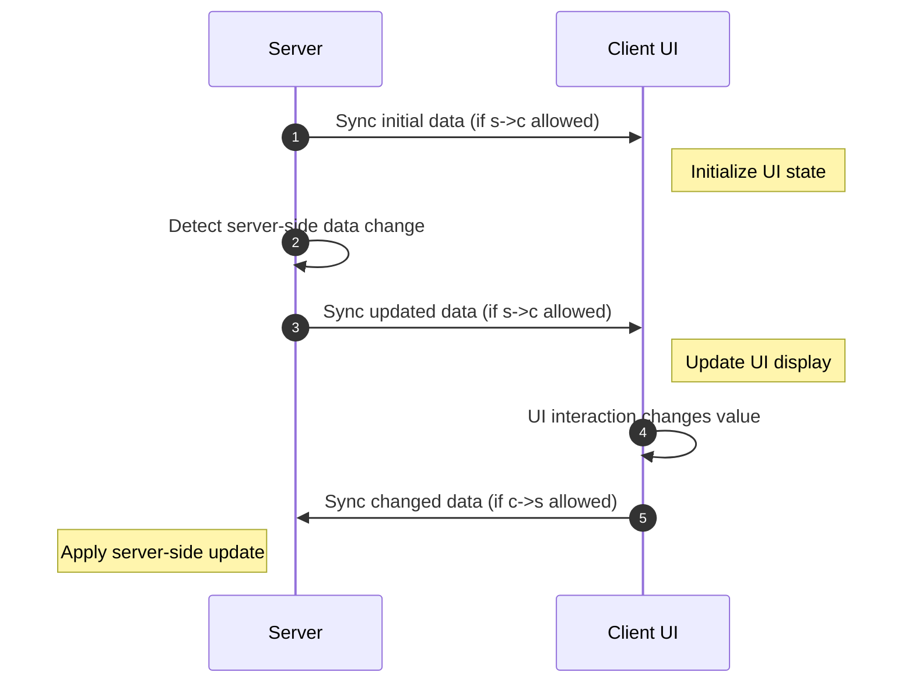

# 数据绑定和 RPCEvent
{{ version_badge("2.1.5", label="Since", icon="tag") }}
在学习**数据绑定**和**RPCEvent**之前，了解这一点很重要**UI组件**和**数据**之间的关系。
---

## 客户端数据绑定
!!!信息“仅限客户端”`bindDataSource` 和`bindObserver` 是**纯粹的客户端**机制。它们连接 UI 组件和局部变量之间的数据流——不涉及网络数据包。对于**服务器和客户端**之间的同步，请参见下面的[Data Bindings Between Client and Server](#data-bindings-between-client-and-server)。
如果 UI 组件是数据驱动的，那么它在数据模型中的角色通常属于以下类别之一：
- **数据消费者**：被动接收数据并渲染它。- **数据生产者**：产生可能改变的数据（实践中纯粹的生产者很少见）。- **数据消费者+生产者**：既显示数据又修改数据。

### **数据消费者**与`IDataConsumer<T>`
**被动接收数据**的组件实现`IDataConsumer<T>`接口，例如`Label`和`ProgressBar`。
该接口允许您绑定`IDataProvider<T>`，它负责**提供更新的数据值**。
当您想要显示**动态文本**或**更改进度值**时，这非常有用。

===“Java”
    ```java
    var valueHolder = new AtomicInteger(0);
    // bind a DataSource to notify the value changes for label and progress bar
    new Label().bindDataSource(SupplierDataSource.of(() ->
        Component.literal("Binding: ").append(String.valueOf(valueHolder.get())))),
    new ProgressBar()
            .bindDataSource(SupplierDataSource.of(() -> valueHolder.get() / 100f))
            .label(label -> label.bindDataSource(SupplierDataSource.of(() ->
                Component.literal("Progress: ").append(String.valueOf(valueHolder.get())))))
    ```

===“科特林”
    ```kotlin
    var value = 0

    // Direct API (outside a DSL builder)
    Label().bindDataSource(SupplierDataSource.of {
        Component.literal("Binding: $value")
    })

    // Kotlin DSL (inside a UIContainer init block)
    label { dataSource({ Component.literal("Binding: $value") }) }
    progressBar { dataSource({ value / 100f }) }
    ```

===“KubeJS”
    ```js
    let valueHolder = {
        "value": 0
    }
    // bind a DataSource to notify the value changes for label and progress bar
    new Label().bindDataSource(SupplierDataSource.of(() => `Binding: ${valueHolder.value}`)),
    new ProgressBar()
        .bindDataSource(SupplierDataSource.of(() => valueHolder.value / 100))
        .label(label => label.bindDataSource(SupplierDataSource.of(() => `Progress: ${valueHolder.value}`)))
    ```

### **数据生产者** 与 `IObservable<T>`产生可变数据的组件实现`IObservable<T>`接口。大多数数据驱动组件都属于这一类，例如`Toggle`、`TextField`、`Selector`
该接口允许您绑定`IObserver<T>`，每当组件的值发生变化时都会收到通知。
例如，要观察 `TextField` 的变化：
===“Java”
    ```java
    var valueHolder = new AtomicInteger(0);
    // bind a Observer to observe the value changes of the text-field
    new TextField()
        .setNumbersOnlyInt(0, 100)
        .setValue(String.valueOf(valueHolder.get()))
        // bind an Observer to update the value holder
        .bindObserver(value -> valueHolder.set(Integer.parseInt(value)))
        // actually, equal to setTextResponder
        //.setTextResponder(value -> valueHolder.set(Integer.parseInt(value)))
    ```

===“科特林”
    ```kotlin
    var value = 0

    // Direct API
    TextField()
        .setNumbersOnlyInt(0, 100)
        .setValue(value.toString())
        .bindObserver { value = it.toIntOrNull() ?: value }

    // Kotlin DSL (inside a UIContainer init block)
    textField {
        observer { value = it.toIntOrNull() ?: value }
        dataSource { value.toString() }
    }.setNumbersOnlyInt(0, 100)
    ```

===“KubeJS”
    ```js
    let valueHolder = {
        "value": 0
    }
    // bind a Observer to observe the value changes of the text-field
    new TextField()
        .setNumbersOnlyInt(0, 100)
        .setValue(valueHolder.value)
        // bind an Observer to update the value holder
        .bindObserver(value => valueHolder.value = int(value))
        // actually, equal to setTextResponder
        //.setTextResponder(value => valueHolder.value = int(value))
    ```

!!!笔记`Toggle`、`Selector` 和 `TextField` 等组件都支持`IDataConsumer<T>` 和 `IObservable<T>`,因为他们负责显示数据并同时修改它。
### `TrackData<T>` — 响应值 (Kotlin)
`TrackData<T>` 是一个 Kotlin 友好的响应式持有者，它实现了 **`IDataProvider<T>` 和 `IObserver<T>`。您可以将其同时绑定到两侧的组件：该组件既可以从中读取数据，也可以向其写回数据。
在 Kotlin 中，`TrackData` 支持使用 `by` 进行**属性委托**，因此您可以像普通变量一样读写所保存的值。
```kotlin
// Create a reactive string value
val trackData = TrackData("10.4")

// Delegate a typed property to a mapped view of it
var trackNumber by trackData.map(
    { it.toFloatOrNull() ?: 1f },   // String -> Float
    { it.toString() }               // Float -> String
)

// Bind a text field: the field displays trackData and writes back to it
textField {
    observer(trackData)    // field changes update trackData
    dataSource(trackData)  // trackData changes push to the field
}.asNumeric(0.3f, 100f)

// Modifying trackNumber notifies the text field automatically
button({
    text("track data + 10")
    onClick = { trackNumber += 10f }
})
```

!!!笔记 ””`TrackData` 是一个**客户端**工具。与`bindDataSource`/`bindObserver` 一样，它不携带网络同步。使用[`bind`](#simple-bidirectional-binding)进行服务器-客户端同步。
---

## 客户端和服务器之间的数据绑定
如果您的 UI **仅在客户端上工作**，`IDataConsumer<T>` 和 `IObservable<T>` 通常就足够了。它们满足了观察和更新本地数据的大部分需求。
然而，许多 UI 都是 **基于容器的 UI**，其中实际数据存储在 **服务器** 上。在这种情况下，您通常需要：
- 在客户端 UI 组件中**显示服务器端数据**。- **将客户端 UI 上所做的更改同步回服务器**。
这称为**双向数据绑定**


这听起来可能很复杂，但 LDLib2 完全抽象了这个过程。
---

### 使用`DataBindingBuilder<T>`
使用`DataBindingBuilder<T>`，您**不需要自己编写任何同步逻辑**。您仅描述：
* **数据存储位置*** **如何阅读*** **如何应用更新**
#### 简单的双向绑定
===“Java”
    ```java
    // Server-side values
    // boolean bool = true;
    // String string = "hello";
    // ItemStack item = new ItemStack(Items.APPLE);

    new Switch()
        .bind(DataBindingBuilder.bool(() -> bool, value -> bool = value).build());

    new TextField()
        .bind(DataBindingBuilder.string(() -> string, value -> string = value).build());

    new ItemSlot()
        .bind(DataBindingBuilder.itemStack(() -> item, stack -> item = stack).build());
    ```

===“科特林”
    ```kotlin
    // Server-side values stored as class fields:
    // private var bool = true
    // private var string = "hello"
    // private var item = ItemStack(Items.APPLE)

    // Most concise: bind a Kotlin property reference directly
    switch { bind(::bool) }
    textField { bind(::string) }
    itemSlot { bind(::item) }

    // Equivalent with explicit getter/setter
    switch { bind({ bool }, { bool = it }) }
    ```

===“KubeJS”
    ```js
    // Server-side values
    // let bool = true;
    // let string = "hello";
    // let item = new ItemStack(Items.APPLE);

    new Switch()
        .bind(DataBindingBuilder.bool(() => bool, v => bool = v).build());

    new TextField()
        .bind(DataBindingBuilder.string(() => string, v => string = v).build());

    new ItemSlot()
        .bind(DataBindingBuilder.itemStack(() => item, v => item = v).build());
    ```

例如，在：
```java
DataBindingBuilder.bool(() -> bool, value -> bool = value).build()
```

* **第一个 lambda** 定义服务器如何向客户端提供数据。* **第二个 lambda** 定义客户端如何更改更新服务器数据。
---

### 单向绑定（仅服务器 → 客户端）
有时，您**不希望客户端更改影响服务器**，例如 `Label`，它仅用于显示。
LDLib2 允许您显式控制同步策略。
???信息“同步策略概述”    - `NONE`根本没有同步。    - `CHANGED_PERIODIC`仅当数据更改时同步（默认值：每个刻度一次）。    - `ALWAYS`强制同步每个刻度，即使未更改（谨慎使用）。
===“Java”
    ```java
    // Block client -> server updates
    new Label().bind(
        DataBindingBuilder.component(() -> Component.literal(data), c -> {})
            .c2sStrategy(SyncStrategy.NONE)
            .build()
    );

    // Shorthand for server -> client only
    new Label().bind(
        DataBindingBuilder.componentS2C(() -> Component.literal(data)).build()
    );
    ```

===“科特林”
    ```kotlin
    // bindS2C shorthand — server → client only
    label { bindS2C({ Component.literal(data) }) }

    // Client → server only
    textField { bindC2S({ newValue -> serverData = newValue }) }

    // With explicit strategy via bindings() helper
    label {
        bind({ Component.literal(data) })
    }
    ```

===“KubeJS”
    ```js
    // Block client -> server updates
    new Label().bind(
        DataBindingBuilder.component(() => data, c => {})
            .c2sStrategy("NONE")
            .build()
    );

    // Shorthand for server -> client only
    new Label().bind(
        DataBindingBuilder.componentS2C(() => data).build()
    );
    ```

---

### 自定义`IBinding<T>`
`DataBindingBuilder<T>` 为常见数据类型提供内置绑定。对于自定义类型（例如`int[]`），您可以创建自己的绑定。
===“Java”
    ```java
    // Server-side value
    // int[] data = new int[]{1, 2, 3};

    new BindableValue<int[]>().bind(
        DataBindingBuilder.create(
            () -> data,
            v -> data = v
        ).build()
    );
    ```

===“科特林”
    ```kotlin
    // bindings() is the Kotlin DSL equivalent of DataBindingBuilder.create()
    // It infers the sync type automatically from the reified type parameter
    // int[] data = intArrayOf(1, 2, 3)

    // Inside a UIContainer init block:
    bind({ data }, { data = it })
    ```

!!!警告内联结束默认情况下并非支持所有类型。请参阅[Type Support](../../sync/types_support.md){数据预览}。不支持的类型需要自定义类型访问器。
如果类型是**只读**（请参阅[Type Support](../../sync/types_support.md){ data-preview }）：
* getter **必须返回一个稳定的非空实例**。* 您必须定义类型和初始值。
`INBTSerializable` 的示例：
===“Java”
    ```java
    // Server-side value
    // INBTSerializable<CompoundTag> data = ...;

    new BindableValue<INBTSerializable>().bind(
        DataBindingBuilder.create(
            () -> data,
            v -> {
                // Instance already updated, just react here
            }
        )
        .initialValue(data).syncType(INBTSerializable.class)
        .build()
    );
    ```

===“科特林”
    ```kotlin
    // INBTSerializable data = ...
    bind({ data }, data))
    ```

这可确保正确的同步并避免只读对象的歧义。
### 客户端上的`Getter` 和`Setter`
您可能想知道为什么我们只在服务器端定义 getter 和 setter 逻辑，而不在客户端定义。
这是因为所有支持`bind`方法的组件都扩展了`IBindable<T>`。**默认情况下**，LDLib2 使用组件自己的 `IBindable` 实现来自动连接客户端：
- 当服务器将数据同步到客户端时，它会调用组件上的**`bindDataSource`**，因此组件的显示会自动更新。- 当组件的值在客户端发生更改时，它会回调**`bindObserver`**，从而将更改发送到服务器。
在大多数情况下，这种默认行为就是您所需要的——您只需描述数据在服务器上的位置，LDLib2 就会处理其余的事情。
!!!警告“设置 `remoteGetter` / `remoteSetter` 时”如果您在构建器上提供`remoteGetter`或`remoteSetter`，LDLib2**不会**自动调用`bindDataSource`/`bindObserver`。您对客户如何读取或应用数据承担全部责任。仅当您需要自定义客户端逻辑时才使用此选项，例如将同步值转发到本身不是 `IBindable` 的单独元素。
===“Java”
    ```java
    // Server-side value
    // Block data = ...;

    var label = new Label();
    new BindableValue<Block>().bind(
        DataBindingBuilder.blockS2C(() -> data)
            .remoteSetter(block -> label.setText(block.getDescriptionId())).build()
    );
    ```

===“科特林”
    ```kotlin
    // Server-side value: Block data = ...

    // api {} gives access to the raw element inside the DSL
    var labelElement: Label? = null
    label { api { labelElement = this } }

    dsl({ BindableValue<Block>() }) {
        api {
            bind(
                bindings({ data }) { /* c2s no-op */ }
                    .c2sStrategy(SyncStrategy.NONE)
                    .remoteSetter { block -> labelElement?.setText(block.descriptionId) }
                    .build()
            )
        }
    }
    ```

===“KubeJS”
    ```js
    // Server-side value
    // Block data = ...;

    let label = new Label();
    new BindableValue().bind(
        DataBindingBuilder.blockS2C(() => data)
            .remoteSetter(block => label.setText(block.getDescriptionId())).build()
    );
    ```

### 合二为一 - `BindableUIElement<T>`您可能已经注意到，几乎所有数据驱动组件（例如`TextArea`、`SearchComponent`、`Switch` 等）都是构建在`BindableUIElement<T>` 之上的。`BindableUIElement<T>` 是一个包装的 UI 元素，它实现以下所有接口：这意味着它既可以**显示数据**又**产生数据更改**，同时支持**客户端-服务器同步**。
???信息内联结束`BindableValue<T>`实际上是一个utill组件，并设置`dispaly: CONTENTS;`，这意味着它不会影响其生命周期中的布局。
如果你想实现自己的UI组件并支持客户端和服务器之间的双向数据绑定，你可以简单地扩展这个类。对于**不**实现`IBindable<T>`的组件（例如基本`UIElement`），您仍然可以通过在内部附加`BindableValue<T>`来实现数据绑定。下面的示例展示了如何将服务器端数据同步到客户端并使用它来控制元素的宽度：
===“Java”
    ```java
    // Server-side value
    // var widthOnTheServer = 100f;

    var element = new UIElement();
    element.addChildren(
        new BindableValue<Float>().bind(DataBindingBuilder.floatValS2C(() -> widthOnTheServer)
            .remoteSetter(width -> element.getLayout().width(width))
            .build())
    );
    ```

===“科特林”
    ```kotlin
    // Server-side value: var widthOnTheServer = 100f

    element({}) {
        dsl({ BindableValue<Float>() }) {
            api {
                bind(
                    bindings({ widthOnTheServer }) { /* c2s no-op */ }
                        .c2sStrategy(SyncStrategy.NONE)
                        .remoteSetter { width -> element.layout.width(width) }
                        .build()
                )
            }
        }
    }
    ```

===“KubeJS”
    ```js
    // Server-side value
    // let widthOnTheServer = 100;

    let element = new UIElement();
    element.addChildren(
        new BindableValue().bind(DataBindingBuilder.floatValS2C(() => widthOnTheServer)
            .remoteSetter(width => element.getLayout().width(width))
            .build())
    );
    ```

### 复杂的用法示例
好吧，让我们做一个更复杂的例子，让我们将服务器上存储的 `String` 列表绑定为 `Selector` （作为候选者）。```java
// method 1, we sync String[]
// represent value stored on the server
// var candidates = new ArrayList<>(List.of("a", "b", "c", "d"));

var selector1 = new Selector<String>();
selector1.addChild(
    // a placeholder element value to sync candidates, it won't affect layout
    new BindableValue<String[]>().bind(DataBindingBuilder.create(
            () -> candidates.toArray(String[]::new), Consumers.nop())
            .c2sStrategy(SyncStrategy.NONE) // only s -> c
            .remoteSetter(candidates -> {
                selector1.setCandidates(Arrays.stream(candidates).toList());
            })
            .build()
    )
);

// method 2, we sync List<String>
// represent value stored on the server and client
// var candidates = new ArrayList<>(List.of("a", "b", "c", "d"));

var selector2 = new Selector<String>();
// because the List is a readonly value for ldlib2 sync system. you have to obtain the real type of List<String>
Type type = new TypeToken<List<String>>(){}.getType();
selector2.addChild(
    // a placeholder element value to sync candidates, it won't affect layout
    new BindableValue<List<String>>().bind(DataBindingBuilder.create(
            () -> candidates, Consumers.nop())
            .syncType(type)
            .initialValue(candidates)
            .c2sStrategy(SyncStrategy.NONE) // only s -> c
            .remoteSetter(selector2::setCandidates)
            .build()
    )
);

root.addChildren(selector1, selector2);
```
如果您理解此代码中显示的两种方法，那么您基本上已经掌握了数据绑定。
- **方法 1** 同步`String[]`，这很简单并且按预期工作。- **方法 2** 同步`List<String>`。由于 `Collection<T>` 在 LDLib2 中被视为 **只读类型**，因此您必须显式提供 `initialValue` 并指定实际类型（包括泛型）。
这确保了绑定系统可以正确识别和跟踪数据。

---

## UI RPC 事件乍一看，数据绑定系统似乎可以处理大多数同步需求，但实际上，情况并非总是如此。
例如，如果您想在用户单击按钮时执行服务器端逻辑，那么数据绑定显然不合适。
现在考虑一个更复杂的场景：将`FluidSlot`绑定到服务器端`IFluidHandler`。通过数据绑定这似乎是可能的。如果它仅用于服务器到客户端的显示，则效果很好。然而，一旦涉及到交互，双向同步就变得危险了。
如果允许客户端修改该值，则可以轻松发送恶意数据包来操纵服务器端`IFluidHandler`。
??? “正确的做法是”    * 使用**服务器到客户端**数据绑定仅用于显示    * 将**客户端交互**（例如单击`FluidSlot`）发送到服务器    * 处理服务器上的交互    * 如果服务器状态发生变化，则通过数据绑定将其同步回客户端
简而言之，我们需要一种机制来在客户端和服务器之间发送交互数据。这种机制称为**`UI RPCEvent`**。
以按钮为例，如果你读过[UI Event](./event.md#register-event-listeners)部分，你已经知道UI事件可以发送到服务器并触发逻辑。在内部，这是使用`RPCEvent` 实现的。
===“Java”
    ```java
    // trigger ui event on the server
    var button = new UIElement().addServerEventListener(UIEvents.MOUSE_DOWN, e -> {
        // do something on the server
    });
    ```

===“科特林”
    ```kotlin
    button {
        serverEvents {
            UIEvents.MOUSE_DOWN on { event ->
                // do something on the server
            }
        }
    }
    ```

直接使用 `RPCEvent` 的等效实现：
===“Java”
    ```java
    var clickEvent = RPCEventBuilder.simple(UIEvent.class, event -> {
        // do something on the server
    });
    var emitter = element.addRPCEvent(clickEvent);

    element.addEventListener(UIEvents.MOUSE_DOWN, e -> {
       emitter.send(clickEvent, e);
    });
    ```

===“科特林”
    ```kotlin
    button {
        // element.rpcEvent { ... } is the Kotlin shorthand
        val rpcEvent = element.rpcEvent { event: UIEvent ->
            // do something on the server
        }
        events {
            UIEvents.MOUSE_DOWN on { rpcEvent.send(it) }
        }
    }
    ```

您可以使用`RPCEventBuilder`构造一个`RPCEvent`并在需要时向服务器发送数据。
!!!笔记发送RPC事件时，**传递给`RPCEmitter#send`的参数必须与`RPCEventBuilder`中定义的参数完全匹配**，包括它们的顺序和类型，并且不要忘记`addRPCEvent`它们。否则，事件将无法正确调度。

### 带返回值的 RPCEvent有时你可能想向服务器发送请求来查询数据，并期望服务器返回结果。例如，要要求服务器执行加法并返回结果，可以这样定义：
```java
var queryAdd = RPCEventBuilder.simple(int.class, int.class, int.class, (a, b) -> {
    // calculate the result and return on the server
    return a + b;
});
var emitter = element.addRPCEvent(queryAdd);

element.addEventListener(UIEvents.MOUSE_DOWN, e -> {
    emitter.<Integer>send(queryAdd, result -> {
        // receive the result on the client
        assert result == 2;
    }, 1, 2);
})

```

### 发送事件到客户端在实践中，**UI RPC 事件主要设计用于客户端 → 服务器通信**，并将可选响应发送回客户端。这符合大多数现实世界的用例，其中**服务器拥有数据和逻辑**，而客户端仅发送交互请求。
因此，LDLib2 **不**为服务器 → 客户端 RPC 事件提供专用的 UI 级 API。
但是，**如果您确实需要主动将事件从服务器发送到客户端**，您可以通过使用通用[RPC Packet](../../sync/rpc_packet.md)系统来实现。
下面的示例展示了服务器如何向客户端发送 RPC 数据包，以及客户端如何定位并操作特定的 UI 元素。
```java
var element = new UIElement().setId("my_element");

// annotate your packet method anywhere you want
@RPCPacket("rpcEventToClient")
public static void rpcPacketTest(RPCSender sender, String message, boolean message2) {
    if (sender.isRemote()) {
        var player = Minecraft.getInstance().player;
        if (player != null && player.containerMenu instanceof IModularUIHolderMenu uiHolderMenu) {
            uiHolderMenu.getModularUI().select("#my_element").findFirst().ifPresent(element -> {
                // do something on the client side with your element.
            });
        }
    }
}

// send pacet to the remote/server
RPCPacketDistributor.rpcToAllPlayers("rpcEventToClient", "Hello from server!", false)
```

这种方法使您可以完全控制服务器启动的客户端逻辑，同时保持 UI RPC 系统简单并专注于交互驱动的工作流程。
!!!提示当将 **`FluidSlot`** 与容器绑定一起使用时，实现已经使用**服务器→客户端（s→c）只读数据同步**结合**RPC事件**进行交互。
您不需要自己处理同步策略。`FluidSlot.bind(...)` 实现也是学习数据同步和基于 RPC 的交互如何协同工作的一个很好的参考。