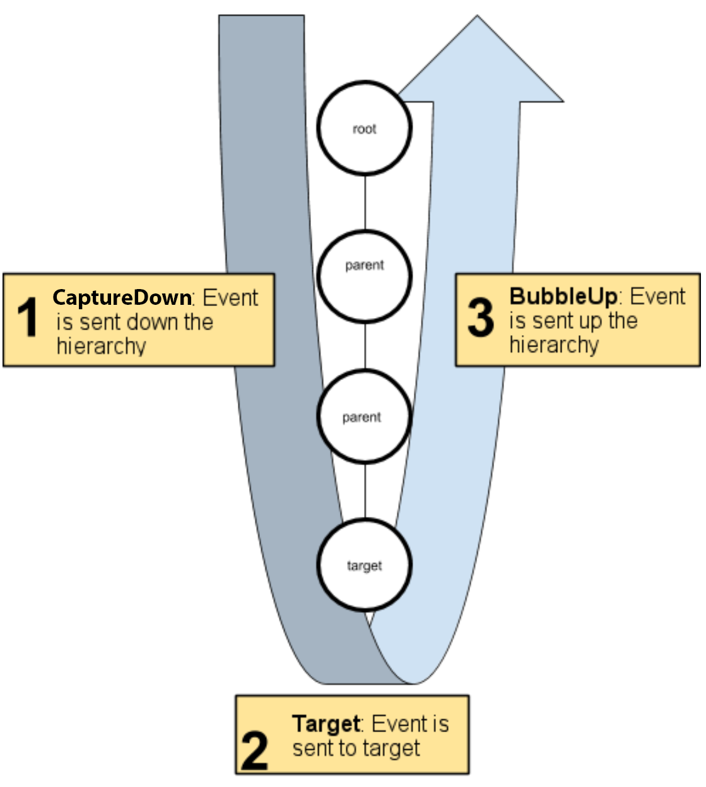
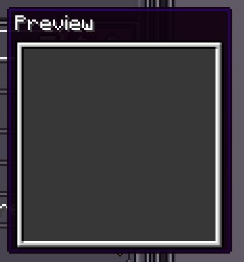

# 事件

{{ version_badge("2.1.0", label="Since", icon="tag") }}

LDLib2 UI 提供事件机制，用于向 UI 元素传达用户操作或通知。事件系统与 [HTML 事件](https://developer.mozilla.org/en-US/docs/Learn_web_development/Core/Scripting/Events#what_is_an_event) 共享相同的术语和事件命名规范。

---

## 事件分发

事件系统监听来自 ModularUI 或手动触发的事件，然后使用 `UIEventDispatcher` 将这些事件分发给 UI 元素。事件分发器为每个发送的事件确定适当的分发策略，然后执行该策略。

### 事件传播
每个事件阶段都有其自己的分发行为。每种事件类型的行为分为两个阶段：

- `捕获阶段`：在向下捕获阶段发送给元素的事件。
- `冒泡阶段`：在向上冒泡阶段发送给元素的事件。

在事件分发器选择事件 `target` 后，它会计算事件的传播路径。传播路径是接收事件的 UI 元素的有序列表。传播路径按以下顺序进行：

1. 路径从 UI 元素树的根部开始，向下延伸到 `target`。这是向下捕获阶段。
2. 事件目标接收事件。
3. 然后事件从目标向上返回到根部。这是向上冒泡阶段。

<figure markdown="span" style="width: 60%">
  
  <figcaption>传播路径</figcaption>
</figure>


大多数事件会发送给传播路径上的所有元素。某些事件会跳过冒泡阶段，某些事件仅发送给事件目标。

### 事件目标

当 `UIEvent` 沿传播路径传播时，`UIEvent.currentElement` 会更新为**当前正在处理**事件的元素。这使得了解"当前是哪个元素在运行我的监听器"变得容易。

在事件监听器中，LDLib2 区分两个重要的元素引用：

- **`UIEvent.target`**：事件**发起**的元素（分发目标）。
- **`UIEvent.relatedTarget`（可选）**：某些事件中可能涉及的另一个元素。
- **`UIEvent.currentElement`**：**当前正在执行**监听器的元素。

`target` 在分发开始前确定，且在传播过程中**不会改变**。  
`currentElement` 随着分发器遍历树而变化（捕获 → 目标 → 冒泡）。

### 停止传播

LDLib2 提供两种级别的取消机制：

- `event.stopPropagation()`  
  阻止事件到达**后续元素和后续阶段**（捕获/冒泡将停止）。

- `event.stopImmediatePropagation()`  
  阻止**当前元素**上的其他监听器运行，并停止进一步传播。

---

## 注册事件监听器

LDLib2 使用**类 DOM 事件模型**：事件在 UI 树中传播，监听器可以注册到：

- **冒泡阶段**（默认）
- **捕获阶段**（设置 `useCapture = true`）

使用 `addEventListener(eventType, listener)` 注册**冒泡阶段**监听器：

=== "Java"

    ```java
    var root = new UIElement().setId("root");
    var button = new UIElement().setId("button");
    root.addChild(button);

    // UIEvents.CLICK == "mouseClick"
    button.addEventListener(UIEvents.CLICK, e -> {
        LDLib2.LOGGER.info("Bubble listener: current={}, target={}",
                e.currentElement.getId(), e.target.getId());
    });
    ```

=== "KubeJS"

    ```js
    let root = new UIElement().setId("root");
    let button = new UIElement().setId("button");
    root.addChild(button);

    // UIEvents.CLICK == "mouseClick"
    button.addEventListener(UIEvents.CLICK, e => {
        console.log(`Bubble listener: current=${e.currentElement.getId()}, target=${e.target.getId()}`);
    });
    ```

要注册捕获阶段监听器，将第三个参数设为 true：

=== "Java"

    ```java
    root.addEventListener(UIEvents.CLICK, e -> {
        LDLib2.LOGGER.info("Capture: current={}, target={}",
                e.currentElement.getId(), e.target.getId());
    }, true);
    ```

=== "KubeJS"

    ```js
    root.addEventListener(UIEvents.CLICK, e => {
        console.log(`Capture: current=${e.currentElement.getId()}, target=${e.target.getId()}`);
    }, true);
    ```

我们还提供了允许你在`服务端`监听事件的方法。事件在客户端触发并同步到服务端。并非所有事件都支持服务端监听器，请查看下方的[事件参考](#事件参考)。


=== "Java"

    ```java
    root.addServerEventListener(UIEvents.CLICK, e -> {
        LDLib2.LOGGER.info("Triggered on the server";
    });
    ```

=== "KubeJS"

    ```js
    root.addServerEventListener(UIEvents.CLICK, e => {
        console.log("Triggered on the server");
    });
    ```

要移除监听器，调用 `removeEventListener(...)`。
确保 useCapture 标志与注册监听器时的值匹配：

=== "Java"

    ```java
    UIEventListener onClick = e -> LDLib2.LOGGER.info("clicked!");

    button.addEventListener(UIEvents.CLICK, onClick);       // bubble
    root.addEventListener(UIEvents.CLICK, onClick, true);   // capture

    button.removeEventListener(UIEvents.CLICK, onClick);          // remove bubble listener
    root.removeEventListener(UIEvents.CLICK, onClick, true);      // remove capture listener
    ```

=== "KubeJS"

    ```js
    let onClick = UIEventListener.creatre(e => LDLib2.LOGGER.info("clicked!"));

    button.addEventListener(UIEvents.CLICK, onClick);       // bubble
    root.addEventListener(UIEvents.CLICK, onClick, true);   // capture

    button.removeEventListener(UIEvents.CLICK, onClick);          // remove bubble listener
    root.removeEventListener(UIEvents.CLICK, onClick, true);      // remove capture listener
    ```

---

## 事件参考

当用户与元素交互并更改元素状态时，LDLib2 会触发事件。事件设计类似于 HTML 元素的 Event 接口。

事件类型基于 `UIEvent.class` 形成层次结构。每个事件系列实现一个接口，该接口定义了同一系列所有事件的共同特征。

下面列出了适用于所有 UI 元素的常见事件。选择下面列出的任何事件类型以获取有关该事件的更多信息以及 API 文档链接。

!!! note
    我们建议使用 `UIEvents.xxx` 而不是事件类型字符串。


### 鼠标事件

鼠标事件是最常用的事件。在处理程序开始捕获鼠标后发送的事件。

| 事件 | 描述 | 向下捕获 | 向上冒泡 | 支持服务端 |
| ----- | ----------- | ------------ | ---------- | ---------- |
| `mouseDown` | 当用户按下鼠标按钮时触发。 | ✅ | ✅ | ✅ |
| `mouseUp` | 当用户释放鼠标按钮时触发。 | ✅ | ✅ | ✅ |
| `mouseClick` | 当用户点击鼠标按钮（按下 + 释放）时触发。 | ✅ | ✅ | ✅ |
| `doubleClick` | 当用户双击鼠标按钮时触发。 | ✅ | ✅ | ✅ |
| `mouseMove` | 当鼠标在元素上移动时触发。 | ✅ | ✅ | ✅ |
| `mouseEnter` | 当鼠标进入元素或其子元素时触发。 | ✅ | ❌ | ✅ |
| `mouseLeave` | 当鼠标离开元素或其子元素时触发。 | ✅ | ❌ | ✅ |
| `mouseWheel` | 当用户滚动鼠标滚轮时触发。 | ✅ | ✅ | ✅ |


| 字段 | 描述 | 支持的事件 |
| ----- | ----------- | --------------- |
| `x` | 鼠标位置 x | All |
| `y` | 鼠标位置 y | All |
| `button` | 鼠标按钮代码（0 - 左键，1 - 右键，2 - 中键，其他...） | `mouseDown` `mouseUp` `mouseClick` `doubleClick` |
| `deltaX` | 滚动增量 x | `mouseWheel` |
| `deltaY` | 滚动增量 y | `mouseWheel` |

**用法**

=== "Java"

    ```java
    elem.addEventListener(UIEvents.DOUBLE_CLICK, e -> {
        LDLib2.LOGGER.info("double click {} with button {}", e.target, e.button)
    });
    ```

=== "KubeJS"

    ```js
    elem.addEventListener(UIEvents.DOUBLE_CLICK, e => {
        console.log(`double click ${e.target} with button ${e.button}`)
    });
    ```

---

### 拖放事件

拖放事件在拖动操作期间分发。
**这些事件仅限客户端，不会发送到服务端。**

| 事件              | 描述  | 向下捕获 | 向上冒泡 | 支持服务端 |
| ------------------ | ------------ | ------------ | ---------- | ---------- |
| `dragEnter`        | 在拖动操作期间当指针进入元素时触发。 | ✅ | ❌ | ❌ |
| `dragLeave`        | 在拖动操作期间当指针离开元素时触发。 | ✅ | ❌ | ❌ |
| `dragUpdate`       | 在拖动期间当指针在元素上移动时触发。     | ✅ | ✅ | ❌ |
| `dragSourceUpdate` | 在拖动期间在拖动源上触发。                          | ✅ | ❌ | ❌ |
| `dragPerform`      | 当拖动对象在元素上释放时触发。        | ✅ | ❌ | ❌ |
| `dragEnd`          | 当拖动操作结束时在拖动源上触发。            | ✅ | ❌ | ❌ |

| 字段 | 描述 | 支持的事件 |
| ----- | ----------- | --------------- |
| `x` | 鼠标位置 x | All |
| `y` | 鼠标位置 y | All |
| `relatedTarget` | 如果 relatedTarget 不为 null，表示新进入的元素。 | `dragLeave` |
| `deltaX` | 拖动增量 x | All |
| `deltaY` | 拖动增量 y | All |
| `dragStartX` | 拖动前的起始位置 x | All |
| `dragStartY` | 拖动前的起始位置 y | All |
| `dragHandler` | DragHandler 用于处理拖动事件。 | All |


所有拖动事件只有在 `startDrag` 启动拖动后才会触发。拖放生命周期如下：

1. 要触发拖动，例如在鼠标事件中，可以调用 `startDrag`。
2. 使用拖动事件进行操作，`dragEnter`、`dragLeave`、`dragUpdate` 和 `dragSourceUpdate`（如果定义了拖动源）。
3. 当拖动完成时，触发 `dragPerform` 和 `dragEnd`（如果定义了拖动源）。

**方法：`#!java DragHandler.startDrag(Object draggingObject, IGuiTexture dragTexture, UIElement dragSource)`**

参数：

- `draggingObject`：被拖动的对象；可以是任何类型，用于表示拖动载荷
- `dragTexture`：用于可视化表示拖动操作
- `dragSource`：作为拖动操作源的 `UIElement`

!!! note
    `dragSourceUpdate` 和 `dragEnd` 仅分发给拖动源。

你也可以使用 `UIElement.startDrag` 启动拖动，这可以帮助你直接传递 `dragSource`。

**用法**

=== "Java"

    ```java
    elem.addEventListener(UIEvents.MOUSE_DOWN, e -> {
        // start drag when the mouse down
        elem.startDrag(null, null);
    });
    elem.addEventListener(UIEvents.DRAG_SOURCE_UPDATE, e -> {
        LDLib2.LOGGER.info("{} dragged ({}, {})", e.target, e.deltaX, e.deltaY)
    });
    ```

=== "KubeJS"

    ```js
    elem.addEventListener(UIEvents.MOUSE_DOWN, e => {
        // start drag when the mouse down
        elem.startDrag(null, null);
    });
    elem.addEventListener(UIEvents.DRAG_SOURCE_UPDATE, e => {
        copnsole.log(`${e.target} dragged (${e.deltaX}, ${e.deltaY})`)
    });
    ```

---

### 焦点事件

焦点事件在 `focusable` 元素获得或失去焦点时分发。

| 事件      | 描述                                   | 向下捕获 | 向上冒泡 | 支持服务端 |
| ---------- | --------------------------------------------- | ------------ | ---------- | ---------- |
| `focusIn`  | 当元素即将获得焦点时触发。 | ✅ | ❌ | ❌ |
| `focus`    | 当元素已获得焦点后触发。      | ✅ | ❌ | ✅ |
| `focusOut` | 当元素即将失去焦点时触发。 | ✅ | ❌ | ❌ |
| `blur`     | 当元素已失去焦点后触发。        | ✅ | ❌ | ✅ |

| 字段 | 描述 | 支持的事件 |
| ----- | ----------- | --------------- |
| `relatedTarget` | 对于 `focusIn` 和 `focus`，指上一个获得焦点的元素。<br> 对于 `focusOut` 和 `blur`，指上一个获得焦点的元素。 | All |

!!! note
    - `focusIn` 和 `focusOut` **不会发送到服务端**。
    - `relatedTarget` 表示正在失去或获得焦点的元素。

**用法**

=== "Java"

    ```java
    elem.setFocusable(true)
    elem.addEventListener(UIEvents.MOUSE_DOWN, e -> {
        // request focus
        elem.focus();
    });
    elem.addEventListener(UIEvents.FOCUS, e -> {
        LDLib2.LOGGER.info("{} gained the focus", elem);
    });
    ```

=== "KubeJS"

    ```js
    elem.setFocusable(true)
    elem.addEventListener(UIEvents.MOUSE_DOWN, e => {
        // request focus
        elem.focus();
    });
    elem.addEventListener(UIEvents.FOCUS, e => {
        console.log(`${elem} gained the focus`);
    });
    ```

---

### 键盘事件

键盘事件分发给当前拥有**焦点**的元素。

| 事件     | 描述                                         | 向下捕获 | 向上冒泡 | 支持服务端 |
| --------- | --------------------------------------------------- | ------------ | ---------- | ---------- |
| `keyDown` | 当用户按下键盘上的按键时触发。  | ✅ | ✅ | ✅ |
| `keyUp`   | 当用户释放键盘上的按键时触发。 | ✅ | ✅ | ✅ |


| 字段 | 描述 | 支持的事件 |
| ----- | ----------- | --------------- |
| `keyCode` | 按键代码 | All |
| `scanCode` | 扫描码 | All |
| `modifiers` | 修饰键 | All |

**用法**

=== "Java"

    ```java
    elem.setFocusable(true)
    elem.addEventListener(UIEvents.MOUSE_DOWN, e -> {
        // request focus
        elem.focus();
    });
    elem.addEventListener(UIEvents.KEY_DOWN, e -> {
        LDLib2.LOGGER.info("key {} pressed", e.keyCode);
    });
    ```

=== "KubeJS"

    ```js
    elem.setFocusable(true)
    elem.addEventListener(UIEvents.MOUSE_DOWN, e => {
        // request focus
        elem.focus();
    });
    elem.addEventListener(UIEvents.KEY_DOWN, e => {
        console.log(`key ${e.keyCode} pressed`)
    });
    ```

---

### 文本输入事件

文本输入事件用于字符级输入，例如在文本字段中输入，该事件也分发给当前拥有**焦点**的元素。

| 事件       | 描述                                      | 向下捕获 | 向上冒泡 | 支持服务端 |
| ----------- | ------------------------------------------------ | ------------ | ---------- | ---------- |
| `charTyped` | 当字符输入到元素中时触发。 | ❌ | ❌ | ✅ |

| 字段 | 描述 | 支持的事件 |
| ----- | ----------- | --------------- |
| `codePoint` | 码点 | All |
| `modifiers` | 修饰键 | All |

**用法**

=== "Java"

    ```java
    elem.setFocusable(true)
    elem.addEventListener(UIEvents.MOUSE_DOWN, e -> {
        // request focus
        elem.focus();
    });
    elem.addEventListener(UIEvents.CHAR_TYPED, e -> {
        LDLib2.LOGGER.info("key {} pressed", e.codePoint);
    });
    ```

=== "KubeJS"

    ```js
    elem.setFocusable(true)
    elem.addEventListener(UIEvents.MOUSE_DOWN, e => {
        // request focus
        elem.focus();
    });
    elem.addEventListener(UIEvents.CHAR_TYPED, e => {
        console.log(`key ${e.codePoint} pressed`)
    });
    ```
---

### 悬停提示事件

悬停提示事件在需要显示动态提示信息时分发。


| 事件           | 描述                                  | 向下捕获 | 向上冒泡 | 支持服务端 |
| --------------- | -------------------------------------------- | ------------ | ---------- | ---------- |
| `hoverTooltips` | 为元素提供悬停提示内容时触发。 | ❌ | ❌ | ❌ |

| 字段 | 描述 | 支持的事件 |
| ----- | ----------- | --------------- |
| `hoverTooltips` | 设置要显示的悬停提示 | All |

!!! info "TooltipComponent"
    { align=right width="200" }
    `hoverTooltips` 允许你在文本组件之后追加 `TooltipComponent`。你可以使用 `ModularUITooltipComponent` 将 LDLib2 UI 追加到提示中。
    

**用法**

=== "Java"

    ```java
    elem.addEventListener(UIEvents.HOVER_TOOLTIPS, e -> {
        e.hoverTooltips = HoverTooltips.empty()
            // add text tooltips
            .append(Component.literal("Hello"), Component.literal("World"))
            // add a image
            .tooltipComponent(new ModularUITooltipComponent(new UIElement().layout(layout -> {
                layout.width(100).height(100);
            }).style(style -> style.background(SpriteTexture.of("ldlib2:textures/gui/icon.png")))));
    });
    ```

=== "KubeJS"

    ```js
    elem.addEventListener(UIEvents.HOVER_TOOLTIPS, e => {
        e.hoverTooltips = HoverTooltips.empty()
            // add text tooltips
            .append("Hello", "World");
            // add a image
            .tooltipComponent(new ModularUITooltipComponent(new UIElement().layout(layout => {
                layout.width(100).height(100);
            }).style(style => style.background(SpriteTexture.of("ldlib2:textures/gui/icon.png")))));
    });
    ```
---

### 命令事件

命令事件用于处理高级 UI 命令（如复制、粘贴、全选）。
它们遵循验证 → 执行的流程。要在 `validateCommand` 期间声明命令，调用 `UIEvent.stopPropagation()`。

| 事件             | 描述                     | 向下捕获 | 向上冒泡 | 支持服务端 |
| ----------------- | ------------------------------- | ------------ | ---------- | ---------- |
| `validateCommand` | 检查元素是否可以处理命令时触发。 | ❌ | ❌ | ❌ |
| `executeCommand`  | 当命令在元素上执行时触发。         | ❌ | ❌ | ❌ |

| 字段 | 描述 | 支持的事件 |
| ----- | ----------- | --------------- |
| `keyCode` | 按键代码 | All |
| `scanCode` | 扫描码 | All |
| `modifiers` | 修饰键 | All |
| `command` | 命令 | All |

**命令**

| 命令 | 描述 |
| ----- | ----------- |
| `copy` | ctrl + c |
| `cut` | ctrl + x |
| `paste` | ctrl + v |
| `select-all` | ctrl + a |
| `undo` | ctrl + z |
| `redo` | ctrl + y / ctrl + shift + z |
| `find` | ctrl + f |
| `save` | ctrl + s |


!!! note
    如果检测到命令输入，命令事件将首先发送到 `focus` 元素（如果存在）。如果未被消费，它将发送到 UI 树中的元素，直到某个元素消费它。

**用法**

=== "Java"

    ```java
    elem.addEventListener(UIEvents.VALIDATE_COMMAND, e -> {
        if (CommandEvents.COPY.equals(event.command)) {
            // notify cosnuming
            event.stopPropagation();
        }
    });

    elem.addEventListener(UIEvents.EXECUTE_COMMAND, e -> {
        if (CommandEvents.COPY.equals(event.command)) {
            ClipboardManager.copyDirect("data");
        }
    });
    ```

=== "KubeJS"

    ```js
    elem.addEventListener(UIEvents.VALIDATE_COMMAND, e => {
        if (CommandEvents.COPY == event.command) {
            // notify cosnuming
            event.stopPropagation();
        }
    });

    elem.addEventListener(UIEvents.EXECUTE_COMMAND, e => {
        if (CommandEvents.COPY == event.command) {
            ClipboardManager.copyDirect("data");
        }
    });
    ```

---

### 布局事件

布局事件在元素的布局状态改变时分发。

| 事件           | 描述                                  | 向下捕获 | 向上冒泡 | 支持服务端 |
| --------------- | -------------------------------------------- | ------------ | ---------- | ---------- |
| `layoutChanged` | 当元素的 yoga 布局改变时触发。 | ❌ | ❌ | ❌ |


**用法**

=== "Java"

    ```java
    elem.addEventListener(UIEvents.LAYOUT_CHANGED, e -> {
        LDLib2.LOGGER.info("{} layout changed", e.target)
    });
    ```

=== "KubeJS"

    ```js
    elem.addEventListener(UIEvents.LAYOUT_CHANGED, e => {
        console.log(`${e.target} layout changed`)
    });
    ```

---

### 生命周期事件

生命周期事件描述元素在 UI 树中存在状态的变化。

| 事件        | 描述                                       | 向下捕获 | 向上冒泡 | 支持服务端 |
| ------------ | ------------------------------------------------- | ------------ | ---------- | ---------- |
| `added`      | 当元素添加到 UI 树时触发。        | ❌            | ❌          | ❌ |
| `removed`    | 当元素从 UI 树移除时触发。    | ❌            | ❌          | ❌ |
| `muiChanged` | 当元素的 `ModularUI` 实例改变时触发。 | ❌            | ❌          | ❌ |

!!! note
    `removed` 不仅在元素移除时发送，在 UI 关闭时也会发送。你可以使用此事件来释放资源。

**用法**

=== "Java"

    ```java
    elem.addEventListener(UIEvents.REMOVED, e -> {
        // release resource here for safe
    });
    ```

=== "KubeJS"

    ```js
    elem.addEventListener(UIEvents.REMOVED, e => {
        // release resource here for safe
    });
    ```

---

### Tick 事件

Tick 事件在元素处于活动状态且可见时每游戏刻分发一次。

| 事件  | 描述                                           | 向下捕获 | 向上冒泡 | 支持服务端 |
| ------ | ----------------------------------------------------- | ------------ | ---------- | ---------- |
| `tick` | 当元素处于活动状态并显示时每刻触发。 | ❌ | ❌ | ✅ |

!!! note
    - `tick` 不会自动发送到服务端。
    - 如果需要，你仍然可以在服务端监听它。


=== "Java"

    ```java
    elem.addEventListener(UIEvents.TICK, e -> {
    });
    ```

=== "KubeJS"

    ```js
    elem.addEventListener(UIEvents.TICK, e => {
    });
    ```
