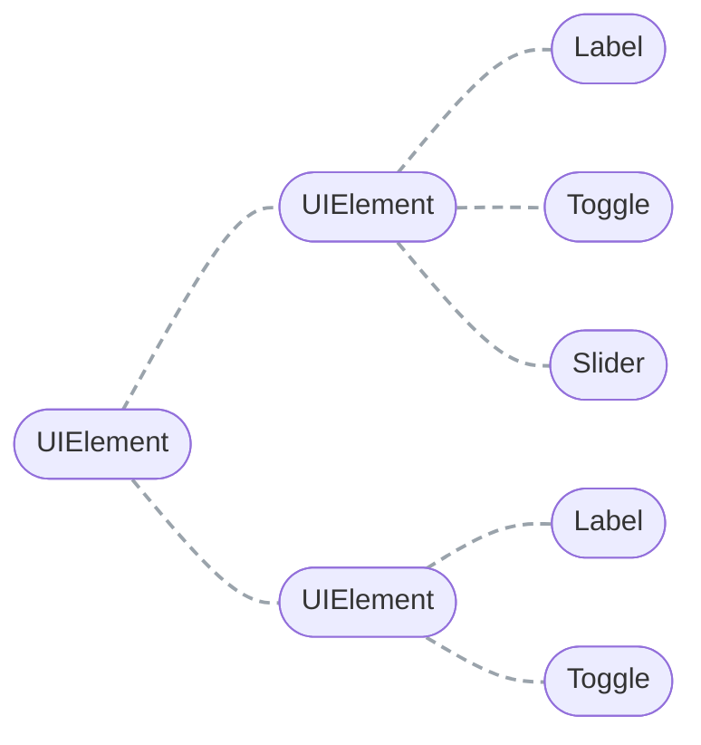
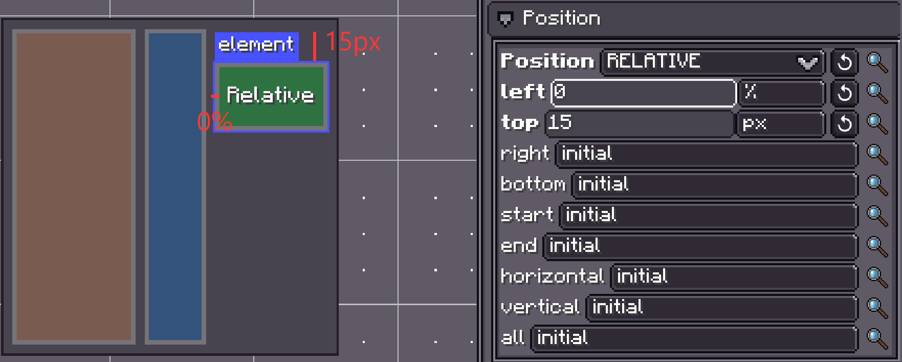
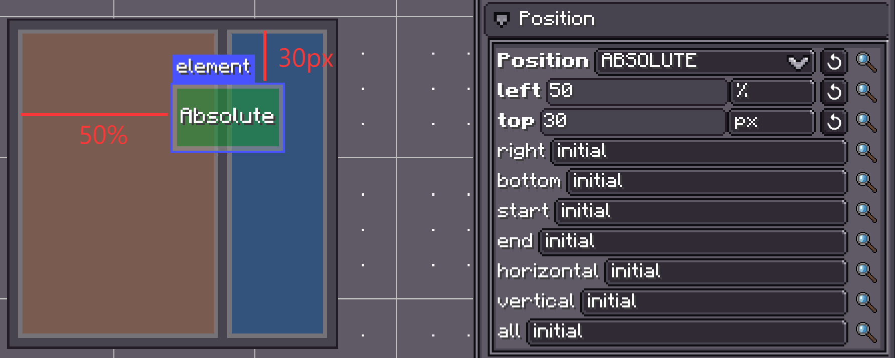
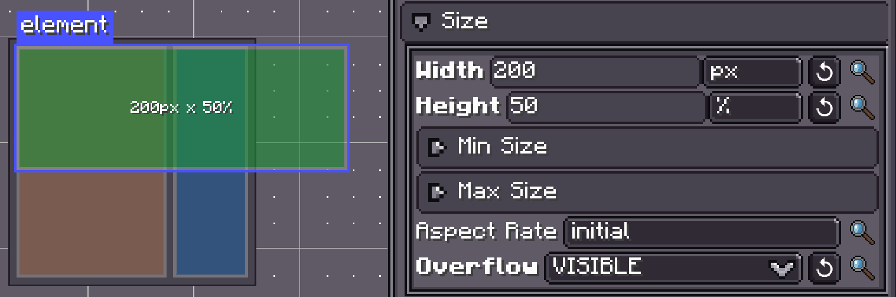
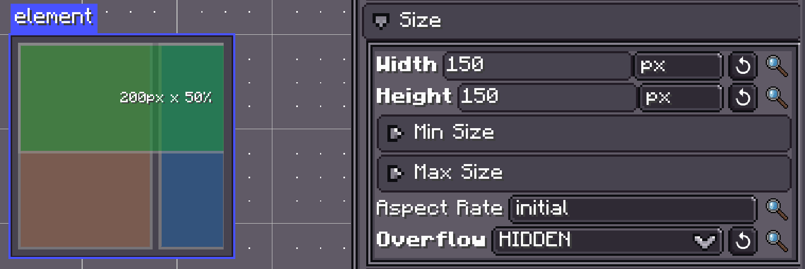
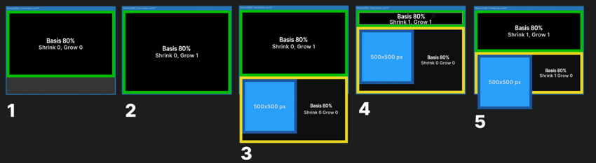
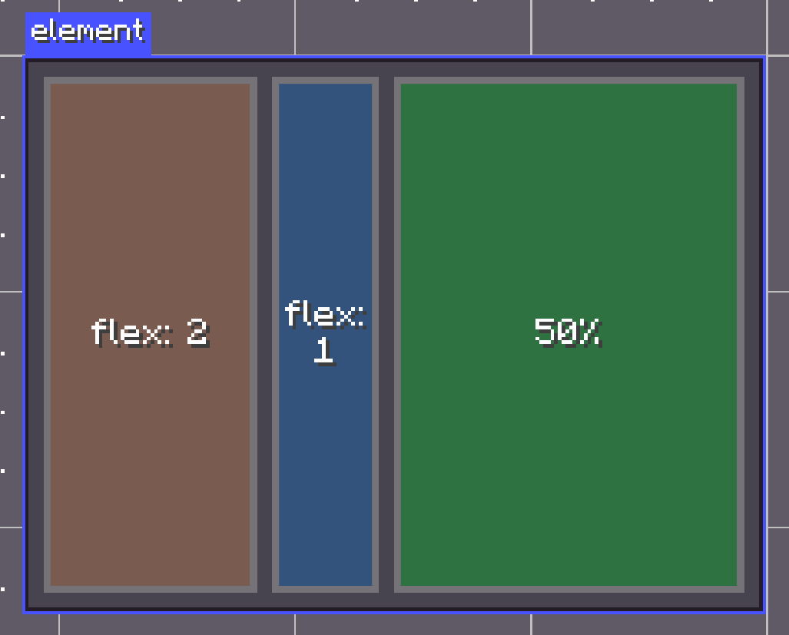
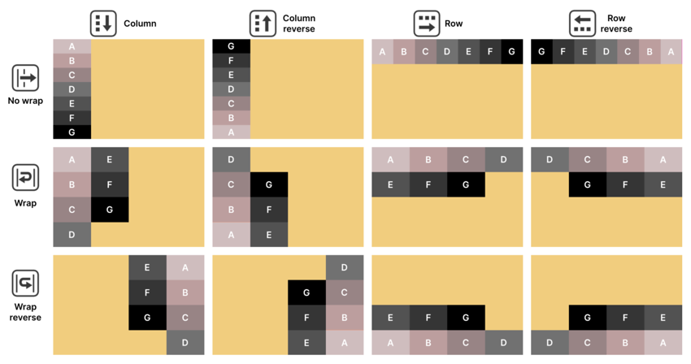
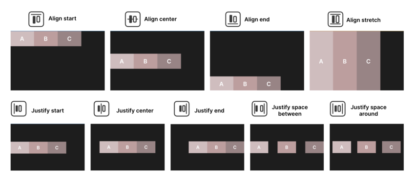
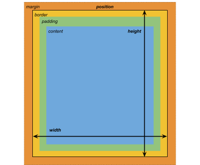

# 布局
{{ version_badge("2.2.0", label="Since", icon="tag") }}
LDLib2 UI 布局构建在 [Taffy layout engine](https://github.com/DioxusLabs/taffy) 之上。它目前实现了 CSS Block、Flexbox 和 CSS Grid 布局算法。
> **Taffy** 是流行 UI 框架中使用的嵌入式布局系统。> 它**不是** UI 框架，并且不执行任何渲染。> 它的唯一职责是计算元素的**大小和位置**。
LDLib2采用**基于FlexBox的/网格布局模型**，它允许您以灵活且可预测的方式描述复杂的UI结构。
---

## 设置布局属性
每个`UIElement` 都拥有一个由太妃糖支持的布局对象。您可以根据您的偏好和用例以多种方式配置布局属性。
除了下面的示例之外，还可以通过以下方式定义布局属性[LSS (LDLib Style Sheet)](./stylesheet.md){ data-preview }，这对于将布局逻辑与 UI 结构分离特别有用。
===“Java”
    ```java
    var element = new UIElement();

    // Set layout directly
    element.getLayout()
            .flexDirection(FlexDirection.ROW)
            .width(150)
            .heightPercent(100)
            .marginAll(10)
            .paddingAll(10);

    // Set layout using a chaining lambda
    element.layout(layout -> layout
            .flexDirection(FlexDirection.ROW)
            .width(150)
            .heightPercent(100)
            .marginAll(10)
            .paddingAll(10)
    );

    // Set layout via stylesheet (LSS)
    element.lss("flex-direction", "row");
    element.lss("width", 150);
    element.lss("height-percent", 100);
    element.lss("margin-all", 10);
    element.lss("padding-all", 10);
    ```

===“KubeJS”
    ```js
    let element = new UIElement();

    // Set layout directly
    element.getLayout()
            .flexDirection(FlexDirection.ROW)
            .width(150)
            .heightPercent(100)
            .marginAll(10)
            .paddingAll(10);

    // Set layout using a chaining lambda
    element.layout(layout -> layout
            .flexDirection(FlexDirection.ROW)
            .width(150)
            .heightPercent(100)
            .marginAll(10)
            .paddingAll(10)
    );

    // Set layout via stylesheet (LSS)
    element.lss("flex-direction", "row");
    element.lss("width", 150);
    element.lss("height-percent", 100);
    element.lss("margin-all", 10);
    element.lss("padding-all", 10);
    ```

---

## 学习 Flex 布局
!!!信息如果你已经熟悉 Flexbox，Taffy 布局应该感觉非常直观。如果没有，我们建议阅读官方[Taffy documentation](https://taffylayout.com/docs)以获得完整的解释。
为了进行更简单的介绍，本章重点介绍**LDLib2 UI 中最常用的 Flex 概念**。

## UI 元素和层次结构
在LDLib2 UI中，界面由**UI元素**（`UIElement`）组成。
- UI 元素表示可视容器，例如面板、按钮、文本字段或图像。- UI 元素可以包含其他 UI 元素，形成 **UI 层次结构**（也称为 *布局树*）。
复杂的界面是通过将多个 UI 元素组合成嵌套层次结构来构建的，并在不同级别应用布局和样式规则。


---

## 定位 UI 元素
设计 UI 布局时，请将每个屏幕视为水平或垂直排列的矩形容器的集合。
将布局分解为逻辑部分，然后使用子容器来组织内容来细化每个部分。
---

## 定位模式
Taffy 支持两种主要定位模式：
### 相对定位（默认）
元素参与其父容器的 Flexbox 布局。
- 子元素根据父元素的 **Flex Direction** 排列- 元素大小和位置动态响应：    - 父级布局规则（填充、对齐、间距）    - 元素自身的尺寸限制（宽度、高度、最小/最大尺寸）
如果布局约束发生冲突，布局引擎会自动解决它们。例如，比其容器宽的元素可能会溢出。
### 绝对定位
元素相对于其父容器定位，但**不参与 Flexbox 布局计算**。
- Flex 属性（例如 Grow、Shrink 或 Alignment）将被忽略- 元素可能与其他内容重叠- 使用`Top`、`Right`、`Bottom` 和`Left` 等偏移量控制位置
<figure markdown="span"><br><figcaption>在顶部，蓝色 ui 元素具有相对位置，父元素使用 Flex Direction: Row 作为 Flex 设置。底部，蓝色 ui 元素使用绝对位置并忽略父元素的 Flexbox 规则。</figcaption></figure>
---

## 尺寸设置
默认情况下，UI 元素是容器。
- 如果没有明确的大小规则，元素可能会扩展以填充可用空间或折叠到其内容的大小- `Width` 和`Height` 定义元素的基本尺寸- `Min` 和 `Max` 值限制元素可以增大或缩小的程度- 如果设置`Aspect Rate`，则一个维度将由另一个维度决定- `Overflow` 控制元素内容的剪辑。默认值是`visible`，这意味着元素的内容不会被剪切到元素的边界。如果将溢出设置为隐藏，则元素的内容将被剪切到元素的内容边界。- 尺寸可以用像素或百分比来表示
这些尺寸规则与 Flexbox 设置交互以确定最终布局。

<figure markdown="span"><br><figcaption>UI 元素的大小设置。</figcaption></figure>
---

## 弹性设置
Flex 设置会影响使用相对定位时元素如何增大或缩小。建议您对元素进行试验，以直接了解它们的行为。
### 弹性基础
定义应用“增长”或“收缩”之前元素的初始大小。
### 弹性成长
- `Flex Grow > 0` 允许元素扩展并占用可用空间- 值越高，可用空间份额越大- `Flex Grow = 0` 防止扩展超出基本大小

### 弹性收缩
- `Flex Shrink > 0`允许元素在空间有限时收缩- `Flex Shrink = 0` 防止收缩并可能导致溢出
> 具有固定像素大小的元素不响应“增长”或“收缩”。
<figure markdown="span"><figcaption>基础、增长和收缩设置。</figcaption></figure>
上面的示例显示了 Basis 如何与 Grow 和 Shrink 选项配合使用：
1. 基础为 80% 的绿色元素占据了 80% 的可用空间。2. 将“Grow”设置为 1 可以让绿色元素扩展到整个空间。3. 添加黄色元素后，元素溢出了空间。绿色元素重新占据了 80% 的空间。4. 收缩设置为 1 会使绿色元素收缩以适合黄色元素。
此处，两个元素的 Shrink 值为 1。它们均匀收缩以适应可用空间。
### 弹性
`Flex = 1`相当于`Flex Grow = 1`和`Flex Shrink = 1`，用于同时设置`Flex Grow`和`Flex Shrink`。
<figure markdown="span"><figcaption>在此示例中，我们假设根容器`width: 200px`。最右边的元素集`width: 50%`。因此，最左侧和中间元素的左侧空间为 100px。他们根据他们的`flex`，将剩余的空间按照`2:1`的比例进行了划分。</figcaption></figure>
---

### 💡 元素大小是如何计算的
使用相对定位时，布局引擎按以下顺序确定元素大小：
1. 根据`Width` 和`Height` 计算基本尺寸2. 检查父容器是否有多余空间或溢出3. 使用`Flex Grow`分配额外空间4. 如果空间不足，使用 `Flex Shrink` 减小大小5. 应用 `Min/Max` 大小和 `Flex Basis` 等约束6. 应用最终解析的尺寸
---

### Flex 方向和 Flex 环绕
- `Flex Direction` 控制子元素是按行还是按列布局- `Flex Wrap` 控制元素是保留在单行上还是换行到其他行或列上
子元素遵循 UI 层次结构中定义的顺序。
<figure markdown="span"><figcaption>使用相对定位和不同方向和环绕组合的父级和子级 UI 元素。</figcaption></figure>
---

＃＃ 结盟
对齐设置控制子元素在容器内的定位方式。
### 对齐项目
沿横轴（垂直于弯曲方向）对齐元素：
### 证明内容合理
控制沿主轴的间距：
Flex Grow 和 Shrink 值会影响空间的分配方式。
### 自我对齐
允许单个元素覆盖父元素的对齐规则。
### 对齐内容
控制弹性项目的**多行或多列**如何**沿横轴**对齐。
!!!笔记`Align Content`仅在以下情况下生效：    
    - 容器允许包裹 (`flex-wrap: wrap`)    - 有**多条线**的孩子

<figure markdown="span"><figcaption>应用于方向设置为行的父元素的对齐和两端对齐设置；请注意，其他位置和大小选项可能会影响最终输出。</figcaption></figure>
---

## 边距和填充
LDLib2 UI 遵循类似于 CSS 的盒模型：
- **内容**：元素的实际内容- **Padding**：内容和边框之间的空间- **边框**：元素周围的可选边界（避免使用它）。- **边距**：元素外部的空间，将其与其他元素分开
<figure markdown="span"><figcaption>具有定义的大小、边距、边框和填充设置的 UI 元素；具有固定宽度或高度的元素可能会溢出空间。</figcaption></figure>
---


## 网格布局
网格类似于[css](https://developer.mozilla.org/en-US/docs/Web/CSS/Reference/Properties/grid)。您可以创建网格布局并定位其子项。