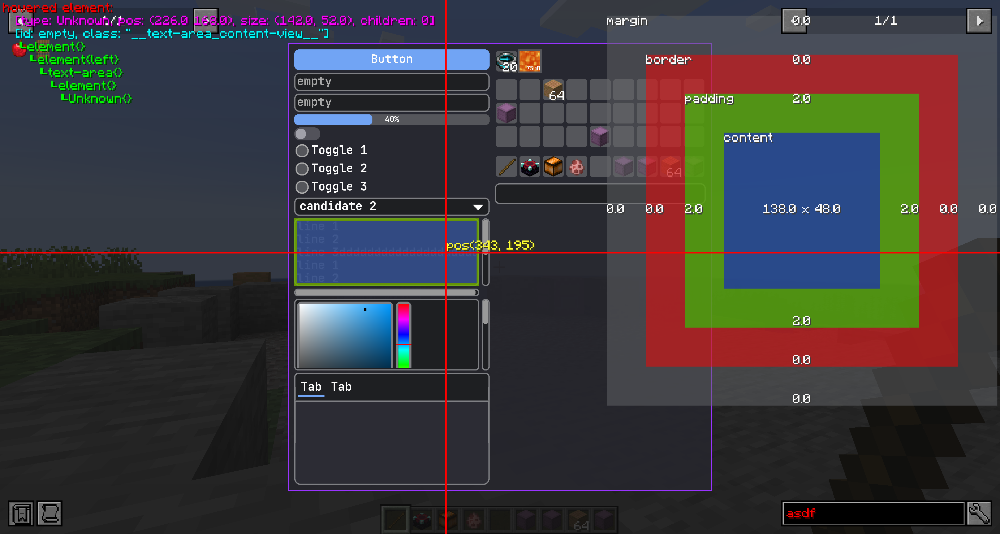

# 模块化用户界面
{{ version_badge("2.1.0", label="Since", icon="tag") }}
本页介绍**LDLib2 UI系统**的核心概念。在运行时，LDLib2使用一个名为**`ModularUI`**的类来管理整个UI树。`ModularUI` 负责：
- 管理 UI 生命周期- 处理输入事件- 应用样式和样式表- 协调渲染- 同步客户端和服务器之间的数据（与菜单一起使用时）
简而言之，**`ModularUI` 是 UI 实例的中央控制器**。
---

## `ModularUI` 的工作原理
下图展示了 `ModularUI` 如何将 Minecraft 系统与 UI 树连接起来：```mermaid
flowchart LR
    Screen["Screen<br/>(Mouse / Keyboard Input)"]
    Menu["Menu<br/>(Server Data)"]

    %% internal structure
    subgraph ModularUI["ModularUI"]
        direction TB
        UITree["UI Tree"]
        Style["Style Engine<br/>(LSS / Stylesheets)"]
        Events["Event System<br/>(Dispatch / Bubble)"]
        Render["Renderer<br/>(Draw Commands)"]
        Bindings["Data Binding<br/>(C<-->S)"]

        UITree <--> Style
        UITree <--> Events
        UITree <--> Render
        UITree <--> Bindings
    end

    %% external connections
    Screen -->|Input Events| ModularUI
    Menu -->|Data Sync| ModularUI
    ModularUI -->|Render Output| Screen
    ModularUI -->|Data Sync / RPC Event| Menu
```

---

## `ModularUI` API
创建`ModualrUI`有两种方法：
- `#!java ModularUI.of(ui)`- `#!java ModularUI.of(ui, player)`
要创建一个简单的仅`client-side` UI，第一个就足够了。
第二个需要 `Player` 作为输入，如果您的 UI 是 `menu-based` UI 并且需要客户端和服务器之间的数据同步，则这是**必需的**。
### 通用 API
| Method | Description |
| ---- | ----------- |
| `shouldCloseOnEsc()` | Whether the UI should close when pressing `ESC`. |
| `shouldCloseOnKeyInventory()` | Whether the UI should close when pressing the Inventory key (default: `E`). |
| `getTickCounter()` | Returns how many ticks this `ModularUI` instance has been active. |
| `getWidget()` | Returns the widget instance used by the Minecraft `Screen`. |
| `getAllElements()` | Returns an unmodifiable list of all UI elements in the UI tree. |

---


### 元素查询 API（按 ID）
| Method | Description |
| ---- | ----------- |
| `getElementById(String id)` | Finds and returns the **first** UI element with the given ID, or `null` if not found. |
| `getElementsById(String id)` | Returns **all** UI elements with the given ID. |
| `hasElementWithId(String id)` | Checks whether at least one element with the given ID exists. |
| `getElementCountById(String id)` | Returns the number of elements with the given ID. |
| `getAllElementsById()` | Returns a copy of the internal mapping from ID to UI elements. |

---

### 元素查询 API（正则表达式和模式）
| Method | Description |
| ---- | ----------- |
| `getElementByIdRegex(String pattern)` | Finds the first element whose ID matches the given regex pattern. |
| `getElementsByIdRegex(String pattern)` | Finds all elements whose IDs match the given regex pattern. |
| `getElementByIdPattern(Pattern pattern)` | Same as above, but uses a precompiled `Pattern` for better performance. |
| `getElementsByIdPattern(Pattern pattern)` | Returns all elements matching a precompiled regex pattern. |

---

### 元素查询 API（部分匹配）
| Method | Description |
| ---- | ----------- |
| `getElementsByIdContains(String substring)` | Finds all elements whose IDs contain the given substring. |
| `getElementsByIdStartsWith(String prefix)` | Finds all elements whose IDs start with the given prefix. |
| `getElementsByIdEndsWith(String suffix)` | Finds all elements whose IDs end with the given suffix. |

---

### 元素查询 API（按类型）
| Method | Description |
| ---- | ----------- |
| `getElementsByType(Class<T> type)` | Returns all UI elements of the given type. |
| `getAllElementsByType()` | Returns a copy of the internal mapping from element type to UI elements. |

!!!笔记所有查询方法都会在适用时返回内部集合的**副本**。返回的列表可以安全修改，不会影响内部 UI 树。
---

## 调试你的用户界面
在开发过程中，UI 树可能并不总是按预期运行，并且很难理解出了什么问题。
您可以按 **`F3`** 启用 **UI 调试模式**。当调试模式处于活动状态时，LDLib2 会直接在屏幕上显示有用的信息。
<figure markdown="span">{宽度=“80%”}</figure>