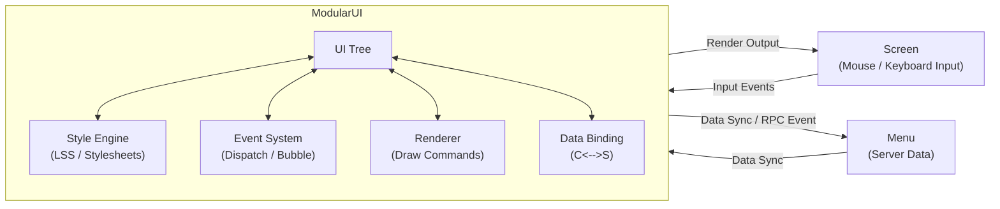

# ModularUI

{{ version_badge("2.1.0", label="Since", icon="tag") }}

本页介绍 **LDLib2 UI 系统** 的核心概念。
在运行时，LDLib2 使用名为 **`ModularUI`** 的类来管理整个 UI 树。  
`ModularUI` 负责：

- 管理 UI 生命周期
- 处理输入事件
- 应用样式和样式表
- 协调渲染
- 在客户端和服务端之间同步数据（与 Menu 配合使用时）

简而言之，**`ModularUI` 是 UI 实例的中央控制器**。

---

## `ModularUI` 的工作原理

下图展示了 `ModularUI` 如何连接 Minecraft 系统与 UI 树：

---

## `ModularUI` API

创建 `ModularUI` 有两种方法：

- `#!java ModularUI.of(ui)`
- `#!java ModularUI.of(ui, player)`

如果只需创建简单的 `client-side`（仅客户端）UI，使用第一种方法即可。

第二种方法需要传入 `Player` 参数，这在 `menu-based`（基于菜单）UI 中是 **必需的**，因为这类 UI 需要在客户端和服务端之间同步数据。

### 通用 API

| 方法 | 描述 |
| ---- | ----------- |
| `shouldCloseOnEsc()` | UI 是否应在按下 `ESC` 时关闭。 |
| `shouldCloseOnKeyInventory()` | UI 是否应在按下物品栏键（默认：`E`）时关闭。 |
| `getTickCounter()` | 返回此 `ModularUI` 实例已激活的 tick 数。 |
| `getWidget()` | 返回 Minecraft `Screen` 使用的 widget 实例。 |
| `getAllElements()` | 返回 UI 树中所有 UI 元素的不可修改列表。 |

---

### 元素查询 API（按 ID）

| 方法 | 描述 |
| ---- | ----------- |
| `getElementById(String id)` | 查找并返回具有指定 ID 的 **第一个** UI 元素，如果未找到则返回 `null`。 |
| `getElementsById(String id)` | 返回具有指定 ID 的 **所有** UI 元素。 |
| `hasElementWithId(String id)` | 检查是否存在至少一个具有指定 ID 的元素。 |
| `getElementCountById(String id)` | 返回具有指定 ID 的元素数量。 |
| `getAllElementsById()` | 返回从 ID 到 UI 元素的内部映射的副本。 |

---

### 元素查询 API（正则表达式与模式）

| 方法 | 描述 |
| ---- | ----------- |
| `getElementByIdRegex(String pattern)` | 查找 ID 匹配给定正则表达式模式的第一个元素。 |
| `getElementsByIdRegex(String pattern)` | 查找 ID 匹配给定正则表达式模式的所有元素。 |
| `getElementByIdPattern(Pattern pattern)` | 同上，但使用预编译的 `Pattern` 以获得更好的性能。 |
| `getElementsByIdPattern(Pattern pattern)` | 返回匹配预编译正则表达式模式的所有元素。 |

---

### 元素查询 API（部分匹配）

| 方法 | 描述 |
| ---- | ----------- |
| `getElementsByIdContains(String substring)` | 查找 ID 包含给定子字符串的所有元素。 |
| `getElementsByIdStartsWith(String prefix)` | 查找 ID 以给定前缀开头的所有元素。 |
| `getElementsByIdEndsWith(String suffix)` | 查找 ID 以给定后缀结尾的所有元素。 |

---

### 元素查询 API（按类型）

| 方法 | 描述 |
| ---- | ----------- |
| `getElementsByType(Class<T> type)` | 返回指定类型的所有 UI 元素。 |
| `getAllElementsByType()` | 返回从元素类型到 UI 元素的内部映射的副本。 |

!!! note
    所有查询方法在适用时返回内部集合的 **副本**。返回的列表可以安全修改，不会影响内部 UI 树。

---

## 调试 UI

在开发过程中，UI 树可能不会总是按预期工作，  
而且很难理解出了什么问题。

你可以按 **`F3`** 启用 **UI 调试模式**。  
当调试模式激活时，LDLib2 会直接在屏幕上显示有用的信息。

<figure markdown="span">
  { width="80%" }
</figure>
