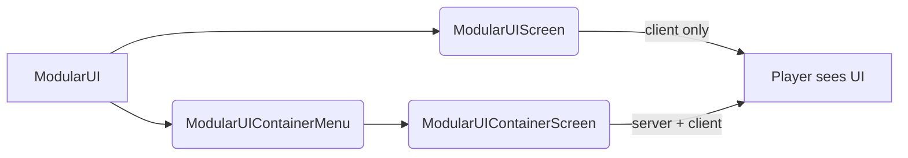
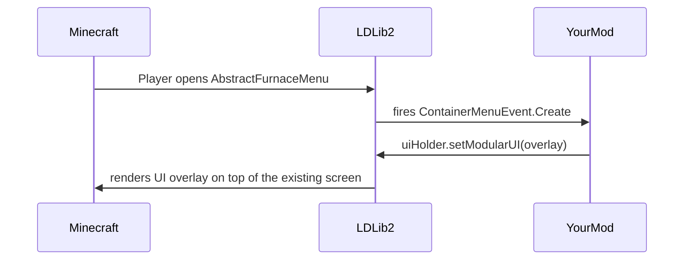

# Screen 与 Menu

{{ version_badge("2.2.1", label="Since", icon="tag") }}

`ModularUI` 是一棵 UI 树——它描述了 UI *长什么样* 以及 *如何交互*。要真正将其显示给玩家，必须将它托管在 Minecraft 的 **Screen** 或 **Menu** 中。

LDLib2 提供了两种开箱即用的宿主和一组工厂辅助方法，让这一过程尽可能简单。

---

## 概述



| 宿主 | 同步方式 | 适用场景 |
| ---- | ---- | -------- |
| `ModularUIScreen` | 仅客户端 | 纯展示型浮层、HUD 组件或无需服务端数据的编辑器窗口 |
| `ModularUIContainerMenu` + `ModularUIContainerScreen` | 服务端 ↔ 客户端 | 任何需要读写服务端数据的 UI（物品栏、机器配置等） |

---

## 仅客户端 Screen

`ModularUIScreen` 直接继承自 Minecraft 的 `Screen`。它仅在客户端运行——不会在服务端打开 menu，依赖服务端同步的数据绑定将无法工作。

```java
// Build your UI
var modularUI = ModularUI.of(UI.of(root));

// Wrap it in a Screen and open it
Minecraft.getInstance().setScreen(new ModularUIScreen(modularUI, Component.literal("My UI")));
```

```kotlin
val modularUI = ModularUI(UI.of(root))
Minecraft.getInstance().setScreen(ModularUIScreen(modularUI, Component.literal("My UI")))
```

!!! note
    `ModularUIScreen` 适用于编辑器、配置浮层等不与服务端交互的纯客户端工具。

---

## 服务端同步的 Screen 与 Menu

对于需要读写服务端数据的 UI，LDLib2 使用标准的 Minecraft **Menu**（容器）系统。服务端创建 `ModularUIContainerMenu`，客户端自动打开配对的 `ModularUIContainerScreen`。

### `IContainerUIHolder`

通过在任意服务端对象（方块实体、物品或普通类）上实现 `IContainerUIHolder` 来描述你的 UI：

```java
public class MyBlockEntity extends BlockEntity implements IContainerUIHolder {

    @Override
    public ModularUI createUI(Player player) {
        // Called on the server to build the UI
        return ModularUI.of(UI.of(
            element({ cls = { +"panel_bg" } }) {
                // ... your elements
            }
        ), player);
    }

    @Override
    public boolean isStillValid(Player player) {
        // Return false to close the UI, e.g. if the block was broken
        return !isRemoved();
    }
}
```

```kotlin
class MyBlockEntity : BlockEntity(...), IContainerUIHolder {

    override fun createUI(player: Player): ModularUI {
        // Called on the server to build the UI
        val root = element({ cls = { +"panel_bg" } }) {
            // ... your elements
        }
        return ModularUI(UI.of(root, StylesheetManager.MODERN), player)
    }

    override fun isStillValid(player: Player) = !isRemoved
}
```

!!! note ""
    `createUI` 在**服务端**调用。生成的 `ModularUI` 会自动同步到客户端。在其中设置的所有 `DataBindingBuilder` 绑定都会在两端保持同步。

### 打开 menu

有了 `IContainerUIHolder` 后，使用 `player.openMenu(menuProvider)` 配合创建 `ModularUIContainerMenu` 的标准 `MenuProvider` 即可打开 menu。下方的[内置工厂](#内置-menu-工厂)已帮你处理好这一切。

---

## 内置 Menu 工厂

LDLib2 为最常见的场景提供了三个预构建工厂辅助类——`BlockUIMenuType`、`HeldItemUIMenuType` 和 `PlayerUIMenuType`。KubeJS 用户可通过 `LDLib2UI` 事件组和 `LDLib2UIFactory` 绑定访问这三者。

完整文档（包括 KubeJS 示例和脚本放置指南）请参阅 [UI Factory](../factory.zh.md){ data-preview }。

---

## 注入到现有 Menu

LDLib2 会在**任意 `AbstractContainerMenu` 打开时**触发 `ContainerMenuEvent.Create` 事件，包括原版和其他 mod 的 menu。
通过处理该事件，你可以在不修改原始代码的情况下为任何现有界面附加 `ModularUI` 浮层。

```java
@SubscribeEvent
public static void onContainerMenuCreate(ContainerMenuEvent.Create event) throws Exception {
    if (event.menu instanceof SomeVanillaMenu menu
            && menu instanceof IModularUIHolderMenu uiHolder) {
        var player = event.player;

        // Build whatever UI you want and inject it
        var mui = ModularUI.of(UI.of(
            // your overlay root element
        ), player);
        uiHolder.setModularUI(mui);
    }
}
```

!!! warning ""
    目标 menu 必须实现 `IModularUIHolderMenu` 才能进行注入。
    LDLib2 通过 mixin 自动将此接口注入到所有 `AbstractContainerMenu` 子类，因此游戏中的每个 menu 都已支持注入。

### 示例：增强原版熔炉

以下示例（取自 `CommonListeners`）为标准熔炉界面添加了一个显示剩余燃烧时间的浮层标签，并为 AE2 驱动器界面添加了优先级文本框——无需直接修改这两个界面：

```java
@SubscribeEvent
public static void onContainerMenuCreateEvent(ContainerMenuEvent.Create event) throws Exception {
    // Attach a burn-time label to any furnace screen
    if (event.menu instanceof AbstractFurnaceMenu furnaceMenu
            && furnaceMenu instanceof IModularUIHolderMenu uiHolderMenu) {
        var player = event.player;
        var field = AbstractFurnaceMenu.class.getDeclaredField("data");
        field.setAccessible(true);
        ContainerData data = (ContainerData) field.get(furnaceMenu);

        var mui = ModularUI.of(UI.of(
            new UIElement().layout(l -> l.width(176).height(166)).addChildren(
                new UIElement()
                    .addChildren(
                        new Label().bind(DataBindingBuilder.componentS2C(() ->
                            Component.literal("burn time: %.2f / %.2f s"
                                .formatted(data.get(2) / 20f, data.get(3) / 20f))
                        ).build())
                    )
                    .layout(l -> l.positionType(TaffyPosition.ABSOLUTE)
                                  .widthPercent(100).paddingAll(5).top(-15))
                    .style(s -> s.background(MCSprites.BORDER))
            )
        ), player);
        uiHolderMenu.setModularUI(mui);
    }
}
```



!!! tip
    这种模式非常适合为游戏中的任何界面（包括其他 mod 的界面）添加上下文信息浮层、快捷操作控件或调试面板。
