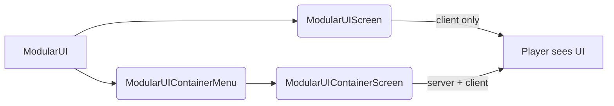
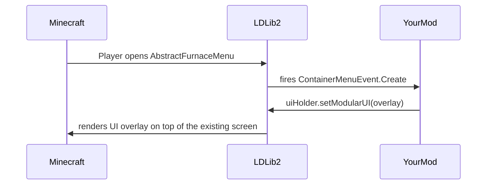

# 屏幕和菜单
{{ version_badge("2.2.1", label="Since", icon="tag") }}
`ModularUI` 是一个 UI 树——它描述了 UI 的外观以及它的行为方式。要实际向玩家显示它，它必须托管在 Minecraft **屏幕** 或 **菜单** 内。
LDLib2 提供了两个现成的主机和一组工厂助手，以使其尽可能简单。
---

＃＃ 概述


| Host | Sync | Use when |
| ---- | ---- | -------- |
| `ModularUIScreen` | Client-only | Display-only overlays, HUD widgets, or editor windows that need no server data |
| `ModularUIContainerMenu` + `ModularUIContainerScreen` | Server ↔ Client | Any UI that reads or writes server-side data (inventories, machine configs, etc.) |

---

## 仅限客户端屏幕
`ModularUIScreen` 直接扩展了 Minecraft 的`Screen`。它仅在客户端 - 服务器上不会打开任何菜单，并且需要服务器同步的数据绑定将不起作用。
```java
// Build your UI
var modularUI = ModularUI.of(UI.of(root));

// Wrap it in a Screen and open it
Minecraft.getInstance().setScreen(new ModularUIScreen(modularUI, Component.literal("My UI")));
```

```kotlin
val modularUI = ModularUI(UI.of(root))
Minecraft.getInstance().setScreen(ModularUIScreen(modularUI, Component.literal("My UI")))
```

!!!笔记将 `ModularUIScreen` 用于客户端工具，例如编辑器、配置覆盖或任何不与服务器交互的 UI。
---

## 服务器同步屏幕和菜单
对于需要读取或写入服务器端数据的 UI，LDLib2 使用标准的 Minecraft **菜单**（容器）系统。服务器创建`ModularUIContainerMenu`，客户端自动打开配对的`ModularUIContainerScreen`。
###`IContainerUIHolder`
您可以通过在任何服务器端对象（块实体、项目或普通类）上实现 `IContainerUIHolder` 来描述您的 UI：
```java
public class MyBlockEntity extends BlockEntity implements IContainerUIHolder {

    @Override
    public ModularUI createUI(Player player) {
        // Called on the server to build the UI
        return ModularUI.of(UI.of(
            element({ cls = { +"panel_bg" } }) {
                // ... your elements
            }
        ), player);
    }

    @Override
    public boolean isStillValid(Player player) {
        // Return false to close the UI, e.g. if the block was broken
        return !isRemoved();
    }
}
```

```kotlin
class MyBlockEntity : BlockEntity(...), IContainerUIHolder {

    override fun createUI(player: Player): ModularUI {
        // Called on the server to build the UI
        val root = element({ cls = { +"panel_bg" } }) {
            // ... your elements
        }
        return ModularUI(UI.of(root, StylesheetManager.MODERN), player)
    }

    override fun isStillValid(player: Player) = !isRemoved
}
```

!!!笔记 ””**在服务器上**调用`createUI`。然后生成的`ModularUI`会自动同步到客户端。您在其中设置的任何 `DataBindingBuilder` 绑定都将在两侧保持同步。
### 打开菜单
一旦您有了`IContainerUIHolder`，请使用`player.openMenu(menuProvider)` 和创建`ModularUIContainerMenu` 的标准`MenuProvider` 打开菜单。下面的[built-in factories](#built-in-menu-factories) 会为您处理所有这些。
---

## 内置菜单工厂
LDLib2 为最常见的用例提供了三个预构建的工厂助手 - `BlockUIMenuType`、`HeldItemUIMenuType` 和 `PlayerUIMenuType`。 KubeJS 用户可以通过`LDLib2UI` 事件组和`LDLib2UIFactory` 绑定访问所有三个。
请参阅 [UI Factory](../factory.md){ data-preview } 以获取完整文档，包括 KubeJS 示例和脚本放置指南。
---

## 注入现有菜单
**每次打开任何 `AbstractContainerMenu` 时，LDLib2 都会触发 `ContainerMenuEvent.Create` 事件**，包括来自原版和其他 mod 的菜单。通过处理此事件，您可以将 `ModularUI` 覆盖附加到任何现有屏幕，而无需修改其原始代码。
```java
@SubscribeEvent
public static void onContainerMenuCreate(ContainerMenuEvent.Create event) throws Exception {
    if (event.menu instanceof SomeVanillaMenu menu
            && menu instanceof IModularUIHolderMenu uiHolder) {
        var player = event.player;

        // Build whatever UI you want and inject it
        var mui = ModularUI.of(UI.of(
            // your overlay root element
        ), player);
        uiHolder.setModularUI(mui);
    }
}
```

!!!警告 ””菜单必须实现 `IModularUIHolderMenu` 才能使注入工作。LDLib2 自动将此接口混合到所有 `AbstractContainerMenu` 子类中，因此游戏中的每个菜单都已支持它。
### 示例：增强香草熔炉
以下示例（取自`CommonListeners`）将显示剩余燃烧时间的覆盖标签添加到标准熔炉屏幕，并将优先级文本字段添加到 AE2 驱动器屏幕 - 两个屏幕均未直接修改：
```java
@SubscribeEvent
public static void onContainerMenuCreateEvent(ContainerMenuEvent.Create event) throws Exception {
    // Attach a burn-time label to any furnace screen
    if (event.menu instanceof AbstractFurnaceMenu furnaceMenu
            && furnaceMenu instanceof IModularUIHolderMenu uiHolderMenu) {
        var player = event.player;
        var field = AbstractFurnaceMenu.class.getDeclaredField("data");
        field.setAccessible(true);
        ContainerData data = (ContainerData) field.get(furnaceMenu);

        var mui = ModularUI.of(UI.of(
            new UIElement().layout(l -> l.width(176).height(166)).addChildren(
                new UIElement()
                    .addChildren(
                        new Label().bind(DataBindingBuilder.componentS2C(() ->
                            Component.literal("burn time: %.2f / %.2f s"
                                .formatted(data.get(2) / 20f, data.get(3) / 20f))
                        ).build())
                    )
                    .layout(l -> l.positionType(TaffyPosition.ABSOLUTE)
                                  .widthPercent(100).paddingAll(5).top(-15))
                    .style(s -> s.background(MCSprites.BORDER))
            )
        ), player);
        uiHolderMenu.setModularUI(mui);
    }
}
```



!!!提示这种模式非常适合向游戏中的任何屏幕添加上下文信息叠加、快速访问控件或调试面板 - 包括来自其他 mod 的屏幕。