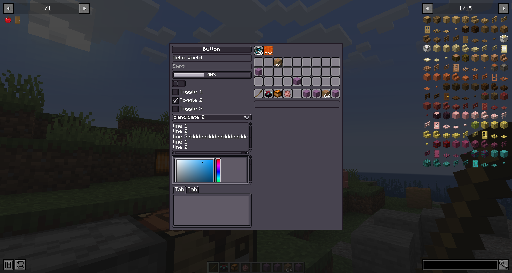
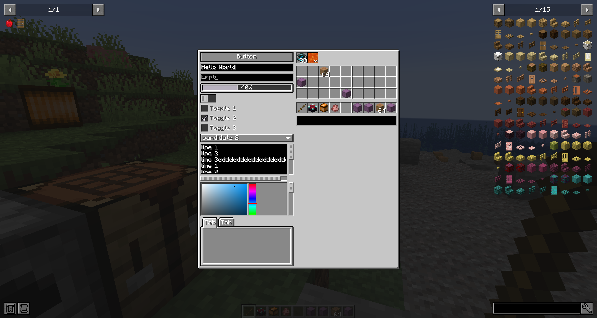
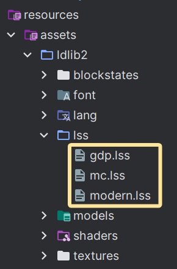

# 样式表
您可以使用 `LDLib Style Sheet` (LSS) 设计您的 UI 样式。 LSS 文件是受 HTML CSS 启发的文本文件。 USS 语法与 CSS 语法相同，但 USS 包括覆盖和自定义，以便更好地与 LDLib2 UI 配合使用。
LSS 允许您将**表示**与**逻辑**分开，使UI代码更干净且更易于维护。
---

## LDLib2 中的样式是什么
在介绍 LSS 本身之前，了解 **Style** 在 LDLib2 中的含义以及样式在内部如何工作非常重要。
如果您熟悉 CSS，这些概念应该很自然。
LDLib2 中的 **样式** 是指影响 UI 元素呈现方式的任何视觉或布局相关的配置，并且 **与服务器端逻辑无关**。示例包括：
- `layout`（大小、位置、弯曲行为）- `background`- `font-size`、`alignment` 等
事实上，你已经知道的`layout`系统本身就是一种**风格**。
每个`UIElement`可以定义多个样式，并且单个样式属性可以具有来自不同源的多个候选值。
在内部，每个 UI 元素都维护一个 **StyleBag**，其中：
- 存储应用于元素的所有样式值- 解决风格之间的冲突- 计算用于渲染的最终有效样式
最终的样式由**优先级**决定，而不是由应用顺序决定。
---

### 风格起源和优先级
每个样式值都有一个**StyleOrigin**，它定义了**样式的来源**和**它的强度**。
???信息“风格起源”    ```java
    public enum StyleOrigin {
        /**
         * Default style defined by the UI component itself
         */
        DEFAULT(0),

        /**
         * Style defined in an external stylesheet (LSS)
         */
        STYLESHEET(2),

        /**
         * Inline style set directly in code
         */
        INLINE(3),

        /**
         * Style applied by animations
         */
        ANIMATION(4),

        /**
         * Important style that overrides all others
         */
        IMPORTANT(5);
    }
    ```

具有较高优先级的样式覆盖具有较低优先级的样式：
> `DEFAULT` < `STYLESHEET` < `INLINE` < `ANIMATION` < `IMPORTANT`
这种设计确保：
- 组件有合理的默认值- 样式表定义全局外观- 内联样式可以覆盖样式表- 动画可以暂时覆盖视觉效果- `IMPORTANT` 风格总是获胜

### 可定制的样式
LDLib2提供了多种自定义UI样式的方法。您可以根据需要自由组合这些方法。
!!!注意行内结束在此页面中，我们不会介绍所有支持的样式及其行为。每个 UI 组件在其自己的 wiki 页面上记录了它支持的样式。
每个UI组件都会公开它支持的`Style`对象，允许您直接通过代码配置样式。
例如，在[`layout`](./layout.md#setting-layout-properties)中，`#layout(...)`和`#getLayout()`都基于相同的底层`Style`系统。`layout` 是所有 UI 元素上可用的共享样式。
此外，一些组件提供了自己的专用样式。例如，`Button` 公开了 `buttonStyle(...)` API，用于配置特定于按钮的视觉属性。
---

## 通过代码自定义样式
设置样式的方法有很多种。
===“Java”
    ```java
    var button = new Button();

    // direct call
    button.getStyle()
        // set background texture
        .background(SpriteTexture.of("photon:textures/icon.png"));
        // set tooltips
        .tooltips("This is my tooltips")
        // set opacity
        .opacity(0.5);

    // chain call, return button itself for chain calls
    button.buttonStyle(style -> {}).style(style -> style
        .background(SpriteTexture.of("photon:textures/icon.png"));
        .tooltips("This is my tooltips")
        .opacity(0.5)
    );

    // lss text
    button.lss("background", "sprite(ldlib2:textures/gui/icon.png)");
    button.lss("tooltips", "This is my tooltips");
    button.lss("opacity", 0.5);
    ```
===“KubeJS”
    ```js
    let button = new Button();

    // direct call
    button.getStyle()
        // set background texture
        .background(SpriteTexture.of("photon:textures/icon.png"));
        // set tooltips
        .tooltips("This is my tooltips")
        // set opacity
        .opacity(0.5);

     // chain call, return button itself for chain calls
    button.buttonStyle(style => {}).style(style => style
        .background(SpriteTexture.of("photon:textures/icon.png"));
        .tooltips("This is my tooltips")
        .opacity(0.5)
    );

    // lss text
    button.lss("background", "sprite(ldlib2:textures/gui/icon.png)");
    button.lss("tooltips", "This is my tooltips");
    button.lss("opacity", 0.5);
    ```

上面所有的方法都可以用来设置样式，但是它们**不等同**。
* 默认情况下，使用`getStyle()`或`style(...)`设置`INLINE`原点的样式。* 默认情况下，使用`lss(...)` 设置以`STYLESHEET` 为原点的样式。
如果您想使用这些 API **使用不同的 `StyleOrigin`** 分配样式，您可以在应用样式时显式指定来源，如下所示：
===“Java”
    ```java
    Style.pipeline(StyleOrigin.IMPORTANT, button.getStyle(), style -> style
        .tooltips("This is my tooltips")
    );

    // lss text
    button.lss("tooltips", "This is my tooltips", StyleOrigin.DEFAULT);
    ```
===“KubeJS”
    ```js
    Style.pipeline("IMPORTANT", button.getStyle(), style => style
        .tooltips("This is my tooltips")
    );

    // lss text
    button.lss("tooltips", "This is my tooltips", "DEFAULT");
    ```

---

## 通过样式表自定义样式
虽然直接在代码中设置 UI 元素样式很方便，但当您的项目涉及大量 UI 设计时，它很快就会变得**乏味且重复**。
尤其：
* 将相同的样式应用于许多 UI 元素需要重复编写代码。* 更新共享样式（例如，更改背景纹理）可能需要手动修改每个相关的 UI 元素。
更重要的是，如果您希望 UI 样式**可由玩家自定义**（例如，允许通过资源包覆盖样式），那么纯粹在代码中管理样式就变得不切实际。
使用 **样式表 (LSS)** 允许您：
* 跨多个 UI 元素集中和重用样式。* 从一个地方修改整个 UI 的外观。* 将 UI 样式公开给资源包以方便自定义。
由于这些原因，样式表是管理和统一大型项目的 UI 样式的推荐方法。
### 语法如果你熟悉CSS，你就会非常熟悉LSS的语法。
LSS 由以下部分组成：
* 包含`selector` 和`declaration block` 的样式规则。* 识别样式规则影响哪个 ui 元素的选择器。* 花括号内的声明块，具有一个或多个样式声明。每个样式声明都有一个属性和一个值。每个样式声明都以分号结尾。
**风格符合规则**
以下是样式规则的一般语法：
```css
selector {
    property1: value;
    property2: value;
}
```

定义样式表后，您可以将其应用到 ui 树。选择器与元素匹配以解析从 LSS 应用哪些属性。如果选择器与元素匹配，则样式声明将应用于该元素。
例如，以下规则匹配任何 `Button` 对象：```css
button {
  base-background: built-in(ui-mc:RECT_BORDER);
  hover-background: built-in(ui-mc:RECT_3);
  pressed-background: built-in(ui-mc:RECT_3) color(#dddddd);
  padding-all: 3;
  height: 16;
}
```

**支持的选择器类型**LSS 支持多种类型的简单和复杂选择器，这些选择器根据不同的条件匹配元素，如下所示：
- 组件类型名称- 分配的`id`- LSS `classes` 列表- 元素在 ui 树中的位置及其与其他元素的关系
如果一个元素与多个选择器匹配，LSS 会应用优先的选择器中的样式。
LSS 支持一组简单选择器，这些选择器与 CSS 中的简单选择器类似但不相同。下表提供了 LSS 简单选择器的快速参考。
| Selector type | Syntax | Matches|
| ---- | ----------- | ----------- |
| Component selector | `type {...}` | Elements of a specific component type. <br> (e.g. `button`, `text-field`, `toogle`) |
| Class selector | `.class {...}` | Elements with an assigned LSS class. <br> (e.g. `.__focused__`) |
| Built-in state selector | `:state {...}` | Elements in a built-in runtime state. <br> `:xxx` maps to `.__xxx__` (e.g. `:disabled` = `.__disabled__`, `:focused` = `.__focused__`, `:hover` = `.__hovered__`). |
| ID selector | `#root {...}` | Elements with an assigned `id`. <br> (e.g. `#root`) |
| Universal selector | `* {...}` | Any elements. |

内置状态选择器可以与组件选择器结合使用，以实现类似 CSS 的可读性：
```css
button:disabled {
}

button:focused {
}

button:hover {
}
```

LSS 支持 CSS 复杂选择器的子集。下表提供了 LSS 复杂选择器的快速参考。
| Selector type | Syntax | Matches|
| ---- | ----------- | ----------- |
| Not selector | `:not(selector) {...}` | Elements that not match the selector. |
| Host selector | `selector:host {...}` | Elements that must be the `host`. |
| Internal selector | `selector:internal {...}` | Elements that must be the `internal`. |
| Descendant selector | `selector1 selector2 {...}` | Elements that are the descendant of another element in the ui tree. |
| Child selector | `selector1 > selector2 {...}` | Elements that are the children of another element in the ui tree. |
| Multiple selector | `selector1, selector2 {...}` | Elements that match all the simple selectors. |

!!!信息“`Host`和`Internal`元素”UI 树可以包含 **主机元素** 和 **内部元素**。
以 **`button`** 为例：
    * `button` 本身是一个 **宿主元素**。它是您创建并直接与之交互的组件。    * 在内部，`button` 包含其他 UI 元素，例如用于呈现其标签的 `text`。

这些内部元素是组件实现的一部分，称为**内部元素**，它们无法从 UI 树中删除并以灰色显示。
通常不需要手动创建或管理它们，但它们仍然存在于 UI 树中，并且可以参与布局、样式和事件传播。
这种区别允许 LDLib2 组件既可组合又可定制，同时保持其内部结构的封装。

???注意“支持的字符”    -  必须以字母（`A–Z` 或`a–z`）或下划线（`_`）开头。    - 可以包含字母、数字 (`0–9`)、连字符 (`-`) 和下划线 (`_`)。    - 选择器区分大小写。例如，myClass 和 MyClass 是不同的。    - 选择器不能以数字或连字符后跟数字开头（例如`.1class` 或`.-1class`）。
**测验**
这里会选择什么样的元素？```css
button:host :not(.my_label#my_id > text:internal) > .my_class:host, text-field {
    // ...
}
```

???信息“答案”    1. **所有 `text-field` 元素**，无论它们在 UI 树中的位置如何。
    2. **具有类 `my_class`** 的主机元素，具有以下约束：        - 该元素必须是**宿主元素**。        - 它的**直接父级**不能**是内部 `text` 元素，其父级是具有 `my_label` 类且 ID 为 `my_id` 的元素。        - 该元素必须在 UI 树中位于其上方的某个位置有一个**主机 `button` 祖先**。

### 应用样式表
要应用样式表，您可以在 `UI` 创建期间附加它们。
===“Java”
    ```java hl_lines="30-32"
    private static ModularUI createModularUI() {
        // set root with an ID
        var root = new UIElement().setId("root");
        root.addChildren(
                new Label().setText("LSS example"),
                new Button().setText("Click Me!"),
                // set the element with a class
                new UIElement().addClass("image")
        );
        var lss = """
            // id selector
            #root {
                background: built-in(ui-gdp:BORDER);
                padding-all: 7;
                gap-all: 5;
            }
            
            // class selector
            .image {
                width: 80;
                height: 80;
                background: sprite(ldlib2:textures/gui/icon.png);
            }
            
            // element selector
            #root label {
                horizontal-align: center;
            }
            """;
        var stylesheet = Stylesheet.parse(lss);
        // add stylesheets to ui
        var ui = UI.of(root, stylesheet);
        return ModularUI.of(ui);
    }
    ```
===“KubeJS”
    ```js hl_lines="30-32"
    function createModularUI() {
        // set root with an ID
        let root = new UIElement().setId("root");
        root.addChildren(
                new Label().setText("LSS example"),
                new Button().setText("Click Me!"),
                // set the element with a class
                new UIElement().addClass("image")
        );
        let lss = `
            // id selector
            #root {
                background: built-in(ui-gdp:BORDER);
                padding-all: 7;
                gap-all: 5;
            }
            
            // class selector
            .image {
                width: 80;
                height: 80;
                background: sprite(ldlib2:textures/gui/icon.png);
            }
            
            // element selector
            #root label {
                horizontal-align: center;
            }
        `;
        let stylesheet = Stylesheet.parse(lss);
        // add stylesheets to ui
        let ui = UI.of(root, stylesheet);
        return ModularUI.of(ui);
    }
    ```

您还可以在运行时修改样式表。
===“Java”
    ```java
    var mui = elem.getModularUI();
    if (mui != null) {
        mui.getStyleEngine().addStylesheet(stylesheet);
    }
    ```

===“KubeJS”
    ```js
    let mui = elem.getModularUI();
    if (mui != null) {
        mui.getStyleEngine().addStylesheet(stylesheet);
    }
    ```

### 本地样式表（子树范围）
除了`UI` 上的全局样式表之外，您还可以将**本地样式表**附加到特定的`UIElement`。
本地样式表仅影响：
* 元素本身* 它的所有后代
它们不影响父元素或兄弟子树。
===“Java”
    ```java
    var panel = new UIElement().setId("panel");
    panel.addLocalStylesheet("""
        button {
            width: 80;
        }
    """);
    ```
===“KubeJS”
    ```js
    let panel = new UIElement().setId("panel");
    panel.addLocalStylesheet(`
        button {
            width: 80;
        }
    `);
    ```

### 内置样式表
LDLib2提供了三个内置样式表`gdp`、`mc`和`modern`，允许您灵活切换主题。`gdp` 是使用 LDLib2 组件时的默认样式表。
您可以使用`StylesheetManager`来访问所有已注册的样式表。
===“Java”
    ```java hl_lines="30-32"
    private static ModularUI createModularUI() {
        // ...
        var stylesheet = StylesheetManager.INSTANCE.getStylesheetSafe(StylesheetManager.MC)
        return ModularUI.of(UI.of(root, stylesheet));
    }
    ```
===“KubeJS”
    ```js hl_lines="30-32"
    function createModularUI() {
        // ...
        let stylesheet = StylesheetManager.INSTANCE.getStylesheetSafe(StylesheetManager.MC)
        return ModularUI.of(UI.of(root, stylesheet));
    }
    ```

所有三个内置样式表如下：
<figure markdown="span"><figcaption>国内生产总值</figcaption><figcaption>MC</figcaption><figcaption>现代的</figcaption></figure>
### 资源包中的样式表
!!!注意行内结束
不要忘记`F3 + T`在运行时修改后重新加载资源。
实际上，可以通过资源包添加或覆盖样式表。通过将`LSS`文件放在指定路径中，`StylesheetManager`将在运行时自动发现并注册它们，同时重新加载资源。
您应该将样式表放在`.assets/<namespace>/lss/<name>.lss` 路径下。
注册后，您可以使用`StylesheetManager`来访问它们。
===“Java”
    ```java
    // replace <namespace> and <name> with your own.
    StylesheetManager.INSTANCE.getStylesheetSafe(
        ResourceLocation.parse("<namespace>:lss/<name>.lss")
    );
    ```
===“KubeJS”
    ```js
    // replace <namespace> and <name> with your own.
    StylesheetManager.INSTANCE.getStylesheetSafe(
        "<namespace>:lss/<name>.lss"
    );
    ```
