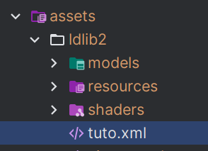

# UI Xml

{{ version_badge("2.1.6", label="Since", icon="tag") }}

LDLib2 允许你使用 **XML** 定义 UI，包括**样式**和**组件树**。  
这提供了一种类似于 **HTML (H5) UI 开发**的工作流，使 UI 结构清晰且声明式。

一个最小的 **UI XML 模板**如下所示：

```xml
<?xml version="1.0" encoding="UTF-8" ?>
<ldlib2-ui xmlns:xsi="http://www.w3.org/2001/XMLSchema-instance"
           xsi:noNamespaceSchemaLocation="https://raw.githubusercontent.com/Low-Drag-MC/LDLib2/refs/heads/1.21/ldlib2-ui.xsd">
    <stylesheet location="ldlib2:lss/mc.lss"/>
    <style>
        .half-button {
            width: 50%
        }
    </style>
    <root class="panel_bg" style="width: 150; height: 300">
        <button text="click me!"/>
        <button class="half-button" text="half"/>
    </root>
</ldlib2-ui>
```

属性 `xsi:noNamespaceSchemaLocation` 指向 LDLib2 提供的 XSD 架构。
在 VS Code、IntelliJ IDEA 或其他 IDE 中编辑 XML 时，该架构可启用：

* 语法高亮
* 验证和错误检查
* 自动补全和建议

## 加载 UI Xml 并设置

你可以通过以下方式加载和使用 UI XML 文件：

<figure markdown="span">
  { width="80%" }
</figure>

=== "Java"

    ```java
    var xml = XmlUtils.loadXml(ResourceLocation.parse("ldlib2:tuto.xml"));
    if (xml != null) {
        var ui = UI.of(xml);

        // find elemetns and do data bindings or logic setup here
        var buttons = ui.select(".button_container > button").toList(); // by selector
        var container = ui.selectRegex("container").findFirst().orElseThrow(); // by id regex
    }
    ```
=== "KubeJS"

    ```js
    let xml = XmlUtils.loadXml(ResourceLocation.parse("ldlib2:tuto.xml"));
    if (xml != null) {
        let ui = UI.of(xml);
        
        // find elemetns and do data bindings or logic setup here
        let buttons = ui.select(".button_container > button").toList(); // by selector
        let container = ui.selectRegex("container").findFirst().orElseThrow(); // by id regex
    }
    ```

!!! info
    `XmlUtils` 还提供了其他加载 XML 文档的方式，例如从字符串或输入流加载。
    请根据你的使用场景选择合适的方法。


## XML 语法概述

LDLib2 UI XML 使用**声明式语法**来描述 **UI 结构**及其**样式**，类似于 HTML + CSS。

在顶层，`<ldlib2-ui>` 根元素定义了一个完整的 UI 文档。  
在其中，你可以描述**样式**、**外部样式表**和**组件树**。

### 样式表

!!! note inline end
    在阅读本章之前，请先阅读 [LSS 页面](./preliminary/stylesheet.md)。
你可以使用 `<stylesheet>` 标签引用外部 LSS 文件：

```xml
<stylesheet location="ldlib2:lss/mc.lss"/>
```

这允许你复用共享样式，或让资源包全局覆盖 UI 外观。

当 `<stylesheet>` 直接放置在 `#!xml <ldlib2-ui>` 下时，它是整个 UI 的**全局样式表**。

### 嵌入样式

内联样式可以使用 **LSS (LDLib Style Sheet)** 语法在 `<style>` 块中定义：

```xml
<style>
    label:host {
        vertical-align: center;
        horizontal-align: center;
    }
    .flex-1 {
        flex: 1;
    }
    .bg {
        background: sprite(ldlib2:textures/gui/icon.png)
    }
</style>
```

当 `<style>` 直接放置在 `#!xml <ldlib2-ui>` 下时，它同样是整个 UI 的**全局**样式。

### 元素的局部样式表

你也可以在任何元素节点（例如 `root`、`element`、`button`、`tab`、`selector`）内放置 `<style>` 或 `<stylesheet>`。

在这种情况下，样式表被视为**局部样式表**，仅影响：

* 当前元素
* 其后代元素

它不会影响父元素或兄弟分支。

```xml
<root>
    <element id="left-panel">
        <style>
            button {
                width: 70;
            }
        </style>
        <button text="inside panel"/>
    </element>

    <button text="outside panel"/>
</root>
```

在上面的示例中，宽度规则应用于 `left-panel` 内部的按钮，而不是外部的兄弟按钮。

!!! note
    `ldlib2-ui.xsd` 包含这些元素级别的 `<style>` / `<stylesheet>` 节点，因此 IDE 架构验证和补全也适用于局部样式表定义。

### 内联样式属性

对于快速调整，样式也可以直接设置在元素上：

```xml
<button style="height: 30; align-items: center;"/>
```

内联样式的优先级高于样式表规则。

### 组件树

UI 布局被描述为 `<root>` 下的**元素树**。
每个 XML 节点映射到一个 UI 组件，嵌套定义父子关系。

属性用于配置组件属性，而子节点定义结构。

---

简而言之：

* **`<stylesheet>`** → 加载外部样式
* **`<style>`** → 定义嵌入样式
* **元素级别的 `<stylesheet>` / `<style>`** → 作用域限定于该元素子树的局部样式表
* **`style` 属性** → 内联样式
* **XML 层级** → UI 组件树

这使得 UI 定义清晰、可读且易于维护。
